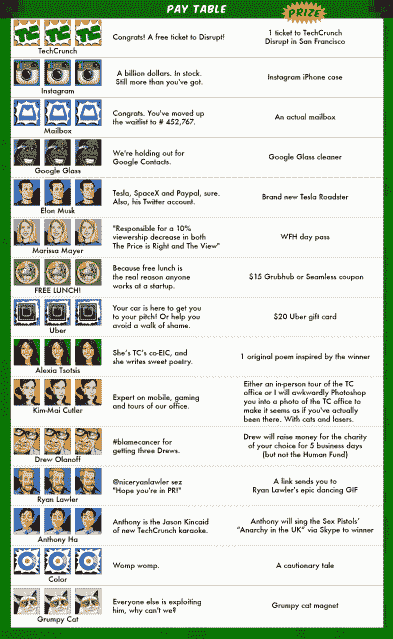

# 进军真钱游戏

> 原文：<https://web.archive.org/web/https://techcrunch.com/2013/04/01/techcrunch-real-money-gaming/>

# TechCrunch 正在进军真钱游戏

尽管内华达州、特拉华州和新泽西州的立法机构刚刚通过法律，为美国的在线赌博铺平了道路，但 Zynga 不会是第一个涉足其中的公司。

鉴于经营博客的经济状况有多糟糕，TechCrunch 一直在探索新的收入来源。它们可能包括，但不限于，[高级贾斯汀·汀布莱克博客帖子过滤器](https://web.archive.org/web/20221124021528/https://beta.techcrunch.com/2013/01/16/were-bringing-techcrunch-back/)，类似 Path 3.0 的 Livefyre 评论贴纸和[关于山达基相关硬件初创公司的新赞助部分](https://web.archive.org/web/20221124021528/http://www.cnn.com/2013/01/16/opinion/schafer-atlantic-scientology-ad)。

然而，最有前景的是虚拟货币和真钱游戏。如果真钱游戏的希望在过去的六个月里使 Zynga 的股票上涨了大约 15 %( T7 ),想象一下这对 AOL 的股票会有什么影响。

在这种情况下，我们将推出一系列新的吃角子老虎机和社交博彩游戏，让您将真金白银投入到您认为将取得成功的初创公司中。可以把它看作是绕过 SEC 关于成为合格投资者的规定的更简单的方法。

当你可以直接赌上你的种子资本时，为什么还要为最低 1000 美元的出资者俱乐部或与 AngelList 或 SecondMarket 打交道而烦恼呢？

**没错，这个帖子上面的游戏真的很管用。说真的，点击旋转按钮。这里有真正的奖品，包括一张旧金山 TechCrunch Disrupt 的门票(价值 1795 美元)。特斯拉跑车，恐怕是虚拟的。但如果你连续三次失读症，她可以给你写首诗，如果你连续三次失读症，他可以通过 Skype 给你唱他那臭名昭著的性手枪的《英国无政府状态》。对于读者获得的每三个连续匹配，我们将收集他们的联系信息以进行抽奖。从每个池中随机选出一人将赢得奖品。**

特别感谢[真钱游戏平台 beta table](https://web.archive.org/web/20221124021528/https://betable.com/)和[社交游戏工作室 Murka](https://web.archive.org/web/20221124021528/http://murka.com/about)在一周内将这款游戏整合在一起。

