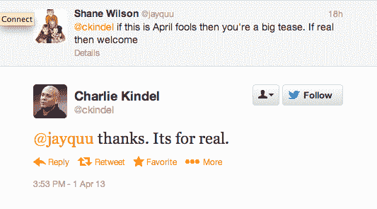

# 前 Windows Phone 高管查理·金德尔(Charlie Kindel)加入亚马逊，从事“秘密工作”——可能与手机相关的 TechCrunch

> 原文：<https://web.archive.org/web/https://techcrunch.com/2013/04/02/kindel-joins-amazon/>

# 前 Windows Phone 高管查理·金德尔(Charlie Kindel)加入亚马逊，从事“秘密工作”——可能与手机有关

前 Windows Phone 开发者布道者查理·金德尔(Charlie Kindel)加入亚马逊，领导一个未披露的项目。金德尔于 2011 年年中离开微软，开始自己创业，但根据他在 LinkedIn 上的简介，他“现在在亚马逊从事一些很棒的工作”。资料显示，他是西雅图亚马逊公司的“秘密总监”。从另一段描述来看，这个秘密可能与手机有关:“我正在组建一个新团队，为亚马逊开拓一个全新的领域。我正在招聘云和移动开发人员和测试人员、项目经理和产品经理。”

在微软，金德尔曾是 Windows Phone 平台的高调宣传者，后来突然离职去做自己的事情。在 Redmond 工作期间，Kindel 经常诋毁 Android，尤其喜欢批评谷歌操作系统的碎片化。但是在他离开微软和 Windows Phone 之后，他已经[在博客上谈到了一个分散的 Android 平台](https://web.archive.org/web/20221205225504/http://ceklog.kindel.com/2012/01/14/fragmentation-is-not-the-end-of-android/)所带来的机遇——不是对谷歌，而是对[其他人的竞争和创新](https://web.archive.org/web/20221205225504/http://ceklog.kindel.com/2012/10/22/lockergnome-guest-post-on-mobile-fragmentation/)——所以如果他加入了亚马逊，致力于打造一款基于 Android 的智能手机，就像亚马逊的 Kindle Fire 平板电脑一样，那么这是一个他已经专注了一段时间的领域。

Kindel 在传统上与傻瓜相关的一天(4 月 1 日)加入了一家生产 Kindle 产品的公司，这引发了人们对整个公告是一个精心策划的恶作剧的猜测——Kindle 发布了[他自己的愚人节帖子](https://web.archive.org/web/20221205225504/http://ceklog.kindel.com/2013/04/01/announcing-the-amazon-kindle-charlie/)关于他如何加入亚马逊建立“亚马逊 Kindle Charlie……亚马逊进入竞争激烈的家庭服务器市场”。然而，在他伪造的新闻稿之前，有一个说明说“以下部分是真的”——金德尔也通过推特证实他真的加入了亚马逊:

关于亚马逊正在开发智能手机的传言已经流传了几年，尽管 2012 年拆箱的建议被证明是不切实际的。去年夏天，彭博也报道了亚马逊手机传闻。最近，亚马逊和运营商计费公司 Bango 之间的一项交易也暗示了可能为智能手机做准备——尽管亚马逊当然对电话传言保持沉默。

如果亚马逊正在制造智能手机，那么它的重点——就像它的 Kindle Fire 平板电脑一样——将是扩大其电子商务服务和安卓应用商店的覆盖范围，而不是试图通过销售智能手机硬件来盈利。今年 2 月[，亚马逊宣布将推出一种虚拟货币](https://web.archive.org/web/20221205225504/https://beta.techcrunch.com/2013/02/05/amazon-to-launch-virtual-currency-amazon-coins-in-its-appstore-in-may/)，用于 Kindle Fire 上的应用内购买——并将在下个月进行一次大规模的[亚马逊币](https://web.archive.org/web/20221205225504/https://developer.amazon.com/post/Tx2EZGRG23VNQ0K/Introducing-Amazon-Coins-A-New-Virtual-Currency-for-Kindle-Fire.html)赠品，以鼓励客户购买应用和应用内购买，以帮助支持其移动设备生态系统，[当时指出](https://web.archive.org/web/20221205225504/http://phx.corporate-ir.net/phoenix.zhtml?c=176060&p=irol-newsArticle&ID=1781498&highlight=):“亚马逊币是为开发者提供的一系列新功能和服务中的最新产品，这些功能和服务使亚马逊成为构建、货币化和营销其应用和游戏的最完整的端到端生态系统。”

通过创造和控制自己的虚拟货币，亚马逊可以向各个方向抛出激励杠杆——因此亚马逊品牌的移动设备使用加强了其在线电子商务业务，反之亦然。很容易想象亚马逊币被扩展到允许用户在 Amazon.com 上购买实物商品，或者该公司创建一个忠诚度计划，买家通过在 Amazon.com 购物积累硬币，然后可以用亚马逊移动应用程序兑换。