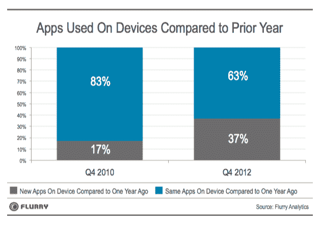

# Flurry 说，应用程序经济非常健康，但是移动浏览器正在受到脸书的挤压

> 原文：<https://web.archive.org/web/https://techcrunch.com/2013/04/03/apps-vs-mobile-web/>

# Flurry 说，应用程序经济非常健康，但是移动浏览器正在受到脸书的挤压

应用分析公司 Flurry 衡量了超过 10 亿台活跃智能移动设备的每月使用情况，该公司研究了美国消费者如何在移动应用和浏览器之间分配时间。该公司发现，iOS 和 Android 应用程序经济非常健康:消费者每天使用智能手机和平板电脑的平均 2 小时 38 分钟中，有 80%花在应用程序上，而只有五分之一的时间(20% —或 31 分钟)花在移动网络浏览器上。

就应用类别而言，游戏占据了消费者移动设备时间的很大一部分——约三分之一(32%)的日均使用量用于扔鸟或类似活动。脸书是下一个最大的时间接收器，削减了 18%的日使用量。根据 Flurry 的数据，再加上花在其他社交网络服务上的 6%的时间，社交媒体应用程序内的活动几乎占用户平均移动日的四分之一。

但推动脸书应用使用的不仅仅是社交网络。Flurry 首席执行官 Simon Khalaf 推测，花在脸书应用程序上的大部分时间是因为用户在扎克伯格的围墙花园内查看网页内容。他指出:“我们可以断言，就消费者花费的时间而言，脸书已经成为最受欢迎的浏览器”——并补充说，移动已经“成为脸书最大的机会”，消费者平均每天花费近 39 分钟使用脸书应用。

### 从消费者花费的时间来看，脸书已经成为最受欢迎的浏览器。

Khalaf 在公司博客上写道:“应用经济已经存在五年了，正在蓬勃发展。”。“我们寻找可能的放缓迹象，但我们找不到任何迹象，这主要是由于智能手机之后平板电脑的快速普及……平板电脑和智能手机正在吞噬台式机，笔记本和应用程序(包括脸书应用程序)正在吞噬网络和人们的时间。"

iOS 浏览器 Safari 也占用了移动用户很大一部分时间(12%)。Flurry 的数据表明，iPhone 和 iPad 用户可能比 Android 用户进行更多的移动浏览(除非 Android 用户比 iOS 设备用户更频繁地使用 Facebookers)，因为即使将 Android 原生浏览器与 Opera Mini 和 Flurry 的分析中发现的其他未命名的浏览器进行比较，也只能获得浏览器与 Safari 使用时间的一半左右。iPad 可能是 Safari 在这里占据主导地位的原因，因为它非常适合浏览移动网络(Android 平板电脑还没有 iPad 那样占据主导地位)。

在其他地方，Flurry 的数据显示，娱乐和公用事业应用各占 8%，而生产力和新闻应用仅各占 2%。它还发现，美国消费者——远不是像第三移动生态系统平台竞争者有时试图争辩的那样对应用感到厌倦——实际上每天使用的应用数量越来越多。Flurry 比较了三年的全球数据，发现每天启动的应用数量从 2010 年第四季度的 7.2 个稳步上升到 2011 年第四季度的 7.5 个，再到 2012 年第四季度的 7.9 个。

“对我们来说，稳定的增长率表明应用经济尚未饱和，因为随着时间的推移，消费者会稳步使用更多的应用，”Khalaf 写道。“虽然商店里的应用程序越来越多，但其中很多都寿命很短，比如书籍、节目和游戏。有人断言，2012 年人们使用的应用程序比 2010 年少，这似乎是不正确的。

Flurry 还比较了新应用和现有应用的使用情况，发现在 2010 年第四季度和 2012 年第四季度之间，新应用的使用比例几乎翻了一番——见下图。该研究的这一部分基于超过 220 万台设备的样本，这些设备已经运行了两年多。对开发商来说，积极的一点是，市场仍然充满活力，对新来者开放。

“我们相信，随着消费者继续尝试如此多的新闻应用程序，应用程序市场仍处于早期阶段，仍有创新和突破的空间，新的应用程序，”Khalaf 指出。

