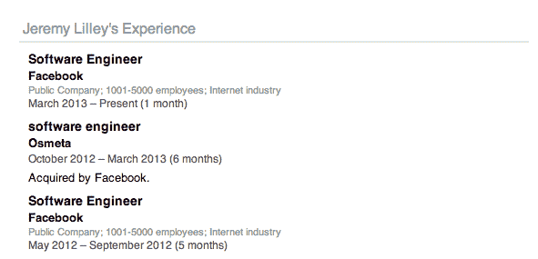

# 已证实:脸书收购了秘密移动软件初创公司 TechCrunch OS meta

> 原文：<https://web.archive.org/web/https://techcrunch.com/2013/04/10/has-facebook-quietly-acquired-osmeta-a-stealth-mobile-software-startup/>

虽然脸书正在以 T2 Facebook Home T3 的形式在移动领域扮演更大胆的角色，但看起来它也在继续进行收购，这将有助于加强整体战略。我们了解到，在上周发布的准备阶段，这家社交网络似乎已经悄悄收购了 [Osmeta](https://web.archive.org/web/20230209002706/http://www.osmeta.com/) ，一家基于山景城的移动软件初创公司。Osmeta 尚未推出商业产品，目前还不完全清楚这是收购还是技术交易。

我们已经向脸书寻求意见，如果有回音，我们会更新这篇文章。 **更新**:脸书发言人现已证实收购，没有进一步的评论。原故事下文继续。

这是我们能够拼凑出来的:

— Osmeta 自 2011 年 8 月以来一直存在。它是由谷歌/IBM 校友阿米特·辛格和 IBM 校友马克·史密斯共同创立的，共有 17 名员工——都是工程师。这是[“关于”页面](https://web.archive.org/web/20230209002706/http://osmeta.com/about/)描述了一个“世界知名的黑客和有能力完成艰巨的软件工程的高度成功的研究人员”的团队除了谷歌和 IBM Research，其他过去的雇主包括雅虎研究，VMware 和脸书。

——[将 Osmeta 列为工作地点的许多员工现在在他们的 LinkedIn 个人资料上显示他们在脸书工作。其中一人](https://web.archive.org/web/20230209002706/http://www.linkedin.com/vsearch/p?company=osmeta&rsid=9830241365632404464&openFacets=N,G,CC&page_num=1)[特别提到](https://web.archive.org/web/20230209002706/http://webcache.googleusercontent.com/search?q=cache:04uxzpj2-KgJ:www.linkedin.com/in/jjlilley+&cd=1&hl=en&ct=clnk)他在 2013 年 3 月 Osmeta 被收购后搬到了脸书。

—该公司尚未公开推出产品，但它正在/曾经在移动领域工作，并且似乎可以在多种设备上工作——其网站上的一张图片证明了这一点，该图片展示了运行在不同平台上的 25 款硬件。不清楚 Osmeta 的技术是否也在 Osmeta 的员工中流行。

—隐形产品过去是/很可能是在软件领域:

> “在我们之间，这些年来，我们在软件创作方面做了几乎所有的事情，包括几个世界第一类型的神奇的东西，”该网站指出。“(例如:Android、Chrome for Android、Chrome OS、Google Crawling、AdWords、ZooKeeper、BookKeeper、Pig (Hadoop)、OSGi、Linux 内核控制组、网络和其他设备驱动程序、认知计算、海量存储系统、不寻常的文件系统、各种类型的虚拟化、视频游戏控制台仿真，等等。)"

— [Amarjit Gill](https://web.archive.org/web/20230209002706/http://www.linkedin.com/in/gillamarjit) ，企业存储公司 [Maginatics](https://web.archive.org/web/20230209002706/http://maginatics.com/) 的首席执行官，他本人也是一名非常成功的企业家(将公司出售给谷歌、苹果和博通)，是 Osmeta 的天使投资人之一和董事会成员。Osmeta 网站上提到的另一位风险投资人是 Brian Long，[大西洋桥风险投资](https://web.archive.org/web/20230209002706/http://www.abven.com/who_we_are/brian_long/)的普通合伙人。不清楚他是否也支持该公司，但大西洋桥恰好是 Maginatics 的支持者。

Osmeta 是什么意思？我们从电子商务应用平台 Lexity 的首席执行官艾米特·库马尔那里得到一个[的猜测，他在德里一起学习时认识了阿米特·辛格，并且似乎是第一个](https://web.archive.org/web/20230209002706/http://b.akumar.me/2013/04/09/why-facebook-bought-osmeta-its-facebook-home/)[发现奥斯梅塔/脸书联系的人](https://web.archive.org/web/20230209002706/https://twitter.com/akumar/status/319901374714355712)。他追溯到 Singh 在虚拟化方面的专业知识。“‘OS meta’——指的是‘元操作系统’——可能是一种虚拟化技术，允许您在任何(潜在的移动)硬件上运行相同的‘核心功能’？”

库马尔还提出了 Osmeta 不仅仅是一个 acqui-hire 的想法:“如果脸书决定，从战略上来说，他们需要 Facebook Home 来超越每一个移动设备——而不仅仅是 Android，”他写道。“也许 Osmeta 迄今为止所建立的东西让他们能够以可扩展的方式快速地在这个分散的设备生态系统中传播 Facebook Home，并在所有设备上实现一致的、以脸书为中心的体验？”

“所有设备”可能有些言过其实，特别是考虑到 iOS 上的 Facebook Home 目前还没有启动。(然而，这里值得注意的是，辛格的[经历](https://web.archive.org/web/20230209002706/http://www.kernelthread.com/resume/)包括对苹果操作系统的一些深入了解，为该环境开发谷歌应用。)与此同时，仅 Android 就提供了一系列设备，你可以看到 Osmeta 正在帮助脸书跨越这些设备。

虽然奥斯梅塔的团队将如何以及是否直接致力于把[的 Facebook 主页变成脸书的下一个主页](https://web.archive.org/web/20230209002706/http://www.engadget.com/2013/04/04/zuckerberg-home-is-the-next-version-of-facebook/)仍有争议，但更清楚的是，脸书仍在积极推进获取知识产权和人才(这里是另一个例子)以确保其在移动领域的所作所为将使其成为领导者，而不是跟随者。