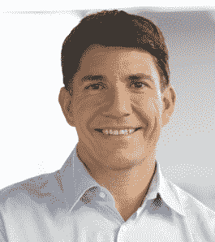

# Mozilla 进行领导层变动:CEO 加里·科瓦奇将于今年晚些时候离职，米切尔·贝克成为 TechCrunch 的执行主席

> 原文：<https://web.archive.org/web/https://techcrunch.com/2013/04/10/mozilla-makes-leadership-changes-ceo-gary-kovacs-to-step-down-later-this-year-mitchell-baker-becomes-executive-chair/>

# Mozilla 进行领导层变动:CEO 加里·科瓦奇将于今年晚些时候离职，米切尔·贝克成为执行主席

开发火狐、火狐操作系统和其他在线工具的非营利组织 Mozilla 今天[宣布](https://web.archive.org/web/20221209232309/https://blog.mozilla.org/blog/2013/04/10/gearing-up-for-the-next-chapter/)其首席执行官加里·科瓦奇将于“今年晚些时候”离职，他于 2010 年加入 Mozilla 该组织已经开始寻找他的替代者。科瓦奇仍将是 Mozilla 董事会的成员。

在成为 Mozilla 的首席执行官之前，Kovacs 是 Sybase(通过被 SAP 收购)的市场、解决方案和产品高级副总裁，Adobe 的移动和设备总经理兼副总裁，以及 Macromedia 的产品营销副总裁。

### Mozilla 的更多领导层变动

此外，Mozilla 正在对其领导团队进行一些调整。[例如，米切尔·贝克](https://web.archive.org/web/20221209232309/https://blog.mozilla.org/press/bios/mitchell-baker/)“在她更深入地参与 Mozilla 的日常活动后”将成为执行主席她的重点将是“确保组织和个人贡献者拥有他们需要的工具，为释放网络的潜力做出有意义的贡献。”

[Jay Sullivan](https://web.archive.org/web/20221209232309/https://blog.mozilla.org/press/bios/jay-sullivan/) ，之前 Mozilla 的产品高级副总裁，现在将成为其首席运营官，Harvey Anderson 被任命为商务和法律事务高级副总裁。[巩俐](https://web.archive.org/web/20221209232309/http://blog.mozilla.org/press/bios/li-gong/)被任命为移动设备高级副总裁，此外他目前还担任该组织的亚洲运营总裁。Brendan Eich 将继续担任 Mozilla 的首席技术官和高级工程副总裁。

Mozilla 表示，这些变化发生在它建立“移动支点”的时候。

加里·科瓦奇

正如 2004 年至 2008 年担任 Mozilla 首席执行官的米切尔·贝克(Mitchell Baker)在今天的博客文章中指出的那样，科瓦奇加入 Mozilla“是为了做出一个戏剧性的转变——将 Mozilla 从桌面浏览器世界转移到移动生态系统中。”她还指出，他“重振了我们对与商业伙伴合作的关注，这是 Mozilla 早期生活中的一个核心特征，但在 Firefox 桌面时代就不那么重要了。”

科瓦奇本人在今天的公告中指出，“过去的两年半是 Mozilla 发展和快速增长的关键时期。我为我们团队的成就感到非常自豪。在我们为下一个 20 亿网络用户赋能的使命中，我们在桌面和移动以及引领市场步伐的能力方面取得了巨大进步。有了这一坚实的基础和强大的团队，现在是我宣布过渡计划和对领导团队能力投下信任票的时候了。我很感激在这个快速增长的时期领导这个组织的特权，我期待着帮助指导 Mozilla 对移动未来的影响。”

在 AllThingsD 的一次采访中，他还提到他将离开 Mozilla“回到更商业化的领域”