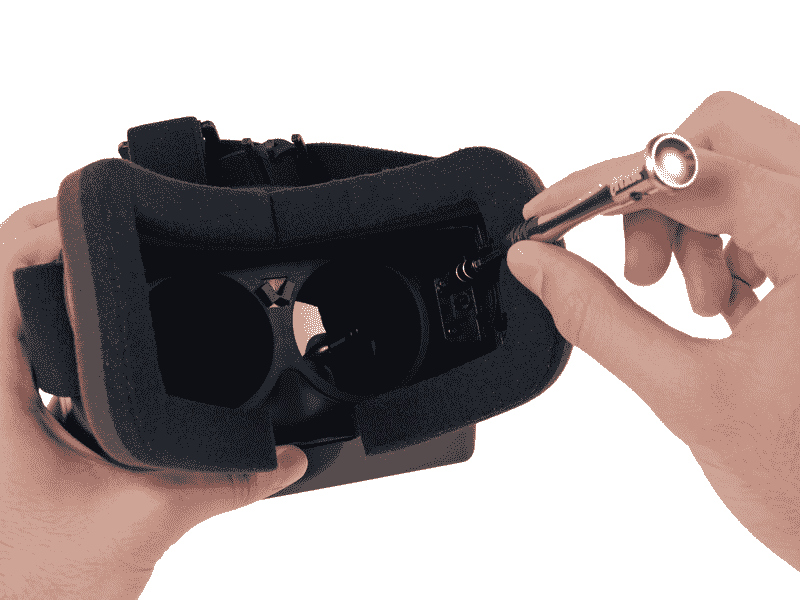

# Oculus Rift 拆卸揭示了你的 3D 游戏的秘密 TechCrunch

> 原文：<https://web.archive.org/web/https://techcrunch.com/2013/04/10/oculus-rift-teardown-reveals-the-secrets-of-on-your-face-3d-gaming/>

# Oculus Rift 拆卸揭示了你脸上的 3D 游戏的秘密

我一直想要一个虚拟男孩，但一直没有得到，但我很高兴我等到了，因为 Oculus Rift 看起来像一个更好的基于护目镜的游戏平台。多亏了该网站提供的开发者版本，这个小工具今天在 iFixit 得到了彻底的清理。裂缝非常容易撕开，因此可修复性很高。Oculus Rift one 还包括一些在团队打开外壳之前动手操作的游戏，这对于 iFixit 拆卸来说是罕见的。

iFixit 提供了一个从裂缝内部观看的伟大视频，准确地显示了它如何通过稍微偏移每只眼睛的图像来管理 3D 效果，然后由你的大脑组合并给出深度的幻觉。拆卸的其余部分显示了 Rift 的核心部件，如由台湾奇美群创提供的 1280×800 分辨率的液晶显示器，它向每只眼睛输出 640×800 的图像。iFixit 称这是“好消息”，因为奇美群创是台湾最大的液晶显示器供应商。

 其他关键部件包括带有 72MHz CPU 的 ARM Cortex-M3 微控制器(当然，大部分处理由主机处理)，板上还有各种运动、加速度和陀螺仪传感器，以帮助设备跟随和补偿头部运动的变化。

Oculus Rift 已经是地平线上最酷、最极客的设备之一，但现在它已经在一个非常简单的功能中被拆开，以展示其相对简单但非常实用的内部功能，我更加兴奋地想要得到一台。