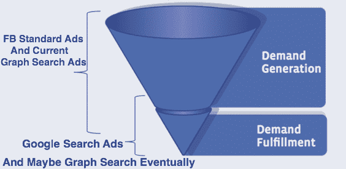

# 脸书测试了它的第一个图形搜索广告，但是它们不是针对你的查询的

> 原文：<https://web.archive.org/web/https://techcrunch.com/2013/04/16/facebook-graph-search-ads/>

投资者希望脸书最终会出售利润丰厚的需求满足搜索广告，但这只是保守的开始。今天，它开始对其在图形搜索上的第一批广告进行小规模测试，但它们并不针对你的搜索查询。相反，他们使用标准的脸书定位和重定位，看起来像它的侧边栏广告，出现在页面的底部——并且只有在有不止一页结果的情况下。

2013 年 9 月 30 日更新:脸书称他们已经结束了图片搜索广告的测试。]

马克·扎克伯格[在针对人物、地点和兴趣的新内部搜索引擎发布会上回答我关于货币化的问题时，暗示广告将出现在图形搜索](https://web.archive.org/web/20230404120508/https://techcrunch.com/2013/01/15/graph-search-ads/)中。他说“你可以通过创造人们想要的东西来建立一个好的企业”，但他指出脸书的旧搜索类型广告“很好地延伸到了这一点”扎克伯格强调，在脸书，用户体验是第一位的，但他承认搜索广告“随着时间的推移，可能会成为一项业务”

但与让公司出现在实时脸书搜索结果下拉菜单中竞争对手或相关业务上方的搜索类型提前广告不同，第一个图形搜索广告实际上只是一个新的位置。脸书告诉我，就目前而言，它们只会出现在一小部分拥有图形搜索的用户群中，而图形搜索本身只面向脸书全部用户群中的一小部分。当测试人员进行图形搜索并进入结果页面时，如果有超过一页的结果，他们会在折叠线下的第二页结果自动加载之前看到两到三个广告。这些广告看起来像脸书的侧边栏单元，带有标题、缩略图、正文，以及通往脸书内外目的地的链接。

图形搜索广告依赖于与大多数脸书广告相同的定位技术:传记特征，如年龄、性别、当前城市和雇主；喜欢，打开图形活动，并根据他们最近访问的网站的 cookies 重新定位。

如果测试进展顺利，广告带来了点击量和品牌提升，它们可能会推广到所有图形搜索用户。

问题仍然是，脸书是否会开始让广告商根据人们搜索的关键词进行定位。如果与脸书的其他定位技术相结合，图形搜索广告可以让企业在用户决定去哪家餐馆、零售店或专业服务机构时接触到他们。目前，图形搜索广告只能根据人口统计、兴趣和浏览历史来定位，但最终当你搜索“附近的牙医”时，你可能会得到牙医的广告

购买漏斗的底部比需求生成漏斗的顶部更有价值，因为广告可以直接与购买和投资回报联系起来。这将让脸书对它们收取更多费用，并获得为谷歌和其他搜索广告预留的巨额预算。真正让投资者兴奋的是这种新的广告类别，而不是对其现有收入流的细微改善，最终可能将 FB 美元(今天收盘价为 26.92 美元)拉高至 38 美元的 IPO 价格之上。