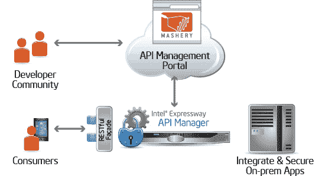

# 来源:Mashery 以超过 1.8 亿美元的价格出售给英特尔

> 原文：<https://web.archive.org/web/https://techcrunch.com/2013/04/17/source-mashery-is-selling-to-intel-for-more-than-180m/>

# 来源:Mashery 正以超过 1 . 8 亿美元的价格出售给英特尔

我们从知情人士处获悉，英特尔将以超过 1 . 8 亿美元的价格收购 Mashery，此举表明这家芯片制造商正慢慢成为一家硬件和软件公司。读写网[将收购价格大致定为该公司上一次](https://web.archive.org/web/20230320220321/http://readwrite.com/2013/04/17/intel-acquires-mashery)[报告的](https://web.archive.org/web/20230320220321/http://www.businessinsider.com/ex-feedster-exec-sold-company-to-intel-2013-4)6000 万美元估值的 2-3 倍。

ReadWrite 首先披露了这一消息，并证实了这个故事，它报道说 Mashery 的 125 名员工通过一封清晨的电子邮件得知了出售的消息，大多数人将被分配到英特尔的互联网服务部门工作。条款没有正式披露，但根据一份声明，该交易“对英特尔的财务结果并不重要”。

API 管理公司 Mashery 成立于 2006 年，在被收购之前筹集了大约 3500 万美元的资金。当我们今天早些时候询问 Mashery 创始人柳文欢·米歇尔斯时，他没有对交易的规模发表评论。

Mashery 和英特尔已经成为朋友有一段时间了，他们在去年 11 月合作开发了英特尔高速公路 API 管理器。根据[可编程 Web](https://web.archive.org/web/20230320220321/http://blog.programmableweb.com/) 的说法，该服务旨在为寻求 API 管理解决方案的企业解决“安全 API 启用和 API 产品管理”的问题。"

有迹象表明，英特尔正在加大对其软件部门的投资。这是继 Project Rhino 之后的最新举措，该项目将为其服务器芯片优化自己的 Hadoop 发行版。这一举措符合英特尔的战略，即成为更大的安全软件提供商，这在 2010 年以 77 亿美元收购 McAfee Software 时得到了充分体现。

在过去几年中，API 管理领域已经成熟。顶点、单个和第 7 层都在空间中竞争。Apigee 是该集团中历史最悠久的一家，最近进行了多元化发展，为下一代软件定义的数据中心提供分析和 API 基础架构。