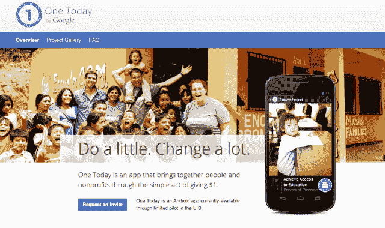
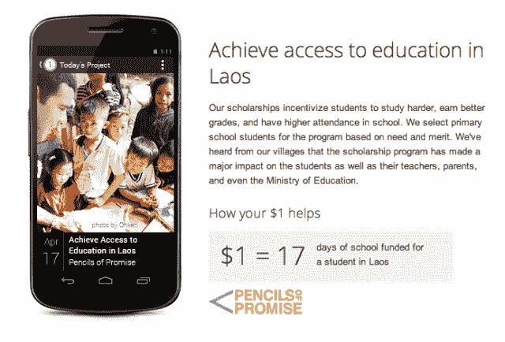
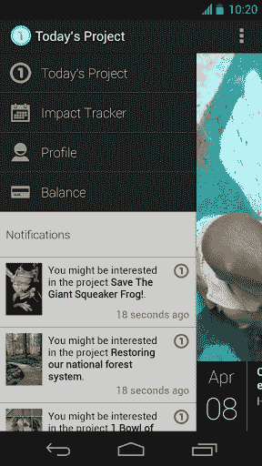

# 谷歌的 One Today 应用旨在让慈善捐赠成为一种更社会化、更频繁的体验

> 原文：<https://web.archive.org/web/https://techcrunch.com/2013/04/18/googles-one-today-app-aims-to-make-charitable-donations-a-more-social-and-frequent-experience/>

# 谷歌的 One Today 应用旨在让慈善捐赠成为一种更加社会化、更加频繁的体验

今天，谷歌悄然推出了一款基于其非盈利部门 Google.org 的新应用。这款应用名为【T2 今日一号】，目前只对安卓用户开放。这样做的目的是让人们向不同的组织捐赠 1 美元，同时提前获得关于你的捐赠将如何使用的完整信息。对于非营利组织来说，这通常是一个巨大的绊脚石，因为人们担心他们的钱不会真正花在真正的改变上。今天有一个项目旨在改变这种状况。

此外，One Today 还有一个社交功能，如果你的朋友为某项事业捐款，你可以设置捐款上限。通过使用谷歌钱包，一旦你所有的朋友用完了你的上限，你可以简单地还清你的“捐款余额”。这是一种非常有趣的众包捐赠方式。当我和人们谈论捐钱给慈善事业时，他们遇到的第一个问题是，他们找不到自己热爱的事业。通过让你把选择捐赠给谁的权利交给你的朋友，这个问题就简单地消失了，你没有理由不捐赠。不过，你不必让其他人参与进来，因为你可以自己参与或者与应用社区互动。

目前，登陆页面允许你请求邀请，即使应用程序本身可以在 Google Play 上[下载。如果你打开应用程序，你会再次看到邀请屏幕，而且没有任何消息表明 Today 将于何时向用户和捐赠开放。](https://web.archive.org/web/20230406113733/https://play.google.com/store/apps/details?id=com.google.android.apps.onetoday&feature=search_result#?t=W251bGwsMSwxLDEsImNvbS5nb29nbGUuYW5kcm9pZC5hcHBzLm9uZXRvZGF5Il0)

该应用程序的其他一些有趣的方面是，它只填充了目前正在与[谷歌非营利组织](https://web.archive.org/web/20230406113733/http://www.google.com/nonprofits/)合作的非营利组织，所以你知道他们是经过预先筛选的。其他网站，如 [Causes](https://web.archive.org/web/20230406113733/http://www.causes.com/) ，充斥着一些组织，这些组织很少或根本没有关于自身或他们筹集的资金用途的信息。根据将预先填充的程序，这款应用显然不是这样的:

组织也可以[注册加入](https://web.archive.org/web/20230406113733/https://www.google.com/onetoday/nonprofits.html)。

从应用程序截图的外观来看，One Today 似乎非常精致，经过了深思熟虑。这是一款谷歌希望你日常使用的应用:

将这些放在一起的原因在[应用的常见问题解答](https://web.archive.org/web/20230406113733/https://www.google.com/onetoday/faq.html)中有所说明:

> 谷歌长期致力于支持非营利组织和做好事。One Today 让非营利组织的筹款变得容易，也让用户的捐赠变得简单有趣。

是的，谷歌确实收取 1.9%的信用卡费用，但考虑到它会为你处理和捐赠，这并不算多。当然，这些捐赠也是免税的。

每次接受一美元的想法对任何人来说都很容易咀嚼，并进入每天捐赠的节奏，例如，这可能比每年只向一个慈善机构一次性捐赠更有意义。随着你捐赠更多，该应用程序将开始推荐你可能感兴趣的其他组织，这是一种类似 Google Play 应用程序的购买体验。当你点击“给予”时，它实际上是一个承诺，一旦你向一些组织做出承诺，就会通知你结算余额。

有了这种方法，小额捐赠实际上可以赶上并为这些非营利组织筹集到比以往更多的资金。在许多情况下，不是你捐赠的实际金额，而是你的社会行为带来的意识。今天的一个是一个放大工具，一旦它向大众开放，看看这个项目如何发展将是有趣的。