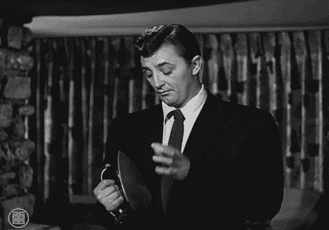
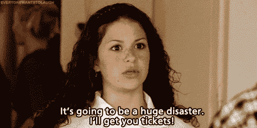

# 每个人都是真正的疯子

> 原文：<https://web.archive.org/web/https://techcrunch.com/2013/04/19/virtual-insanity/>

 每个人都有精神错乱的时候。互联网让这一点变得痛苦而明显，因为我们抽象的、通常没有背景的疯狂时刻被随意发布，然后在某些情况下被放大，让所有人都能看到。因为这种动态，我们也有无限的机会去解构别人精神错乱的方式。也就是说:我们在国家紧急状态和丑闻中做的第一件事？[看看嫌疑人](https://web.archive.org/web/20230330101529/http://www.buzzfeed.com/chrisgeidner/what-we-know-about-boston-marathon-bomb-suspect-dzhokhar-tsa?utm_campaign=socialflow&utm_source=twitter&utm_medium=buzzfeed)是否有推特、脸书或 Myspace 账户——然后玩[评论——部分心理学家](https://web.archive.org/web/20230330101529/http://www.urbandictionary.com/define.php?term=Internet%20Psychologist)。或者[差一点](https://web.archive.org/web/20230330101529/https://twitter.com/search/users?q=Dzhokhar%20Tsarnaev)。

BuzzFeed 首席执行官 Jonah Peretti 将在 TechCrunch Disrupt 上发表主题演讲，他说:“我们认为自己是理智的，其他人是疯狂的，但实际上我们都有点疯狂。”。这个演讲将会是关于这个确切的主题，标题是:“每个人都是字面上的疯狂”，就像这篇文章的标题一样。

在过去的两周之后，我可以确定某个地方的某个人需要解释一下为什么每个人在网上看起来都更古怪。我在看着你，[阿曼达·贝尼斯](https://web.archive.org/web/20230330101529/https://twitter.com/amandabynes)。

****** [在这里购买《约拿的谈话》的门票](https://web.archive.org/web/20230330101529/https://techcrunch.com/events/disrupt-ny-2013/purchase-tickets/)。******

“我们认为自己有一致的兴趣，但实际上我们是反复无常的，我们喜欢什么取决于环境而不是我们自己的信念，”乔纳解释说。“这一切在网络上变得很清楚，因为我们可以如此仔细地衡量人类的行为。”

互联网揭露和归档人类黑暗心理面的例子不断涌现:就在昨天，Gawker 发布了一封来自马里兰大学女生联谊会女生的电子邮件。这篇文章获得了超过 160 万次的浏览量，其中一位 Delta Gamma 董事会成员痛斥她的姐妹会成员“简直太他妈的尴尬了”。

关于互联网的另一件大事是人们经常误用“字面上的”这个词

> *“如果你照我说的打开了这封邮件，把你自己绑在你坐的椅子上，因为这封邮件将会是一段艰难的旅程。*
> 
> 对于那些把头埋在石头下面的人来说，这显然是本章的大部分内容，我们已经在夜间活动和与适马努的一般社交方面搞砸了。我一直收到短信，说人们真的很他妈的尴尬，很他妈的无聊。如果你现在正在读这篇文章，并对自己说“哦，天哪，丽贝卡，这周我和我的姐妹们玩得很开心！”那你现在就给自己脸上来一拳这样我就不用他妈的亲自去校园找你了。
> I 根本不在乎，西格玛努也不在乎你有多喜欢和你的姐妹们聊天。你他妈的一年有 361 天可以和姐妹们聊天，而这一周不行，我他妈的重复一遍，一天都不行。这个星期是关于培养希腊社区的关系，如果你们只是站在一起互相交谈，而不是我们的比赛，那他妈的是不可能的。新闻快讯你愚蠢的公鸡:兄弟会不喜欢无聊的姐妹会。哦，等等，双他妈的新闻快报:西格玛努是不会想和我们一起玩，如果我们他妈的吸，顺便说一下，如果你是一个白痴，需要它为你详细说明，我们他妈的吸到目前为止。这也适用于你们这些在 SIGMA NU BROTHERS 面前公开谈论在另一个兄弟会玩游戏的小混蛋。你们是弱智吗？这不是一个反问句，我只是想让你给我回封邮件，告诉我你是否反应迟钝，这样我就可以确保你不会再去参加夜间活动了…”
> 
> **(你可以在这里阅读[整件事](https://web.archive.org/web/20230330101529/https://techcrunch.com/events/disrupt-ny-2013/purchase-tickets/)。不，只是开玩笑，这是一个扰乱 Eventbrite 页面的链接。试试这里的[。](https://web.archive.org/web/20230330101529/http://gawker.com/5994974/the-most-deranged-sorority-girl-email-you-will-ever-read) )**

我的理论是，这封邮件引起了人们的共鸣，不是因为它超级极端，而是因为它提醒了我们在网上做的许多更危险的事情，当我们认为没有人看的时候，甚至当人们看的时候，或者因为人们看的时候。“我认为这是一封普通的电子邮件，这很奇怪吗？”[开玩笑说](https://web.archive.org/web/20230330101529/https://twitter.com/anthonyha/status/325018364466573312) TechCrunch 作家安东尼·哈。

每个笑话背后都有一点点真相。

https://twitter.com/ryanlawler/status/325006984099282944

因为这些社交平台太新了，人们不知道什么是合适的。甚至，[也许特别是](https://web.archive.org/web/20230330101529/http://www.theawl.com/2013/04/is-your-social-media-editor-destroying-your-news-organization)，我们专门为此目的雇佣的人。我们只是让这一切在某种人类交流雪崩中草率地进行。

“我们满足于满足我们的强迫性自我、自恋自我和附加自我，”乔纳说。“我们喜欢在谷歌上搜索没人看的内容，但我们喜欢在脸书上分享不同的内容，我们认识的每个人都在看。我们是奇怪的生物，我们在网络上的行为是我们矛盾灵魂的窗口。”

下周来看看乔纳在 [Disrupt New York](https://web.archive.org/web/20230330101529/https://techcrunch.com/events/disrupt-ny-2013/purchase-tickets/) 的演讲吧。许多其他疯狂的人也会在那里。但不是联谊会的女孩。我希望。

