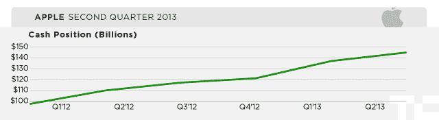

# 苹果的现金储备仍在增长，增长了 6%，达到 1450 亿美元

> 原文：<https://web.archive.org/web/https://techcrunch.com/2013/04/23/apple-cash-q2-2013/>

# 苹果的现金储备仍在增长，增长了 6%，达到 1，450 亿美元

苹果现在手头有 1450 亿美元的现金——在过去三个月里增长了 5.8%。该公司去年[报告](https://web.archive.org/web/20221207175829/https://beta.techcrunch.com/2013/01/23/apple-now-has-many-billions-in-cash-more-than-hps-annual-revenue-and-vietnams-gdp/)他们在 12 月 30 日有 1371 亿美元的现金返还。换个角度来看，有了 1.4 亿美元，你可以制作电影《T2》中的蜘蛛侠《T3》。苹果公司有足够的钱生产*一千部*大片。

苹果可以用它的现金收购一些公司。但是超过 1.45 亿美元，你可以收购很多公司。例如，脸书的市值只有 618.9 亿美元。如果苹果公司用它所有的现金收购脸书，它仍然会支付很高的溢价。

凭借 95 亿美元的利润和很少的运营支出，苹果的现金可能会在未来三个月增长。

然而，苹果似乎还没有准备好使用手头的现金(短期投资)。既然苹果正在派发股息，它的现金是投资者剩下的问题之一。股东们希望苹果将这些现金真正用于一些事情——收购、大额投资、分红或其他金融活动(比如股票回购)。

该公司喜欢利用其雄厚的财力来确保与生产线的交易，以确保其供应链的效率。但这仍会留下大量现金。苹果仍然坐拥超过 1450 亿美元，却没有任何计划。

