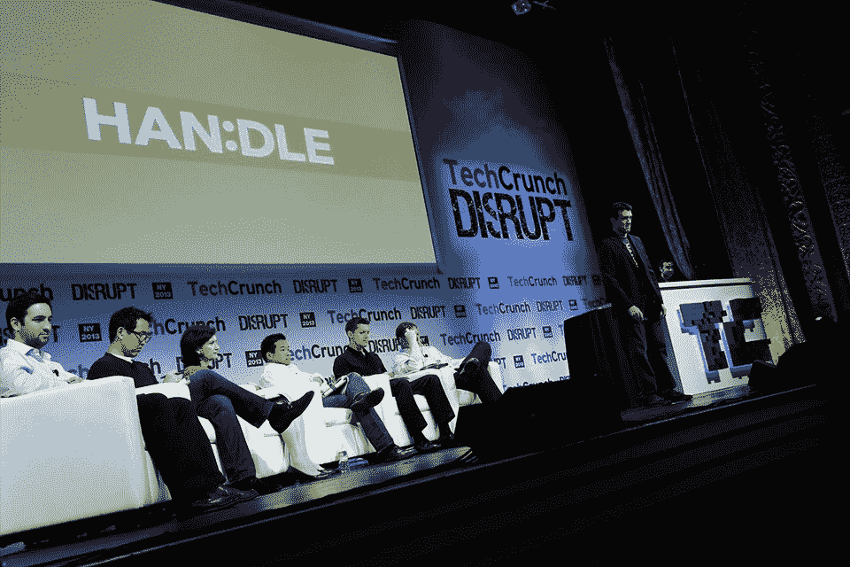

# TechCrunch Disrupt NY 2013 的获胜者是...谜！TechCrunch

> 原文：<https://web.archive.org/web/https://techcrunch.com/2013/05/01/and-the-winner-of-techcrunch-disrupt-ny-2013-is-enigma/>

女士们先生们，我们有一个赢家。

今年的 Disrupt NY 战地初创公司是我们迄今为止最强的公司之一，但在参与竞争的 30 家公司中，只有 7 家能够进入最后一轮。HealthyOut、Enigma、Floored、Glide、HAN:、SupplyShift 和 Zenefits 脱颖而出，成为我们的七名决赛选手，他们各自的团队面临着另一项挑战。

他们不得不再次走上舞台，面对评委们更加严格的审查，他们是红杉资本合伙人鲁洛夫·博塔、艾伦公司董事总经理南希·佩雷兹曼、SV Angel 管理合伙人李尚义、KPCB 合伙人钱启华、CrunchFund 合伙人(TechCrunch 创始人)迈克尔·阿灵顿和 TechCrunch 联合编辑埃里克·埃尔登。

我们的评委在曼哈顿中心的后台隐藏了很长一段时间，但他们最终选定了一家雄心勃勃的初创公司。

### 扰乱纽约战场赢家:谜

由 Marc DaCosta、Hicham Oudghiri、Jeremy Bronfmann 和 raphal Guilleminot 创建的 Enigma 是一项网络服务，允许其用户挖掘大量公开可用(但难以获得)的数据。该服务从超过 10 万个数据源中提取数据，但筛选所有这些信息的过程看似简单——快速搜索一个人的姓名和公司会出现多个可预览的信息表，进入并处理数据是经过深思熟虑的。

将 Enigma 视为公共数据的一种 Wolfram Alpha 会让您更加接近，但在寻找看似不同的数据点之间的联系时，Enigma 要聪明得多。迄今为止，Enigma 已经筹集了 145 万美元的种子资金，并与哈佛商学院、研究公司 Gerson Lehrman Group、S&P 资本智商公司和新成立的战略投资者纽约时报建立了合作关系。

你可以在这里阅读更多关于[谜](https://web.archive.org/web/20221224180408/https://techcrunch.com/2013/04/30/enigma-makes-unearthing-and-sifting-through-public-data-a-breeze/)

### 《谜》获奖后的后台采访

#### 亚军:手柄

由肖恩·卡罗兰(Shawn Carolan)和乔纳森·麦考伊(Jonathan McCoy)创立的 Handle (或韩:)是一款所谓的“优先引擎”，可作为网络应用和 iOS 应用提供，旨在提高用户的工作效率。应用程序是如何做到这一点的？通过将电子邮件客户端和任务管理器的功能合并到一个服务中。用户可以“分类”他们的电子邮件，并将其存档以备后用，但他们也可以创建任务并安排在某一天完成。

这款网络应用充满了超级用户快捷方式(按“A”键存档一封电子邮件，而“R”键打开一封回复)，再加上整体关注于形成一幅清晰的图片，说明在任何给定的日子里需要完成什么，这对于长期忙碌的人来说是一个潜在的强大工具。到目前为止，Handle 已经从 Menlo Ventures(Carolan 是该公司的董事总经理)那里筹集了 400 万美元。

你可以在这里阅读更多关于手柄[的内容。](https://web.archive.org/web/20221224180408/https://techcrunch.com/2013/04/29/handle-is-a-priority-engine-and-task-management-app-for-your-inbox/)