# 纽约初创公司在 TechCrunch Disrupt NY 2013 上大放异彩

> 原文：<https://web.archive.org/web/https://techcrunch.com/2013/05/01/new-york-startup-scene-shines-at-techcrunch-disrupt-ny-2013/>

香槟酒瓶是空的。创业公司正在打包。TechCrunch Disrupt NY 2013 是一个总结，这是一场精彩的表演。

Enigma 赢得了创业战场，赢得了 5 万美元和 Disrupt 杯。Ryan Lawler 的城市交通小组不知何故比 Josh Constine 与说唱天才的谈话更吵闹。阿什顿·库彻出现了，并再次证明了他作为硅谷风险投资家的价值。甚至还特别放映了亚历克斯·温特即将上映的关于 Napster 兴衰的电影《下载》。

只是不是破门而入的出席人数证明了这是迄今为止最好的扰乱。这个展览展示了最好的创业公司，最好的演讲者，都在纽约市美丽的曼哈顿中心。我知道我们在每次中断后都会这么说——毕竟，这是第八次中断展示——但这真的是迄今为止最好的展示。

他们说纽约是不夜城——过去五天里，成千上万的 Disrupt 参与者、志愿者和工作人员证明了这一点。

## 4 月 27 日星期六

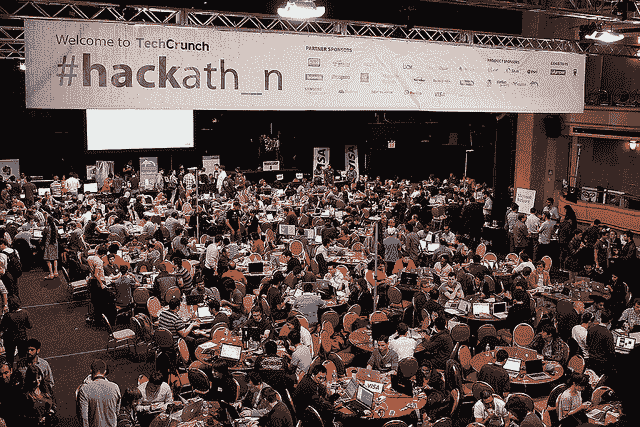

该节目于 4 月 27 日周六以黑客马拉松的形式正式开始。我们有创纪录的出席人数。一千多名黑客挤满了曼哈顿中心的底层，占据了该设施的每一寸可用空间，在接下来的 24 小时内敲打出他们的应用程序。Nerf 枪，能量口香糖和午夜躲避球会议让与会者继续下去。《漫步者》最终击败了 164 个其他项目，赢得了最高奖项。

## 4 月 29 日星期一

Disrupt NY 2013 以与 Chris Dixon 和 Eric Eldon 的炉边谈话开始，Andreessen Horowitz 的合伙人[解释了他对比特币初创公司](https://web.archive.org/web/20230120055805/https://techcrunch.com/2013/04/29/chris-dixon-plans-on-investing-in-more-bitcoin-startups-says-more-entrepreneurs-are-getting-involved/)的看法，以及 3D 打印如何[改变制造业](https://web.archive.org/web/20230120055805/https://techcrunch.com/2013/04/29/chris-dixon-3d-printing-will-transform-manufacturing-social-media-startups-are-facing-general-fatigue/)。

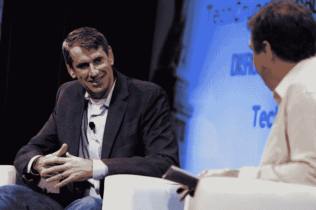

TechCrunch 创始人迈克尔·阿灵顿和 Benchmark 的比尔·格利一起上台谈论纽约市的创业公司。Gurley 还透露，他[认为优步比易贝发展得更快。这是一个相当令人震惊的说法，看看易贝在 1997 年投资 670 万美元后两年就身价 50 亿美元。](https://web.archive.org/web/20230120055805/https://techcrunch.com/2013/04/29/benchmarks-bill-gurley-uber-is-growing-faster-than-ebay-did/)

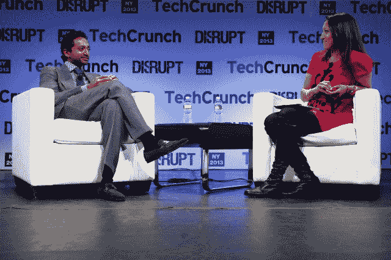

Disrupt NY 2013 的第一天并不完全是阳光灿烂。前脸书高管、投资公司 Social+Capital Partnership 的创始人查马斯·帕里哈皮蒂亚(Chamath Palihapitiya)解释说，科技世界应该“感到非常羞愧”，因为“就正在开始的事情而言，我们处于绝对最低水平。”是的，帕利哈皮提亚是这么认为的。

乔纳·佩雷蒂上台发表主旨演讲。他谈到了社交网络、T2 猫和 T3，并解释了为什么 T4 的性爱比谷歌上的耶稣更受欢迎。

当丹尼斯·克劳利上台时，他向 TechCrunch 的科琳·泰勒解释说 [Foursquare 的 API 目前没有得到充分利用](https://web.archive.org/web/20230120055805/https://techcrunch.com/2013/04/29/dennis-crowley-says-that-its-api-is-currently-underutilized-apps-using-its-location-data-are-smarter/)。他承诺，定位应用将变得更加智能。哦， [Foursquare 仍在增长](https://web.archive.org/web/20230120055805/https://techcrunch.com/2013/04/29/foursquare-ceo-dennis-crowley-all-our-numbers-are-up-20-30-each-month/)——至少 Crowley 是这么说的。

Jim Bankoff 的 Vox Media 推出了 Vox Creative ，从而加强了其广告游戏。据此，Bankoff 表示公司将在 2013 年实现盈利。

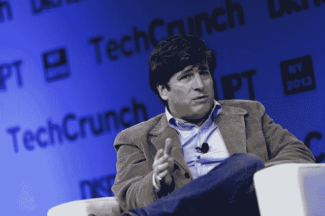

Betaworks 的 John Borthwick 与 TechCrunch 的 Alexia Tsotsis 一起登台，讨论了对 Instapaper 的收购，以及 Digg 即将推出的 RSS 阅读器——这款产品显然在谷歌杀死 reader 之前就已经在开发中了。

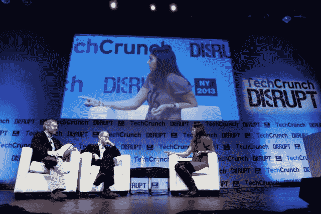

随着 Gilt 董事长凯文·瑞安和 10gen 创始人德怀特·梅里曼[在台上宣布](https://web.archive.org/web/20230120055805/https://techcrunch.com/2013/04/29/gilt-chairman-kevin-ryan-and-10gen-founder-dwight-merriman-could-launch-1-or-2-new-startups-by-september/)他们正在寻求在未来几个月推出一两家创业公司，大事情正在发生。

Flipboard 很大。[拥有 5600 万用户的](https://web.archive.org/web/20230120055805/https://techcrunch.com/2013/04/29/flipboard-now-at-56m-users-adding-6m-in-one-month-since-2-0-launch/)，首席执行官迈克·麦库埃向 TechCrunch 的埃里克·埃尔登解释说，他们的目标是让移动应用[成为移动出版商](https://web.archive.org/web/20230120055805/https://techcrunch.com/2013/04/29/mike-mccue-wants-flipboard-to-be-the-home-of-brand-advertising-for-mobile-publishers/)的品牌广告之家。

* * *

## 4 月 28 日星期二

这一天以著名的纽约风险投资家弗雷德·威尔逊和 TechCrunch 创始人迈克尔·阿灵顿的对话开始，后者最近也成为了一名风险投资家。两人谈论比特币，并与威尔逊交流风险投资的故事，告诉他如何向风险投资家推销。威尔逊恳求道:“把你的背景故事留在家里。阿林顿连忙点头表示同意。

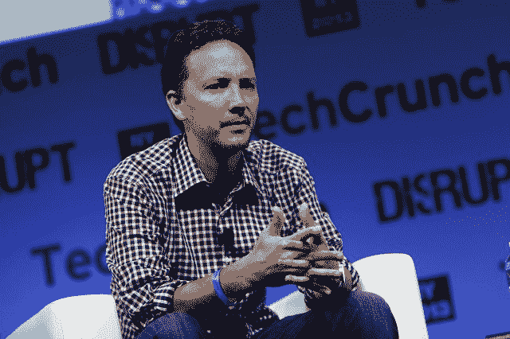

随后，麦克·阿伯特和邮箱公司首席执行官兼联合创始人 Gentry Underwood 一起上台。两人谈到了在扩展安德伍德热门的 iOS 电子邮件应用程序时令人惊讶的痛苦。工程师们花了几个星期每天 24 小时来满足最初的需求。然后 Dropbox 收购了这家公司。

谷歌的产品管理总监 Seth Sternberg 和产品经理 Ardan Arac 利用 Disrupt stage 宣布了 Google +的新功能。简单地说，Google +的可见性现在在谷歌搜索中被放大了。

易贝首席执行官约翰·多纳霍[向彭博首席内容编辑诺姆·皮尔斯汀解释了](https://web.archive.org/web/20230120055805/https://techcrunch.com/2013/04/30/how-ebay-ceo-john-donahoe-keeps-founders-from-leaving-after-acquisitions/)公司如何筛选其收购，以及他如何防止创始人在收购后离开——这是许多公司在收购初创公司后未能执行的一个技巧。

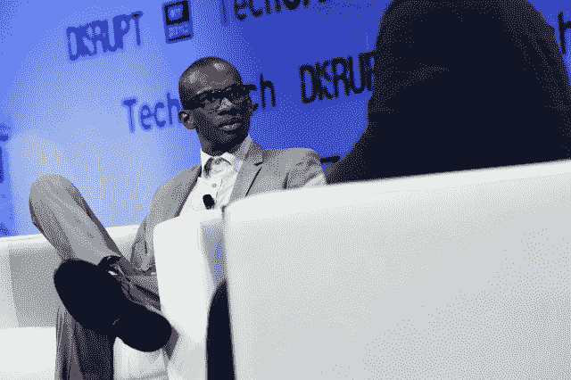

特洛伊·卡特正在从内部颠覆音乐产业。今天，他与 TechCrunch 的 Josh Constine 谈论了他管理 Lady Gaga 在线存在的秘密(她没有亲自使用脸书)，[名人在网上走极端](https://web.archive.org/web/20230120055805/https://techcrunch.com/2013/04/30/lady-gagas-manager-troy-carter-says-celebrities-cant-add-rocket-fuel-to-a-bad-product/)，以及为什么他认为[地面广播](https://web.archive.org/web/20230120055805/https://techcrunch.com/2013/04/30/troy-carter-says-the-next-technology-disruption-in-music-will-happen-in-terrestrial-radio/)将是下一个大破坏的发源地。

一个企业家应该在什么时候筹集资金，他们应该从谁那里筹集资金……嗯，他们应该从[筹集资金吗](https://web.archive.org/web/20230120055805/https://techcrunch.com/2013/04/30/just-because-its-easier-to-raise-vc-money-that-doesnt-mean-you-should/)？这些是 TechCrunch 的 Alexia Tsotsis 在一个小组中讨论的一些问题，其中包括来自麦克·阿伯特的 Kleiner Perkins cau field&Byers，红杉资本的 Aaref Hilaly，AngelList 的 Naval Ravikant 和 BoxGroup 的 David Tisch。

谷歌展示广告产品，尼尔·莫汉，脸书广告产品总监 Gokul Rajaram 和 Twitter 产品收入高级总监 Kevin Weil 上台谈论数字广告的现状——他们每个人对这个主题都有独特的观点。

在与 TechCrunch 的 Leena Rao 的聊天中，PayPal、Stripe 和 Gumroad 的代表就货币发表了[想法，这使得风投们清空他们的银行账户重新投资——比特币，这是 Disrupt NY 2013 上非常受欢迎的话题。](https://web.archive.org/web/20230120055805/https://techcrunch.com/2013/04/30/disrupt-digital-money-panel-on-bitcoin/)

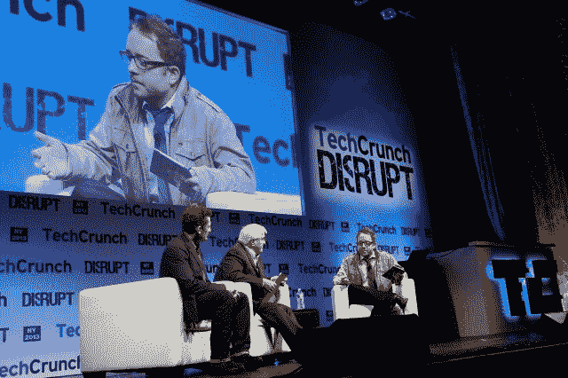

下午以连续投资者罗恩·康韦、电影制作人/演员亚历克斯·温特和 CrunchFund 的 MG 西格勒之间的谈话开始[，谈论关于 Napster 兴衰的纪录片《下载》。康威说，即使在 2013 年，互联网共享仍有待解决，这是整个事件中最令人失望的部分之一。](https://web.archive.org/web/20230120055805/https://techcrunch.com/2013/04/30/ron-conway-talks-napster-and-the-sharing-economy-problem-that-never-got-solved/)

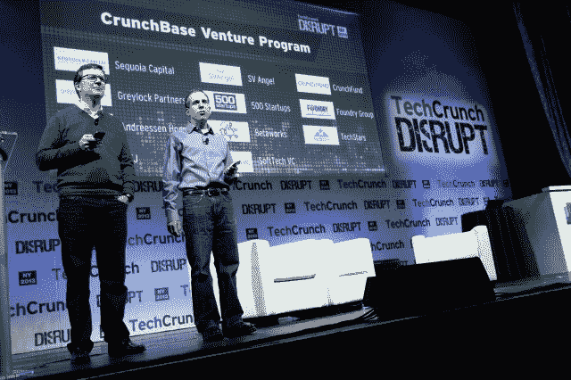

TechCrunch 的首席运营官·奈德·德斯蒙德和 CrunchBase 的马特·考夫曼利用 TechCrunch Disrupt stage 对 CrunchBase 进行了大规模扩展，这是 TechCrunch 自己强大的免费维基风格的个人、技术公司和投资者目录。CrunchBase Venture Program 的新功能是吸引那些希望改善 CrunchBase 数据集的风险公司。

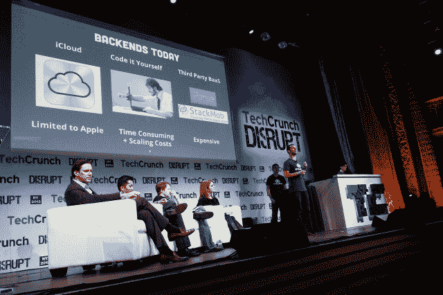

* * *

## 5 月 1 日星期三

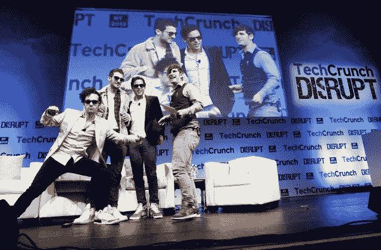

Disrupt 的最后一天开始于与 TechCrunch 的 Josh Constine 和 Rap Genius 的喧闹创始人的一次颇为不羁的谈话，Rap Genius 是一家合作注释初创公司，创始人[宣布舞台上的](https://web.archive.org/web/20230120055805/https://techcrunch.com/2013/05/01/rap-genius-co-founder-apologizes-to-zuck-then-says-theyll-be-bigger-than-facebook/)将比脸书更大。该网站还希望通过新闻天才[获得突发新闻。](https://web.archive.org/web/20230120055805/https://techcrunch.com/2013/05/01/rap-genius-news-genius/)

但是说唱天才并不是今天早上的亮点。当 [SideCar 的联合创始人](https://web.archive.org/web/20230120055805/https://techcrunch.com/2013/05/01/sidecar-defends-its-nyc-ride-sharing-business-says-tlc-protects-taxi-industry/)、 [Hailo 的首席执行官/创始人](https://web.archive.org/web/20230120055805/https://techcrunch.com/2013/05/01/on-demand-taxi-service-hailo-cleared-to-operate-in-new-york-city/)与纽约出租车和豪华轿车委员会(TLC)政策和项目副专员 Ashwini Chhabra 一起登台时，事情就发生了。TechCrunch 的瑞安·劳勒(Ryan Lawler)继续管理这群脾气暴躁的人。当[最终透露出](https://web.archive.org/web/20230120055805/https://techcrunch.com/2013/05/01/sidecar-sting-nyc/)纽约市刚刚在一次诱捕行动中对两个免费搭车的边车司机进行了处罚时，这个话题达到了顶峰。

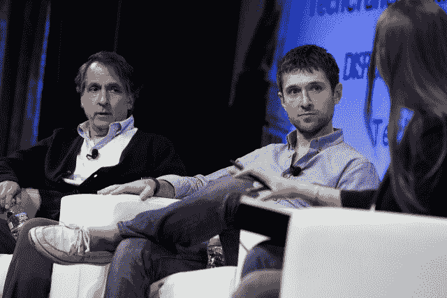

Ken 和 Ben Lerer 与 Caroline McCarthy 谈论了两人组在未来几周计划启动的从风险投资、创办媒体公司到 StopTheNRA.com 的所有 T2 业务。

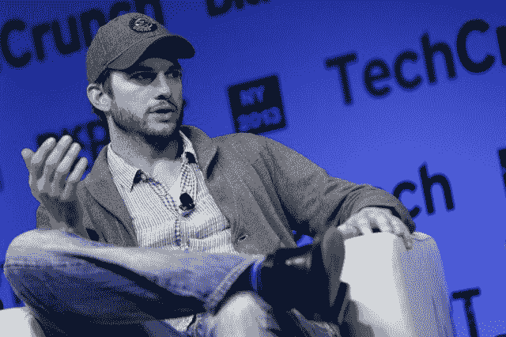

阿什顿·库彻在三年内第三次登上扰乱舞台。自从 2011 年在纽约 Disrupt 发表第一次演讲以来，他已经在硅谷取得了长足的进步，他的风险投资公司[正在以 1 亿美元的估值为](https://web.archive.org/web/20230120055805/https://techcrunch.com/2013/05/01/ashton-kuchers-a-grade-fund-raising-at-100-million-valuation/)融资。

Disrupt 并不完全是关于网络创业公司，而是 Hardware Alley 的硬件公司市场和 TechCrunch 与 Adafruit 的 Limor Fried 的谈话。这家总部位于纽约的初创公司正试图让学习编码和构建变得有趣起来。毛绒电子元件只是该公司秘方的一部分。弗里德还向约翰解释了为什么公司[把所有的生产都留在北美](https://web.archive.org/web/20230120055805/https://techcrunch.com/2013/05/01/limor-fried-explains-why-adafruit-industries-likes-manufacturing-in-north-america/)——她解释说，从长远来看，外包给中国并不总是更便宜。

随着 TechCrunch 创始人迈克尔·阿灵顿与著名的硅谷投资者罗恩·康韦、李尚义和布莱恩·波科尔尼的对话，下午的季节又开始了。包括阿灵顿在内的四位风险投资人详细讨论了 Chamath Palipitiya 周一的评论，即创业质量处于“历史最低点”。他们不同意。“[创新没有死](https://web.archive.org/web/20230120055805/https://techcrunch.com/2013/05/01/sv-angel-disagrees-with-chamath/)，”李尚义总结道。

电子商务初创公司 Warby Parker 的联合创始人戴夫·吉尔博(Dave Gilboa)可以说是“成功”的电子商务初创公司之一，他在一个下午的小组会议上分享了该初创公司早期[的一些故事，Everlane 的 Michael Preysman、Nasty Gal 的 Deborah Benton、Wanelo 的 Deena Varshavkaya 也参加了会议。该小组由 TechCrunch 的联合编辑 Alexia Tsotsis 主持。哦，还有](https://web.archive.org/web/20230120055805/https://techcrunch.com/2013/05/01/warby-parkers-dave-gilboa-on-selling-frames-from-his-apartment-partnerships-and-a-big-no-comment-on-those-google-glass-rumors/)[关于纽约热门创业公司](https://web.archive.org/web/20230120055805/https://techcrunch.com/2013/05/01/warby-parkers-dave-gilboa-on-selling-frames-from-his-apartment-partnerships-and-a-big-no-comment-on-those-google-glass-rumors/)和谷歌眼镜的那些传言？“无可奉告”是官方评论。

作为纽约市顶级初创公司之一，Tumblr 创始人戴维·卡普对他的城市有很多话要说。与他一起的还有红杉资本合伙人罗洛夫·博塔和 TechCrunch 创始人迈克尔·阿灵顿。简而言之，比起在硅谷，他更喜欢走在 T2 的街道上。

## 创业战场

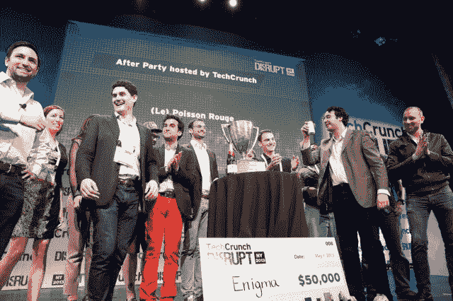

三十家创业公司登上了“颠覆战场”的舞台。七家最终被选为[决赛入围者](https://web.archive.org/web/20230120055805/https://techcrunch.com/2013/04/30/disrupt-ny-battlefield-2013/) : Enigma、Floored、Glide、Handle、HealthyOut、SupplyShift 和 Zenefits。

经过一个下午紧张的评审，Enigma 赢得了 50，000 美元，Disrupt 杯和 2013 年纽约 Disrupt 冠军头衔。恭喜你，谜。

* * *

今年纽约市出现了成群结队的扰乱纽约。超过 1，800 人参加，180 家公司在创业巷和硬件巷展出。1100 名编码人员和设计人员在短短 24 小时内就完成了 164 个项目。这真的是一次梦幻般的扰乱。

我们累了，纽约城。

但我们不会休息太久。TechCrunch 即将于 5 月 30 日在得克萨斯州奥斯汀举行[大型见面会和发布会。更多的活动将在整个夏天举行，直到 9 月的](https://web.archive.org/web/20230120055805/https://techcrunch.com/events/austin-meetup/)[Disrupt SF hits](https://web.archive.org/web/20230120055805/https://techcrunch.com/events/disrupt-sf-2013/)和 [Disrupt Europe: Berlin 2013](https://web.archive.org/web/20230120055805/https://techcrunch.com/events/disrupt-europe-berlin-2013/) 。

回头见。

