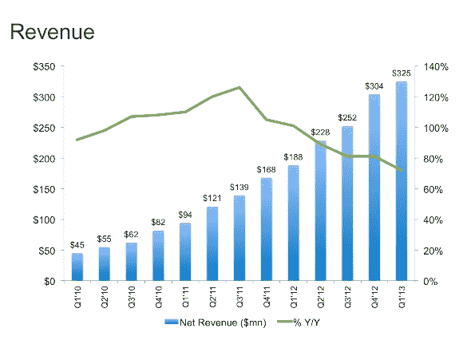
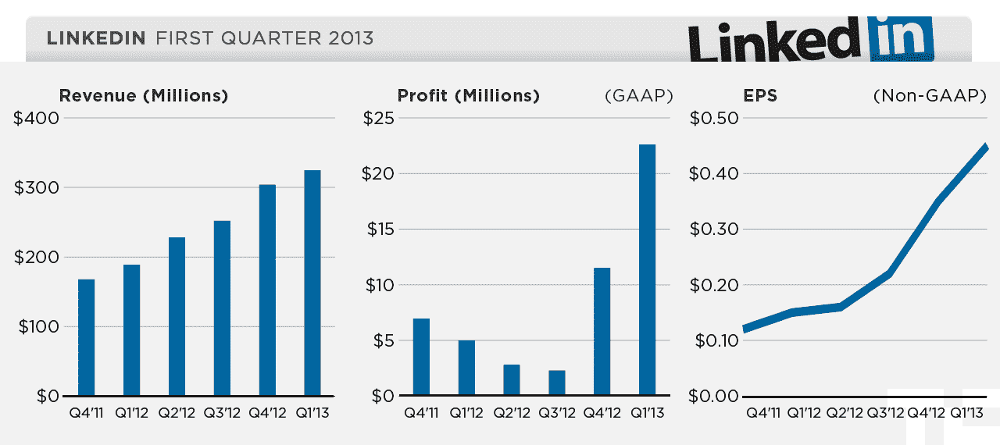

# LinkedIn 的股票因增长放缓而下跌 10%，尽管它的销售额为 3.247 亿美元，超过了 Q1 的估计；每股收益 0.45 美元 TechCrunch

> 原文：<https://web.archive.org/web/https://techcrunch.com/2013/05/02/linkedin-stock-dips-10-on-q2-forecast-of-slowing-growth-even-as-it-beats-q1-estimates-on-sales-of-324-7m-eps-0-45/>

# LinkedIn 的股票因增长放缓而下跌 10%，尽管它的销售额为 3.247 亿美元，超过了 Q1 的估计；每股 0.45 美元

[LinkedIn](https://web.archive.org/web/20221108045435/http://www.linkedin.com/) 刚刚[报告](https://web.archive.org/web/20221108045435/http://investors.linkedin.com/releasedetail.cfm?ReleaseID=761589) Q1 收益 3.247 亿美元，同比增长 72%，非 GAAP 每股收益 0.45 美元，均大大超过分析师(通过首次电话会议)估计的 3.17 亿美元和每股收益 0.31 美元；以及 LinkedIn 自己上个季度的指导意见，当时它预计收入在 3.05 亿美元至 3.1 亿美元之间。Q1 的净收入为 2260 万美元，比去年的 500 万美元大幅增长。然而，这家专注于工作的社交网络公司的股价在盘后交易中[下跌了近 11%](https://web.archive.org/web/20221108045435/https://www.google.com/finance?q=NYSE%3ALNKD&ei=N86CUdjEJaWE0QHFzQE) ，原因是有消息称下一季度不会那么乐观。

First Call 估计 Q2 的收入为 3.59 亿美元，但今天 LinkedIn 发布了一份指南，预计销售额为 3.42 亿至 3.47 亿美元。这比去年同期增长了 50%至 52%，是增长放缓的一个迹象。收益演示中的这张幻灯片说明了公司收入下降的所有情况:

该公司表示，它现在拥有 2.25 亿用户，高于上个季度的 2 亿。从过去几周的一些产品发布来看，LinkedIn 可能正在为如何在其他收入流和客户获取放缓的情况下更好地利用其长期用户奠定基础。新的发布包括升级，更多的媒体增强[简介](https://web.archive.org/web/20221108045435/https://beta.techcrunch.com/2013/05/01/linkedin-raises-your-profile-now-lets-you-add-photos-videos-powerpoints-and-comments-from-others/)；一个[联系人更新](https://web.archive.org/web/20221108045435/https://beta.techcrunch.com/2013/04/25/linkedin-turns-its-contacts-section-into-a-personal-assistant-with-google-yahoo-evernote-outlook-apps-integration-and-a-standalone-iphone-app/)添加更多“个人助理”生活组织功能；新的 [iPhone 和 Android 应用](https://web.archive.org/web/20221108045435/https://beta.techcrunch.com/2013/04/17/linkedin-updates-iphone-android-apps-with-a-personalized-activity-stream-better-navigation-and-their-first-ads/)；扩展的[搜索引擎](https://web.archive.org/web/20221108045435/https://beta.techcrunch.com/2013/03/25/linkedins-new-search-aims-for-more-engagement-with-autocomplete-unified-results-and-improved-alerts/)；[@在状态更新中提及](https://web.archive.org/web/20221108045435/https://beta.techcrunch.com/2013/04/04/linkedin-rolls-out-facebook-style-mentions-in-status-updates-and-home-page-comments/)； [Klout 式代言](https://web.archive.org/web/20221108045435/https://beta.techcrunch.com/2013/03/06/endorsements-linkedins-answer-to-klout-passes-1b-recommendations-and-builds-up-a-new-data-set/)；以及为该网站最忠实的垂直用户重新设计的招聘人员主页。

以下是该公司不同部门在过去一个季度的表现:

**人才解决方案**收入为 1.843 亿美元，比去年增长 80%。2013 年第一季度，人才解决方案收入占总收入的 57%，而去年为 54%。

**营销解决方案**收入为 7480 万美元，比 2012 年第一季度增长 56%。2013 年第一季度，营销解决方案收入下降了 2 个百分点，占总收入的 23%。

**高级订阅**产品收入为 6560 万美元，比 2012 年第一季度增长 73%。它仍然占 Q1 总收入的 20%。

美国仍然是该公司最大的市场，收入为 2.014 亿美元，占总收入的 62%。这与上一季度的比例相同，并且在过去几年中一直在下降。国际市场销售额为 1.233 亿美元。

LinkedIn 仍然有很大一部分销售额来自其“现场销售渠道”:1.84 亿美元，而在线销售额为 1.407 亿美元。涉及真人的现场销售对 LinkedIn 来说成本更高，因此随着增长放缓，该公司可能会在未来几个季度试图增加在线销售，以提高收益。

我们正准备听电话，并将从那里更新细节。

