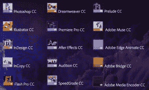
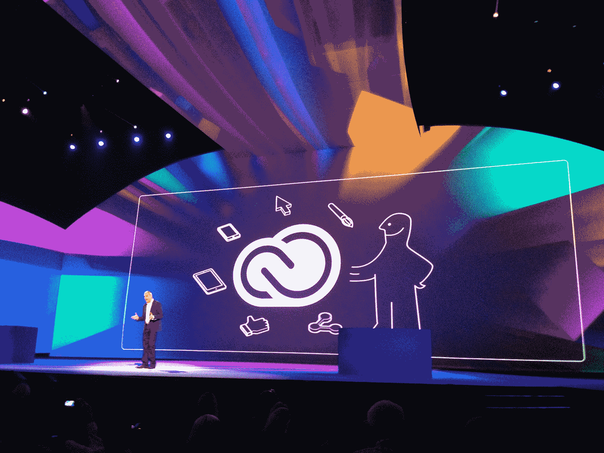

# Adobe 全力推出基于订阅的 Creative Cloud，将停止销售常规许可证

> 原文：<https://web.archive.org/web/https://techcrunch.com/2013/05/06/adobe-goes-all-in-with-subscription-based-creative-cloud-will-stop-selling-regular-cs-licenses-shrink-wrapped-boxes/>

Adobe 相信它的未来在于数字发行和订阅——它将把赌注押在这上面。正如 Adobe 今天在洛杉矶 [Max 大会上宣布的那样，它将把所有资源投入到开发创意云工具上。](https://web.archive.org/web/20230315095320/http://max.adobe.com/)

就在一年多前，Adobe [推出了 Creative Cloud](https://web.archive.org/web/20230315095320/https://techcrunch.com/2012/04/22/adobe-officially-unveils-cs6-and-its-49month-all-inclusive-creative-cloud-subscription-service/) ，这是一项为设计师、摄影师、摄像师、网络开发人员和音频专业人士提供所有工具的订阅服务。Adobe Creative cloud 和 creative suite 团队的负责人斯科特·莫里斯(Scott Morris)上周告诉我，这将是获得其工具的唯一途径。该公司目前将继续销售 CS6，但不清楚会持续多久。新的创意云应用将于 6 月 17 日推出。

大多数 Max 与会者可能期望 Adobe 今天展示 Creative Suite 7。相反，Creative Suite 的名字实际上正在消失，取而代之的是 Creative Cloud，它将不再有传统的版本号。当然，对于 Adobe 来说，这也意味着该公司正在转向一种新的商业模式，重点将直接放在订阅上，而不再是销售盒装软件、许可证和升级。

 自去年推出这项服务以来，Adobe 新增了 50 多万付费创意云用户和 200 万免费服务用户。正如 Adobe 的 David Wadhwani 在今天的主题演讲中指出的，毫无疑问，Creative Suite 是公司的正确方向。

正如斯科特·莫里斯告诉我的那样，该公司对 Creative Cloud 的成功感到惊讶，并决定不要试图继续使用不同版本的应用程序，如 Photoshop、Dreamweaver 和 premiere pro——一个用于 Creative Cloud，可以持续升级，另一个用于 Creative Suite 的下一版本——更有意义的是专注于使用 Creative Cloud 作为其工具的分发机制。

莫里斯告诉我，制作这些不同的版本分散了我的注意力，这一举措将“赋予 Adobe 专注的能力”，并使其工程师的生活更轻松。他认为，这种变化将使公司更具创新性，并比以前更快地向客户提供新功能。

该公司没有计划发布任何新版本的 Creative Suite，但 Adobe 将确保每个 CS6 应用程序都可以在下一版本的 OS X 和 Windows 上运行。它还将提供常见的错误修复和安全补丁，但不会给工具添加任何新功能。

对于 Adobe 来说，这显然是有点冒险的一步，莫里斯在我们的讨论中承认了这一点。他指出，大多数用户可能都希望 Adobe 在未来几年发布这样的声明——然而，今天发布这样的声明可能会有点令人震惊。他告诉我，是什么让他和 Adobe 团队的其他人相信这将是可行的，因为几乎每个订阅了 Creative Cloud 的人都喜欢它。它甚至在 Adobe 的在线商店中获得了比 Photoshop 更高的评级，“这几乎是闻所未闻的，”莫里斯告诉我。

莫里斯还承认，将会有客户无法切换到 Creative Cloud，在很大程度上，这是因为在线组件，如 Behance 社区和云存储功能。例如，政府机构不希望使用(或不被允许使用)，学校不希望学生将他们的作品公开发布到 Behance，一些企业客户也不希望使用这些功能。对他们来说，Adobe 已经创建了特殊许可和 Creative Cloud 版本，仍然使用在线分发机制，但不包括这些客户会反对的功能。

为了让目前的用户更容易过渡，Adobe 将允许目前拥有 CS3 许可证的所有人在有限的时间内每月支付 29.95 美元订阅 Creative Cloud。它还将为刚刚购买 Photoshop 等独立产品的用户提供类似的降价。

