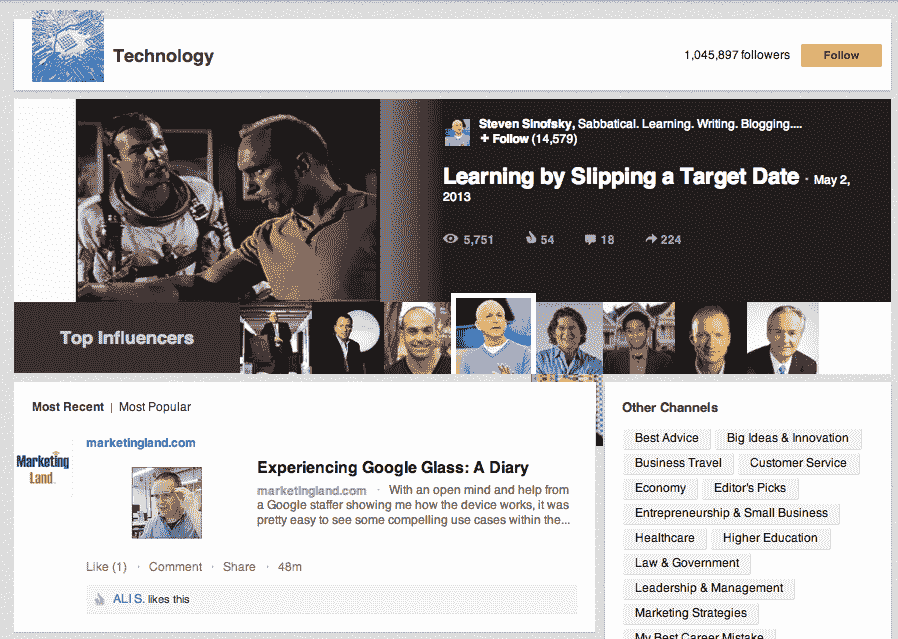

# 寻求更高粘性的 LinkedIn 在 LinkedIn Today TechCrunch 上增加了精选内容频道

> 原文：<https://web.archive.org/web/https://techcrunch.com/2013/05/07/linkedin-on-the-lookout-for-more-stickiness-adds-curated-content-channels-on-linkedin-today/>

LinkedIn ，现在拥有 2 . 25 亿用户，继续为其网站引入更多的功能，以吸引人们回到网站并停留更长时间。今天轮到了社交新闻页面 [LinkedIn Today](https://web.archive.org/web/20221007033939/http://www.linkedin.com/today) ，它有了一个叫做[频道](https://web.archive.org/web/20221007033939/http://www.linkedin.com/today/channels?trk=tod3-top-nav-filter)的新功能。Channels 从今天开始面向英语用户推出。LinkedIn 表示，它计划在周三正式宣布这项服务。**更新** : [下面是](https://web.archive.org/web/20221007033939/http://blog.linkedin.com/2013/05/08/refreshed-linkedin-today-discover-content-with-channels/)正式公告。

频道汇集了围绕技术、营销策略、零售和医疗保健等一般主题的精选内容——总共 20 个，不久将增加更多——每个频道都将新闻来源的热门帖子与特定主题中被认为有影响力的精选人物(LinkedIn 的“影响者”列表)的帖子相结合。

频道将取代“行业”，这一功能自 2011 年 LinkedIn 首次推出 LinkedIn Today 以来就一直存在。行业在覆盖内容方面更加具体(例如，互联网而不是技术)，也针对 LinkedIn 上的趋势新闻，特别是你的联系人。

另一方面，频道试图变得更跨学科，更少新闻性。它利用了这样一种想法，即对“社交媒体”感兴趣的人不是社交媒体专业人士，他们将 LinkedIn 用作学习资源，而不仅仅是新闻来源。

“我们认为频道更好地代表了专业人士在 LinkedIn 上讨论和分享的内容和话题，这些内容和话题超越了特定的行业，”发言人朱莉·井上说。"像企业家精神和你的职业生涯这样的话题不仅仅适用于一个行业."

这也让 LinkedIn 于 2012 年 10 月推出的 250 多名影响者的精选[名单更有价值，他们的帖子也进入了渠道组合。](https://web.archive.org/web/20221007033939/http://www.linkedin.com/today/influencers?trk=tod3-top-nav-filter)

随着时间的推移，这可能还包括添加多媒体，如使用 SlideShare 的演示等。这也有可能为其他种类的添加敞开大门。虽然 LinkedIn 还没有说它将在哪里使用它在收购 Pulse news 聚合应用程序时获得的技术/服务，但你可以看到 LinkedIn 今天的频道部分是一个可以成为自然之家的地方。(另一个，我已经在[之前指出过](https://web.archive.org/web/20221007033939/https://beta.techcrunch.com/2013/04/17/linkedin-updates-iphone-android-apps-with-a-personalized-activity-stream-better-navigation-and-their-first-ads/)，是在一个改进的 LinkedIn iPad 和其他原生平板电脑应用程序中，它没有像 iPhone 和 Android 应用程序那样在几周前同时升级。)

产品经理 Kevin Gu 指出，新频道将带来的其他新功能包括能够在自己的主页上看到频道的更新；能够根据最新新闻或最受欢迎的功能对内容进行分类；以及某一天影响最大的帖子。除此之外，用户还将看到频道进入他们的 LinkedIn 电子邮件摘要，其中现在将包括影响者帖子、趋势专业新闻以及 Slideshare 内容。

当然，所有这些都回到了 LinkedIn 如何为其长期增长战略塑造自己。上周的[季度收益](https://web.archive.org/web/20221007033939/https://beta.techcrunch.com/2013/05/02/linkedin-stock-dips-10-on-q2-forecast-of-slowing-growth-even-as-it-beats-q1-estimates-on-sales-of-324-7m-eps-0-45/)显示 LinkedIn 仍然超过销售目标和收益预期，但该公司的股票仍然因收入增长放缓的证据而受到打击。

从这个意义上来说，如今增强 LinkedIn 的举措更多的是为了改善用户在网站上的停留时间。在网站上花费更多时间可能会对广告产生积极影响，广告是该公司未来的一个重要收入来源——这是脸书和 Twitter 等公司遵循的模式，它们也采取措施推出让用户在页面上逗留更长时间的功能。相反，LinkedIn 已经证实，渠道和影响者目前本身并不是获得收入的直接途径。

“我们的影响者在 LinkedIn 上分享他们的独特见解没有得到补偿，我们目前没有计划将我们的渠道页面或我们的影响者平台货币化，”井上说。

在过去的几个月里，LinkedIn 引入了许多变化。它们包括升级的、媒体增强的[简介](https://web.archive.org/web/20221007033939/https://beta.techcrunch.com/2013/05/01/linkedin-raises-your-profile-now-lets-you-add-photos-videos-powerpoints-and-comments-from-others/)；一个[联系人更新](https://web.archive.org/web/20221007033939/https://beta.techcrunch.com/2013/04/25/linkedin-turns-its-contacts-section-into-a-personal-assistant-with-google-yahoo-evernote-outlook-apps-integration-and-a-standalone-iphone-app/)添加更多“个人助理”生活组织功能；新的 [iPhone 和 Android 应用](https://web.archive.org/web/20221007033939/https://beta.techcrunch.com/2013/04/17/linkedin-updates-iphone-android-apps-with-a-personalized-activity-stream-better-navigation-and-their-first-ads/)；扩展的[搜索引擎](https://web.archive.org/web/20221007033939/https://beta.techcrunch.com/2013/03/25/linkedins-new-search-aims-for-more-engagement-with-autocomplete-unified-results-and-improved-alerts/)；[@在状态更新中提及](https://web.archive.org/web/20221007033939/https://beta.techcrunch.com/2013/04/04/linkedin-rolls-out-facebook-style-mentions-in-status-updates-and-home-page-comments/)； [Klout 式代言](https://web.archive.org/web/20221007033939/https://beta.techcrunch.com/2013/03/06/endorsements-linkedins-answer-to-klout-passes-1b-recommendations-and-builds-up-a-new-data-set/)；以及为该网站最忠实的垂直用户重新设计的招聘人员主页。与许多其他增强功能一样，如今的 LinkedIn 及其新的频道功能提供了更流畅的外观和更多的功能。