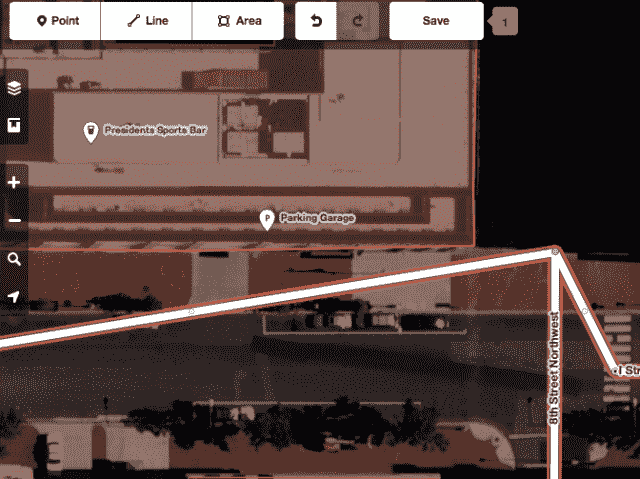
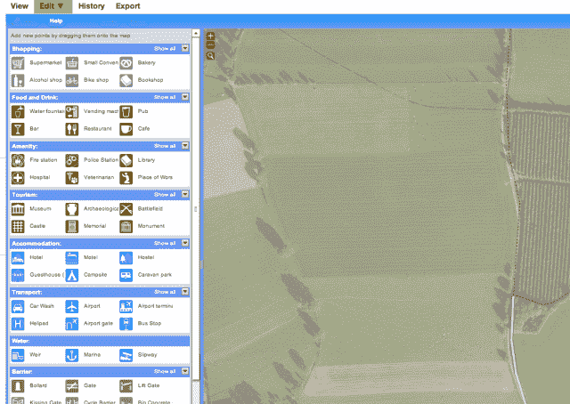

# OpenStreetMap 将推出新的“iD”编辑器 TechCrunch，与谷歌地图一较高下

> 原文：<https://web.archive.org/web/https://techcrunch.com/2013/05/07/openstreetmap-to-give-google-maps-a-run-for-its-money-by-launching-its-new-id-editor/>

# OpenStreetMap 将推出新的“iD”编辑器，与谷歌地图一较高下

谷歌已经成为地图之王[,因为它在过去八年中开发了技术](https://web.archive.org/web/20230215190843/https://techcrunch.com/2013/03/08/inside-google-street-view-from-larry-pages-car-to-the-depths-of-the-grand-canyon/)。竞争对手之一， [OpenStreetMap](https://web.archive.org/web/20230215190843/https://techcrunch.com/2013/04/29/openstreetmap-makes-it-easier-to-suggest-corrections-new-html5-based-editor-coming-later-this-year/) ，已经开发了自己的工具，并建立了一个地图爱好者社区，现在为 Hipmunk、Evernote 和 Foursquare 等服务提供支持。今天，正如承诺的那样，这个非营利组织发布了一个全新的地图编辑器，代号为“iD”，由[的 MapBox](https://web.archive.org/web/20230215190843/https://techcrunch.com/2013/04/24/satellite-imagery-company-skybox-teams-with-mapbox-for-analysis-and-annotation-of-data/) 从头开始构建。

编辑器将允许其社区，以及那些以前从未编辑过地图的人，绘制出道路、地标以及其间的一切。在过去的几周里，我有机会和编辑一起玩，这太棒了。谷歌有自己的社区工具，被称为地图制作工具，帮助他们进入世界上还没有到达的角落和缝隙。

现在 [OpenStreetMap](https://web.archive.org/web/20230215190843/http://www.openstreetmap.org/) 有了自己的一套工具，使地图编辑变得容易，我希望该服务能够提高其地图的质量，使其成为寻找服务提供商的应用程序和服务的真正替代选择。以下是 OpenStreetMap 美国基金会秘书 Alex Barth 对编辑器发布的评论:

> 从今天开始，100 万社区地图绘制者可以访问这个新编辑器。它从根本上缩短了现有用户和 OpenStreetMap 每天新增的 2000 名用户的学习曲线。像这样投资于核心基础设施是 OpenStreetMap 的一个游戏规则改变者，传统的专有数据公司将无法跟上顶级编辑体验和开放许可数据库的结合。简而言之，我们将让更多的人更快地添加更多的数据。

在现有地图中添加和更改道路就像拖放一样简单，使用 iD:

编辑器本身是开源的，用纯 JavaScript 和 d3 可视化库构建。由于 MapBox 一直在开发这个工具，它已经得到了世界各地编码人员的参与:

[维梅奥·http://www.vimeo.com/62308979 w = 600]

下面的编辑工具是 OpenStreetMap 社区使用的工具，但并不容易掌握:

MapBox 首席执行官埃里克·贡德森认为，iD 编辑器将启动社区，从而产生更多内容:“这个编辑器非常容易使用，任何人都可以在几分钟内开始绘制地图。这将提高 OpenStreetMap 的数据质量和数量，这意味着 MapBox 将拥有世界上最好的地图。”

“世界上最好的地图”意味着它在质量和广度上都超越了谷歌。这是一个不小的壮举，但是我们已经看到开源产品在过去达到了数百万个…问问 WordPress 就知道了。

[图片来源: [Flickr](https://web.archive.org/web/20230215190843/http://www.flickr.com/photos/fsse-info/2792355658/)