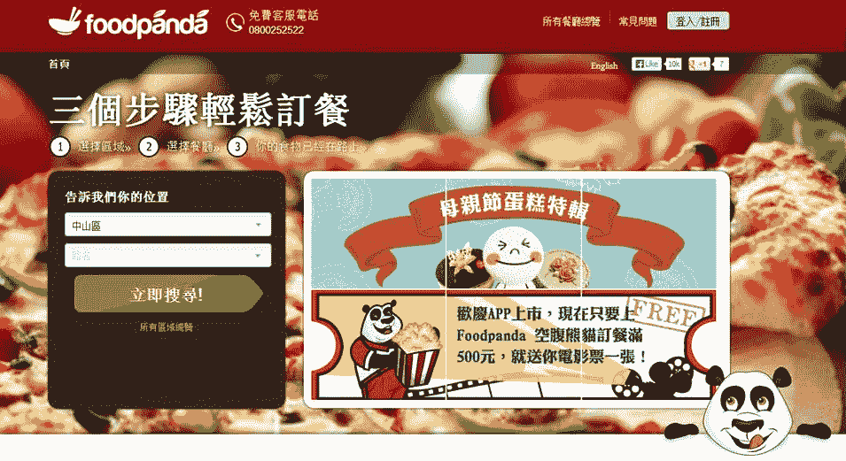

# 火箭互联网支持的 FoodPanda 筹集了 2000 多万美元，为其送餐雄心的下一个目标做准备 TechCrunch

> 原文：<https://web.archive.org/web/https://techcrunch.com/2013/05/07/rocket-internet-backed-foodpanda-raises-26m-as-it-prepares-for-the-next-course-in-its-food-delivery-ambitions/>

送餐大战继续升温:今天 [foodpanda](https://web.archive.org/web/20230201122830/http://www.foodpanda.com/) ，火箭互联网孵化的初创公司，提供一站式服务，从精选的餐馆和外卖店订购食物并送到你家门口，现在与全球约 15，000 家餐馆合作，今天宣布获得超过 2000 万美元的资金，参与投资的有火箭常规 [AB Kinnevik](https://web.archive.org/web/20230201122830/http://www.kinnevik.se/en/) ，俄罗斯的 Phenomen Ventures 以及火箭互联网本身。这不仅是 foodpanda 报道的第一轮投资，而且看起来可能是 Phenomen 对一家火箭互联网公司的第一次公开投资；风投们[曾支持过](https://web.archive.org/web/20230201122830/http://www.crunchbase.com/financial-organization/phenomen-ventures-fund)其他电子商务企业，如 Fab、Hailo 和 OneTwoTrip，以及 YC 孵化的视频公司 Virool。

在 Foodpanda 获得融资之前，欧洲其他提供类似服务的初创公司也获得了大量融资。其中包括《送货员英雄》的 5000 万美元和《T2》的 6400 万美元。融资竞赛是一个迹象，表明在这个有很多跟风玩家的市场中，获得临界质量和相对于竞争对手的技术优势将是长期生存和利润的关键。

由 Samwer 兄弟创立的 Rocket Internet 多年来已经成为欧洲最大的电子商务孵化器之一，易贝和 Groupon 等公司的退出引人注目。但最近，萨姆威兄弟已经将自己的地盘设在新兴市场，并在那里挖掘机会。在这方面，foodpanda 也不例外。包括其子品牌 hellofood 在内，该公司目前活跃在 27 个市场——事实上，只有新兴市场，重点是东欧、亚洲、拉丁美洲和非洲部分地区。总名单是印度，印度尼西亚，马来西亚，巴基斯坦，新加坡，台湾，泰国，越南，加纳，科特迪瓦，肯尼亚，摩洛哥，塞内加尔，尼日利亚，俄罗斯，阿根廷，巴西，智利，哥伦比亚，墨西哥，秘鲁，匈牙利，委内瑞拉，波兰，乌克兰，罗马尼亚和沙特阿拉伯。

全球董事总经理拉尔夫·文泽尔表示，这笔资金不仅将用于扩展到更多国家，还将用于在那些已经开展业务的城市扩大业务。“我们确实已经覆盖了某些城市，但其中一件事是扩展到新的城市。例如，在俄罗斯，我们在三个城市有很好的覆盖，但现在我们希望增加到 17 个，”他在接受采访时说，并补充说，其他国家也在日程上。“我们正在更多的东欧和亚洲国家开展业务。我们仍然会看到很多对我们来说非常有趣的市场。”Foodpanda 声称，在它开展业务的许多国家，它现在是“市场领导者”。

在技术投资的问题上，Rocket Internet 的一个有趣卖点是，它的公司可以如何利用投资组合中的一些其他资产来帮助自己的增长。文泽尔指出，在 foodpanda 的案例中，这可能会在客户服务和物流等领域发挥作用——使用一些相同的团队和后端系统，这些团队和后端系统正在时装和其他商品等领域的其他电子商务运营中推广。另一个原因可能是食品的付款方式。在新兴市场工作，支付卡的渗透率不是特别高，所以 foodpanda 正试图找到帮助人们支付食物的替代方式，这些方式可能比简单的货到付款更安全。

“接受付款对我们来说是一个重要的话题，顾客如何为送到他们面前的食物付款，”他说。“我们希望找到无需太多开销就能从餐馆收取费用的方法，我们还希望为此提供最佳的用户体验。我们已经开始引入在线支付，这也是我们将利用投资的一个领域。我们和 Payleven(火箭的 Square 竞争对手)也有很好的协同作用。虽然还没有决定什么，但肯定有很大的潜力。幸运的是，我们看到了支付选择的增长。”

文泽尔说，虽然 foodpanda 的佣金结构并不透明——它因城市而异，取决于交易是与连锁店还是独立的——但他确实注意到了一些新兴的流行类别。他说，在俄罗斯，大多数人点寿司；而在非洲国家，最受欢迎的菜肴是墨西哥菜，在拉丁美洲是印度菜。