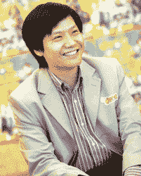

# 着眼于今年 45 亿美元的销售额，手机制造商小米希望效仿有 340 年历史的中国医药公司 TechCrunch

> 原文：<https://web.archive.org/web/https://techcrunch.com/2013/05/09/eyeing-4-5b-in-sales-this-year-phone-maker-xiaomi-looks-to-emulate-a-340-year-old-chinese-medicine-company/>

偶像崇拜谁？

作为安卓手机和操作系统制造商小米的首席执行官，雷军可以说是中国科技创业的代表，他是亚马逊收购的 Joyo.cn 和最近 IPO 的 YY 等公司的长期天使投资人和连续创业者。

他被称为“中国的史蒂夫·乔布斯”，因为小米是一家集成硬件和软件的制造商，改变了安卓系统以适应中国人的口味。他们以材料成本或略高于材料成本的价格销售高端安卓手机，并通过配件以及最终的软件和服务获利。虽然中国一直以低端硬件制造商闻名，但小米正在推动一种理念，即世界一流的产品可以在中国制造和设计。

该公司有自己的粉丝可以证明这一点。在推出他们的第一款设备两年后，小米[计划今年销售 1500 万台设备](https://web.archive.org/web/20221209024056/https://beta.techcrunch.com/2013/03/11/xiaomi-expects-to-double-sales-to-15-million-handsets-this-year/)，为公司带来 45 亿美元的收入。去年，他们售出了 700 万部手机。他们网站上批量销售的 20 万到 30 万部手机经常售罄——有时不到一小时。

雷军

但小米也有难以置信的高期望要实现；该公司的估值不仅基于原始硬件销售，还基于小米最终将能够利用软件服务赚钱的想法——在竞争激烈的中国市场上，小米尚未证明这一点。

三年前创办这家公司时，君思考了中国商业和创业的历史，以寻找榜样。

“中国什么样的公司能持续一个世纪？”他在本周的 GMIC 会议上问道。

他说，他最终看中了两家公司:一家有 340 年历史的传统中药企业同仁堂和火锅连锁店海底捞。

他说，同仁堂的使命教会了他两件事——永远不要为了成本而生产质量较低的产品，永远不要不遗余力地创造质量最好的产品。

海底捞，确实是一家很好吃的火锅连锁店(是的，我尝过)，教会了他客服的价值。在另一次采访中，联合创始人兼总裁林斌建议我点菜单上没有的菜，甚至称赞餐厅的餐具。

“他们非常非常认真地对待客户的反馈，总是给你一个惊喜，”宾说。

在某种程度上，君对中国盛行的商业文化颇有微词。“中国的诚信存在很大问题，”他说。“人们卖猪，但你不吃猪肉，”他在台上补充道，暗指最近的健康恐慌，老鼠肉被标为羊肉。

##### 吸引粉丝

与这种对高质量零部件的关注相结合的是一种营销模式，这种模式对全球任何手机制造商来说都是不寻常的。

去年，小米通过其在线商店直接销售了 72%的手机，绕过了与实体零售商打交道的昂贵物流难题。目前，他们有两种型号:一种零售价为 1999 元人民币(326 美元)，一种更基本的型号售价为 1499 元人民币(245 美元)。

他们能做到这一点，是因为该公司培养了一种独特的参与式手机设计模式。该公司每周都会发布一个新版本的定制 Android 体验:miUI。

在他们的数百万客户中，有几十万“铁杆”粉丝拆卸手机，仔细检查每一个规格，并提供如何更换手机的建议。

“中国消费者实际上非常挑剔，他们不仅比较手机的构造、外观和感觉，还比较手机内部的一切 CPU、内存、速度、规格，”宾说。“他们非常清楚自己为这些手机支付的费用。”

军使用中国公共社交网络平台微博征求意见，并与小米粉丝交流。微博有时会被比作 Twitter。他根据用户反馈提供了不同级别的硬盘存储。他说，在一名记者的要求下，他们甚至添加了一个录音应用程序。

“我们共同开发手机，”君在另一次采访中说。“在过去的几年里，我已经使用了 70 多部手机。我有很多建议，但是他们会换手机吗？甚至诺基亚？很可能不是。所以我创建了一个模型，邀请我所有的粉丝参与设计这款手机。对他们来说，这是最令人兴奋的事情之一。”

他表示，这是小米营销支出低于同行的一个关键原因。

“如果你在小米手机里发明了一个功能，你会告诉你的同学朋友你发明了一个功能吗？很可能你会的。”

他们的方法符合一个正在推动全球硬件复兴的大趋势:在资本密集型制造流程之前，通过社交媒体感受产品市场适合度的能力——无论是通过 Twitter、微博还是 Kickstarter 活动。

通过这些反馈以及小米自己的内部工程师和设计师，miUI 包括了对标准 Android 风格的改进。Jun 表示，他们已经调整了应用程序在后台的运行方式，这样小米手机可以长达六七天不充电。(我一直带着一部老款小米手机，每次都能用几天，不像我的 iPhone，每天都要充电。)坦白地说，也有许多类似苹果的用户界面。

##### 软件的利润和作为一个保护护城河

尽管小米在将自己定位为不仅仅是一家商品硬件制造商方面做得很好，但它的下一个挑战将是证明它可以通过软件和服务赚钱。由于小米以材料成本或接近材料成本销售手机，它将依靠配件和服务来提高利润率。

君不愿透露小米本质上更像是一家软件还是硬件公司(这个问题也困扰着苹果的分析师)。

“我们把自己定位为铁人三项运动员，”君说。“我们做软件、硬件和互联网服务，所以如果你会问这三者哪一部分更强，我的回答是:你会问一个铁人三项运动员他们最擅长跑步、游泳还是骑自行车吗？”

他们分享了一些显示吸引力的虚荣统计数据，尽管很难理解它们的意思。小米的应用程序商店每天有 350 万次应用程序下载，每天有 350 万张照片上传到云服务，累计上传了 20 亿条消息。其即时通讯应用 MiTalk 远远落后于腾讯的微信，微信是今年另一个重要的中国科技故事，拥有 1.9 亿活跃用户。

不过，有一些有希望的指标。宾表示，小米的用户在移动网络上的活跃程度是其他制造商的两倍。这种参与可能会给游戏和电子商务带来有趣的收入机会，尽管该公司拒绝透露具体细节。

小米的另外两个增长领域是国际市场和其他类型的硬件。该公司正在向大中华区——或台湾和香港——扩张。宾不愿意谈论更多的国际市场，他说公司只是想首先在这两个领域证明自己。

存在独特的挑战。首先，这些市场更多地依赖于西方常见的补贴模式，在西方，运营商通过后付费计划降低定价。在中国，许多消费者预先支付手机的全部费用。他们也不知道这种大量吸引核心粉丝的营销模式是否会在 mainland China 之外奏效。

另一个增长领域是小米的新机顶盒。这是一个艰难的开始，机顶盒的最初销售受到中国电视内容监管规定的阻碍。但他们两个月前重新开业了。宾和君拒绝透露迄今为止的销售数据，只是说君在易贝和淘宝上看到过售价 90 美元(大约是标价 299 元人民币的两倍)的二手模特。

宾不愿意分享太多目标，因为他声称小米内部甚至没有那么多目标。甚至达到 1500 万部手机的目标也是生产那么多，不一定要卖出那么多(尽管它们总是会卖光)。

“我们没有任何 KPI(关键绩效指标)——甚至内部也没有，”宾说。“我们的关键绩效指标是让每个能在线下单并全额付款的人都能拿到手机。”