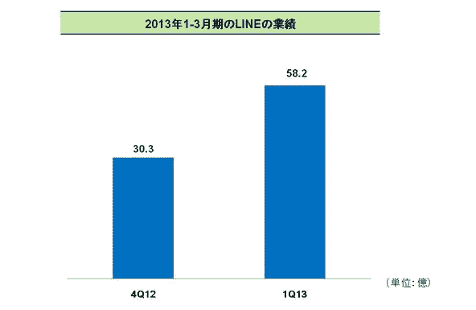

# Line 报告称，Q1 2013 年收入为 5890 万美元:一半来自游戏应用内购买，30%来自贴纸，80%来自日本| TechCrunch

> 原文：<https://web.archive.org/web/https://techcrunch.com/2013/05/09/line-reports-q1-2013-earnings-of-58-9m-half-from-game-in-app-purchases-30-from-stickers-80-from-japan/>

# Line 报告称，Q1 2013 年收入为 5890 万美元:一半来自游戏应用内购买，30%来自贴纸，80%来自日本

由 [Line Corporation](https://web.archive.org/web/20230328043748/http://linecorp.com/) ( [之前由 NHN Japan Corp](https://web.archive.org/web/20230328043748/http://linecorp.com/press/2013/0401472) 运营的免费即时通讯应用 [Line](https://web.archive.org/web/20230328043748/https://techcrunch.com/2013/03/17/line-the-social-entertainment-platform/) ，最近[在全球拥有 1.5 亿用户](https://web.archive.org/web/20230328043748/https://techcrunch.com/2013/05/01/line-150m-users/)，已经宣布了 2013 年 Q1 的[收益——首次披露了其收入有多少来自游戏内购，有多少来自其他亮点:贴纸。Line 利用免费的社交信息和游戏服务吸引用户，并通过可以在其应用程序中购买的娱乐附加服务来实现其产品的货币化。](https://web.archive.org/web/20230328043748/http://linecorp.com/press/2013/0509552)

根据 Q1 的调查结果，Line 的绝大部分收入来自日本——这是其应用首次在日本推出的地方。Q1 58.2 亿日圆(合 5890 万美元)的收入中，约 80%来自日本。它还指出，2012 年第四季度，其 Q1 总收入增长了 92%:

将收入按内容类型划分，游戏应用内购买约占 Q1 收入的一半(50%)，而付费贴纸(Line 提供一些免费贴纸)约占三分之一(30%)。

Line 还透露，它现在在日本、泰国和台湾拥有 24 款“种子游戏”——或可以从其主要消息应用程序中下载的游戏——191 种贴纸和 92 个官方账户(针对名人和品牌)。

该公司指出，从现在开始，它将定期报告收益，并表示将增加新类型的应用内娱乐内容，其中提到购物和音乐是两个重点领域。

它还表示，计划加强其应用在亚洲、西班牙和南美的营销，但有趣的是，它没有提到美国 Line 于 1 月份在美国推出的。

亚洲显然仍是 Line 的主要市场，但该地区存在大量的信息差异和竞争。例如，中国 WhatsApp 的竞争对手微信——由[腾讯](https://web.archive.org/web/20230328043748/http://www.crunchbase.com/company/tencent)制造——现已[超过 1.9 亿月活跃用户](https://web.archive.org/web/20230328043748/http://www.thechinaperspective.com/articles/chinacorporaten-10135/)。