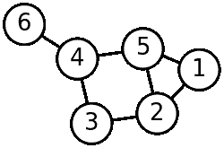

# GraphLab 为消费者推荐服务中使用的数据分析筹集了 675 万美元

> 原文：<https://web.archive.org/web/https://techcrunch.com/2013/05/14/graphlab-raises-6-75m-for-data-analysis-tool-used-for-consumer-recommendation-services/>

# GraphLab 为消费者推荐服务中使用的数据分析筹集了 675 万美元

[开源分布式数据库 GraphLab](https://web.archive.org/web/20230310181955/http://graphlab.com/) 从 Madrona Venture Group 和 NEA 获得了 675 万美元，用于其用于为推荐引擎分析数据图的机器学习技术。

五年前在卡内基梅隆大学开发的开源数据分析平台采用半结构化数据，描述了人、网络流量、产品购买和其他数据之间的关系。然后，它分析这些数据，为服务提供在线推荐。

 图形数据库，类似于 Graphlab，随着更多的数据需要相互关联以更好地理解其含义，其使用已经增加。 [Wikiepdia](https://web.archive.org/web/20230310181955/http://en.wikipedia.org/wiki/Graph_theory) 在图论的背景下描述图形数据库。它应用数学结构来“模拟对象之间的成对关系”。在这种情况下，图由顶点或节点以及连接它们的线(称为边)组成。”

将数十亿个节点和线路联系起来的能力构成了推荐的基础。

Carlos Guestrin 博士是 GraphLab 的首席执行官。他是华盛顿大学机器学习的亚马逊教授，在卡内基梅隆大学开发了这项技术。他说graph lab 的灵活性和更好的机器学习能力使其优于其他数据分析工具，如开源机器学习技术[【Mahout](https://web.archive.org/web/20230310181955/http://mahout.apache.org/)。

GraphLab 已经在市场上获得采用。许多消费者服务使用它来推动数百万次交易。潘多拉和沃尔玛实验室被称为该技术的用户。

(图片由维基百科提供)