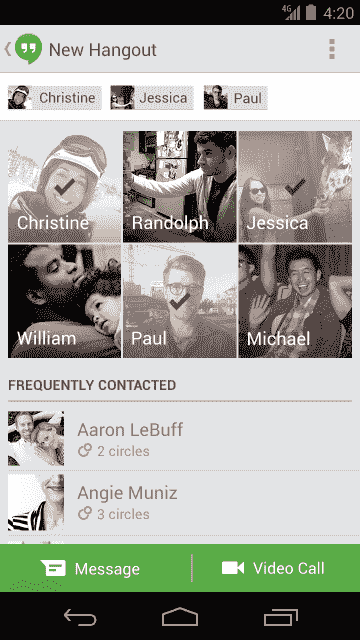

# 谷歌将 Gmail 和 G+ Chat 合并为“Hangouts ”,这是一款跨平台的文本和群组视频消息应用 TechCrunch

> 原文：<https://web.archive.org/web/https://techcrunch.com/2013/05/15/google-hangouts-messaging-app/>

今天在 I/O 大会上，谷歌将“Hangouts”重新命名为一个新的统一的跨平台消息系统。它允许人们在 Hangouts 的 Android 和 iOS 应用程序之间发送文本、照片和群组视频消息，以及 Gmail 和 Google+网站集成。Hangouts 今天推出，取代 Google Talk [GChat]和 G+ Messenger。虽然它还不支持短信，但它可能会挑战脸书的短信和苹果的 iMessage。

一年多来，来自 [GigaOm](https://web.archive.org/web/20221224062804/http://gigaom.com/2012/06/27/google-to-merge-hangouts-talk-messenger/) 、 [Droid Life](https://web.archive.org/web/20221224062804/http://www.droid-life.com/2013/04/09/google-babel-news-google-voice-support-eventually-coming-synced-notifications-first-class-ios-experience/) 和其他人的传言表明，谷歌将对其分散的消息服务进行[大统一](https://web.archive.org/web/20221224062804/https://techcrunch.com/2012/07/02/message-war/)。今天，谷歌将提供新的免费 iOS 和 Android Hangout 应用程序，即 Google+集成，你可以通过点击 Gmail 聊天列表中的照片从 Google Talk 升级到 Hangouts。目前没有像 Windows Phone 或黑莓这样的其他平台的计划。

谷歌的维克·冈多特拉在今天的旧金山 I/O 大会上说，“技术应该让出道路，这样你才能生活、学习和热爱。”操作系统和设备应该无关紧要。你只想和你关心的人说话。这就是[改版](https://web.archive.org/web/20221224062804/http://www.google.com/+/learnmore/hangouts/)的目的。它将人类和对话带到了最前沿。

### Hangouts 是信息厨房水槽

#### 存在、圈子和交付

让我们仔细看看 Hangouts 提供的功能。在场，或者知道朋友们什么时候有空聊天，是一个很大的焦点。您可以看到朋友何时在聊天，他们是否正在打字，以及他们是否看到了您的信息[也称为已读回执]。使用 Google+ Circles，你可以选择特定的朋友或整个群组开始聊天。

Hangouts 会小心翼翼地将你的信息发送到你的朋友正在使用的任何网络界面或移动应用程序。如果您离线，Hangouts 将会保存您的信息，直到您返回。与 Google Talk 不同，它不会在您离线时每次收到消息时都向您发送电子邮件。只有当你不在的时候，有人开始与你交谈，它才会通过电子邮件向你发送 pings 命令。Hangouts 不会在不同的平台上向你发送重复的通知，如果你需要一些安静的时间，你可以暂停所有的通知。

这个想法是，当你在平台之间移动时，你可以开始、停止和重新开始对话，你可以跨桌面、Android 和 iOS 设备与朋友聊天。

#### 文本、表情符号、照片和视频

当然，你可以发送简单的短信，但 Hangouts 的亮点在于生动的多媒体通信。为了给你的文字增添趣味，你可以添加 850 个手绘表情符号中的任何一个。您可以在 Hangouts 中发送照片，这些照片会保存到 Google+相册中，您和您的对话伙伴可以在以后查看、编辑和共享。事实上，您可以随时返回并查看您的照片和信息历史记录，或者您可以关闭历史记录，这样您的派单就不会被保存。

Hangouts 皇冠上的宝石是它的同名视频聊天。您可以同时与多达 10 个朋友面对面交谈。当您进行视频聊天时，您将在一个大窗口中看到谁在说话，而您的其他聊天伙伴则显示在下方的互动程序中。当你打电话给朋友时，他们的聚会将会响起，如果他们错过了数字聚会，他们将会得到通知。

但是 Hangouts 视频不仅仅是一个群体互动时间。谷歌添加了一堆花里胡哨的东西。您可以添加视觉和声音效果，或者使用特殊的 Hangouts 应用程序。所以如果你想戴一顶虚拟的海盗帽或者放一些烟花，你可以。你可以在一起大笑的同时与朋友同时观看 YouTube 视频，并截图以捕捉精彩瞬间。

#### 还没有短信

Hangouts 缺少的最大功能是向没有安装 Hangouts 应用程序的朋友发送和接收短信。这意味着聚会并不是真正普遍的。它的几个竞争对手允许它，包括苹果的 iMessage 和脸书的 Android 版 Messenger(但不支持 iOS 版)。

因此，如果你想把妈妈拉到一个常去的地方，你可能需要用你的手机给她发一条标准的短信，告诉她安装 Hangouts 应用程序。这可能是一个巨大的绊脚石。然而，谷歌告诉我们，短信支持是 Hangouts 测试人员要求最多的功能之一，所以如果它在未来的更新中出现，我不会感到惊讶。

奇怪的是，谷歌告诉我们，在一些国家，功能手机用户，而不是智能手机用户，可以通过短信参与 Hangouts。这应该有助于它接触到发展中国家的更多人，发展中国家是即时通讯应用增长的核心地区。

其他缺失的功能包括语音消息或 VoIP，但你可以只使用视频通话而不看屏幕，以近似语音通话。YouTube 上也没有空中广播的视频。

### 为什么谷歌需要统一消息

最近，随着 WhatsApp 和 Line 等独立消息应用与苹果、脸书和谷歌竞争私人通信，消息领域已经成为了的战场。每个人都想成为短信的高科技继承者。

对谷歌来说，短信可以创造大量的参与和盈利选择。当然，谷歌可以通过在某个地方植入广告，或者出售视频聊天的特效和文本贴纸，直接将视频网站货币化。

Gmail 中更强大的跨平台聊天体验可能会增加用户在 Gmail 上的停留时间，谷歌已经在 Gmail 上显示了广告。这也可能最终给人们一个使用 Google+的真正理由。

不过，最重要的是，Hangouts 可以让谷歌更人性化。仍然被视为一家搜索和广告公司，当人们想要社交时，他们不会首先考虑它。Hangouts 利用谷歌所有强大的技术来拉近人们的距离。