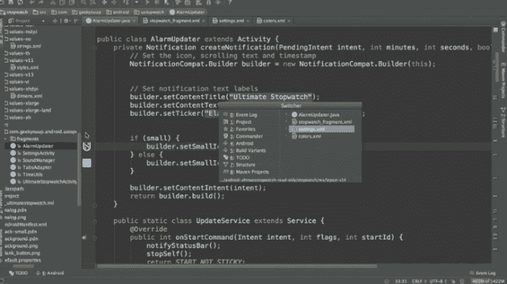
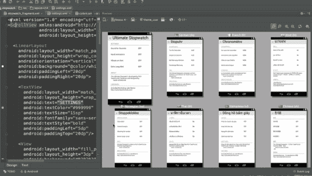
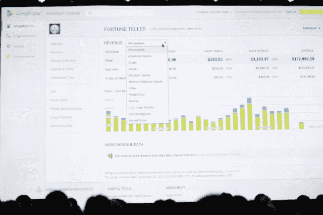
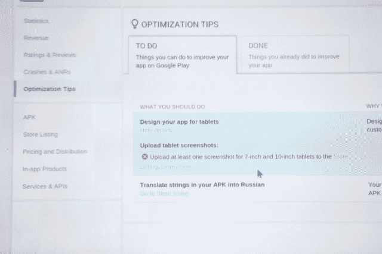

# 谷歌推出 Android Studio 和面向开发者控制台的新功能，包括测试版和分阶段推出 TechCrunch

> 原文：<https://web.archive.org/web/https://techcrunch.com/2013/05/15/google-launches-android-studio-a-development-tool-for-apps/>

# 谷歌推出 Android Studio 和开发者控制台的新功能，包括测试版和分阶段推出

今天，在谷歌的 I/O 开发者大会期间，该公司宣布了一组面向应用开发者的工具，包括一个名为 Android Studio 的新开发者套件。这是一个基于 IntelliJ 的 IDE。

这是一个受欢迎的声明，当屏幕截图出现在舞台上时，人群“哦”和“啊”了起来。

这个工具为 Android 开发提供了更多的选择，使开发过程更快，效率更高。显示了一个“实时布局”,在您实时编辑时呈现您的应用程序。

【T2

此外，你可以切换到不同的布局和屏幕尺寸，如 3.7 英寸的手机和 10 英寸的平板电脑。该团队指出，这可能对国际化很有用，让你可以快速看到东西是什么样子，而不必打包你的应用程序并将其安装在设备上。

该公司表示，它对 Android Studio 有“大计划”。

### 开发人员控制台更新和测试版/分阶段推出

在工作室宣布之后，帮助开发者把他们的应用拿到测试者手中的新功能也宣布了。这在以前并不容易，但现在控制台允许您管理测试用户和分阶段的展示过程。

谷歌产品经理 Ellie Powers 分享了这些新功能，包括赚钱的方法。控制台现在会有优化提示，比如翻译帮助。app 翻译服务让你直接在开发者控制台获得专业翻译；只需选择俄语——它将显示不同翻译供应商的列表，然后谷歌将扮演中间人。您的结果将在控制台内交付。

你可以投资一项活动，通过新的推荐跟踪来推广你的应用。它会告诉你安装来自哪里，让你跟踪每个推荐渠道的有效性，然后从用户第一次在设备上打开应用程序开始，应用程序会发生什么。这些使用指标也将显示在控制台中。

