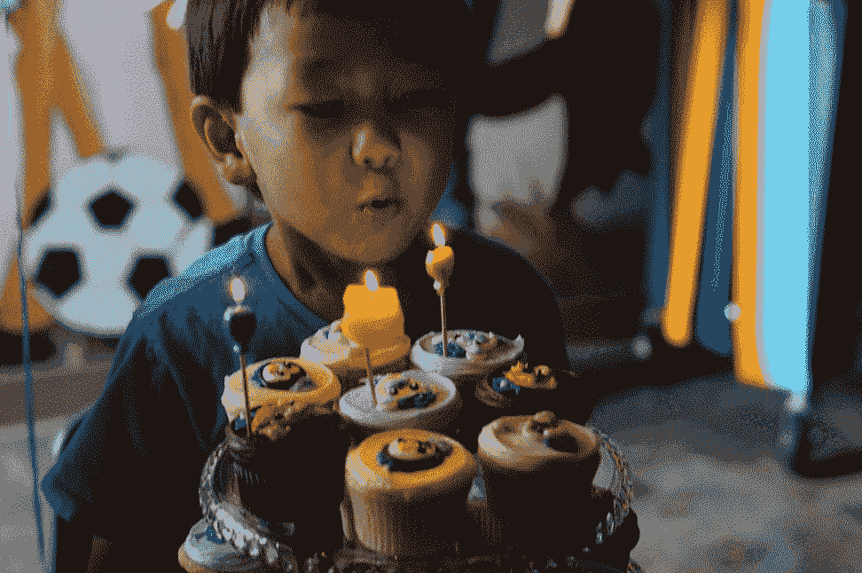
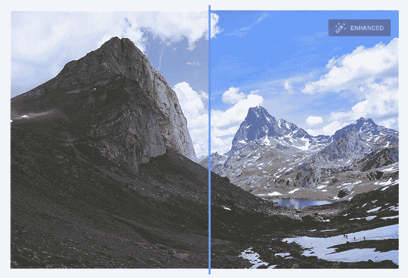
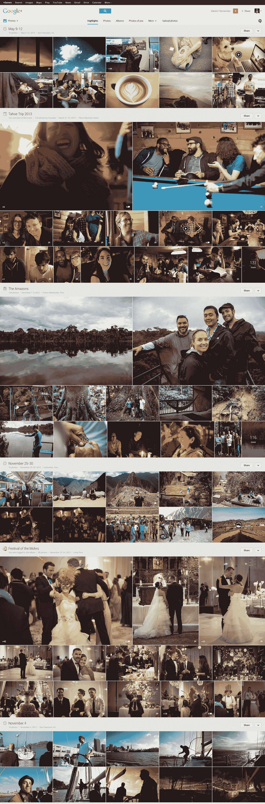

# Google+ Photos 现在可以自动创建动画 gif、全景图、HDR 图像和更好的集体照

> 原文：<https://web.archive.org/web/https://techcrunch.com/2013/05/15/google-photos-can-now-automatically-create-animated-gifs-panoramas-hdr-images-and-better-group-shots/>

照片一直是 Google+体验的中心，在今天的 I/O 大会上，谷歌宣布了对 [Google+ Photos](https://web.archive.org/web/20230303153320/https://plus.google.com/+google/photos) 的重大更新，该更新现在利用了该公司去年 9 月[收购 Nik Software](https://web.archive.org/web/20230303153320/https://techcrunch.com/2012/09/17/google-acquires-nik-software-the-company-behind-the-popular-snapseed-photo-editing-app-for-ios/) 时获得的许多工具。这次更新的重点是直接自动化许多照片编辑和分享过程。例如，Google+现在可以自动增强图像中的色调分布，软化皮肤，锐化图像的某些部分并消除噪声——所有这些计算都在云中进行。

正如谷歌的维克·冈多特拉在活动前告诉我们的那样(今天又重申了一遍)，“你不是拍照，而是创造。”他指出，用户花费数千美元使照片变得更好，但摄影仍然是劳动密集型的，组织照片通常仍然是一件麻烦事。“这需要时间，大多数人都没有时间，”冈多拉说。但是如果谷歌的数据中心可以成为你的暗室呢？

那么，如果谷歌可以自动修复你的图像，选择最好的，并自动突出显示它们，会怎么样呢？这是该公司今天推出的另一项新功能。该系统现在可以分析您的图像，剔除模糊的照片、重复的照片和曝光不良的图像(它将尝试修复这些图像)。例如，它还可以识别具有特定地标的优秀图像，检测人脸，查看人们是否在微笑和/或这些人是否在你的 Google+圈子中。它还会尝试基于美学做出一些决定。冈多特拉说，过去需要几个小时的工作，现在在云中自动完成，只需几秒钟。

利用所有这些，该系统可以使绿色植物流行，软化肤色，清理水的颜色，并自动应用局部增强对比度和其他功能。还能自动去红眼。当然，用户也可以单独应用所有这些增强功能。

当然，原始图像总是保持不变，用户可以轻松地在增强版和原始图像之间来回切换。

现在谷歌为每个人提供 15GB 的免费存储空间，用户也可以上传价值 15GB 的全尺寸图片到 Google+ Photos。此外，自动备份功能为 2048 像素以下的照片提供了无限的存储空间。

## 汽车真棒

在当今这个动画 gif 的时代，Google+团队也决定加入这场游戏——但有所改变。该系统显然被称为“Awesome”，它可以自动检测图像何时是一系列图像的一部分，并将其拼接成一幅图像或一个动画 GIF。“如果我们检测到你在连拍模式或其他模式下拍摄了一系列照片，我们可以将它们拼接在一起，”冈多特拉告诉我们。为了识别这些图像，系统会做一些分析，以确保背景没有移动。

然而，这不仅仅是关于动画 gif。这项被谷歌称为“auto awesome”的新功能还可以从一系列照片中自动创建一张集体照，并选择一张每个人都在微笑的照片。它可以将风景照片拼接在一起，以创建全景图，并从一系列检测到括号内曝光的照片中创建 HDR 图像。由于谷歌数据中心的强大力量，所有这一切都发生得非常快。

所有这些功能今天都将上线，谷歌已经在 Google+中为你现有的所有照片创建了“令人惊叹”的图片。

