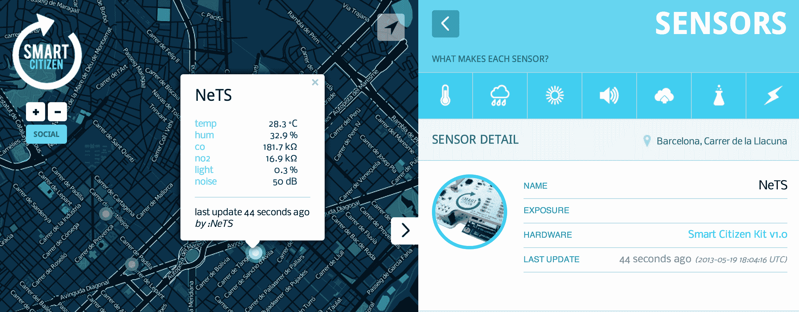

# Acrobotics 希望通过其智能市民环境传感器 TechCrunch 启动智能城市

> 原文：<https://web.archive.org/web/https://techcrunch.com/2013/05/19/acrobotics-wants-to-kickstart-smarter-cities-with-its-smart-citizen-environment-sensors/>

# Acrobotics 希望通过其智能市民环境传感器启动智能城市

关于让我们的城市变得“更智能”的概念有很多讨论，也就是说，给城市装上传感器和数据驱动的服务，以提高效率和生活质量。见鬼，就连谷歌也开始在自己的活动场地[安装大量传感器](https://web.archive.org/web/20221208075019/https://beta.techcrunch.com/2013/05/13/at-io-google-will-be-tracking-things-like-nose-level-and-air-quality-with-hundreds-of-arduino-based-sensors/)。

外面的大部分讨论都在讨论地方政府如何努力实现这个崇高而模糊的目标，但一个名为“机器人产业”的团队正试图将责任推给市民。为此，该团队在 Kickstarter 上发起了一项价值 5 万美元的活动，用于一种名为[智能公民套件](https://web.archive.org/web/20221208075019/http://www.kickstarter.com/projects/acrobotic/the-smart-citizen-kit-crowdsourced-environmental-m)的小型传感器阵列，希望人们开始收集并与世界分享他们的环境数据。

“目前的城市建设方式存在问题，”Acrobotic 的首席运营官·弗朗西斯科·萨巴拉告诉我。“北京的空气质量非常糟糕——我们认为洛杉矶的空气质量也很糟糕——而且不会有任何改善。

智能公民项目的心脏(或者大脑，我猜)是一个由 Arduino 驱动的套件，它被藏在用户家中(或者外面，如果你有合适的外壳)，以跟踪当地的环境变量——比如温度、湿度、空气成分、环境亮度和声音水平。当你不在家时，可以说它足够整洁，可以随时监控你家的环境条件，但这里的真正价值是当一群用户设置他们的智能公民传感器并一起启动它们时。

该团队希望智能公民套件能够广泛销售，普通人能够以比你通过启动天气频道应用程序更精细的粒度准确地了解环境状况。不管怎样，萨巴拉承认，智能公民项目主要是为了让人们意识到气候变化和全球变暖，而不会对此产生太多的政治或分歧。

“我相信气候正在变得更糟，但我们的方法更个人化，”萨巴拉说。“通过提高意识，我们正在努力找到一个解决方案，而不是敲打人们的脑袋。”

碰巧的是，一些聪明的公民工具包已经启动了。快速浏览一下传感器跟踪网站的演示版本，就会发现一些小东西正在萨巴拉的本土巴塞罗那运行 Smart Citizen 团队运行了一个更早、更本地化的众筹活动(萨巴拉称之为“概念验证运行”)，看到西班牙的一些用户在城市各处安装并启动了他们的传感器阵列。将鼠标悬停在一个亮蓝色的点上会显示最新的环境数据(用户可以定义他们希望这些更新发生的频率)，而灰色的单元最近没有启动。

由于智能公民工具包的构造方式，用户最终将能够监测的不仅仅是这个早期工具包支持的环境标准。萨巴拉说，Acrobotics 团队目前正在研究可交换子板，这将使智能公民工具包也可以用于土壤和水测试——非常适合城市居民的园丁。如果你突然渴望更敏锐地监控你的周围，你可以花 155 美元声称自己是一个完全构建的智能公民——你们中更方便的人可以通过购买 105 美元的未组装套件来节省一点钱。