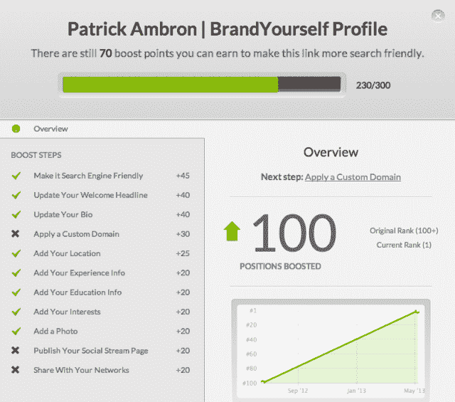

# BrandYourself 通过提供全方位服务的礼宾功能升级其在线信誉工具 TechCrunch

> 原文：<https://web.archive.org/web/https://techcrunch.com/2013/05/19/brandyourself-concierge/>

# BrandYourself 升级其在线信誉工具，提供全方位服务的礼宾服务

随着新版服务的推出，BrandYourself 正在努力与在线声誉市场(尤其是 reputation)中的大牌展开较量。

T2 公司最初是作为一个相当简单的自助工具来提高你在网上的形象，比如创建一个网站和其他内容，当有人在谷歌上搜索你的名字时，就可以消除不良结果。(随着时间的推移，T4 越来越关注谷歌的搜索结果。)基本服务是免费的，但 BrandYourself 每月收取 10 美元的附加功能和使用费用。

凭借 BrandYourself 的免费增值自助服务产品，它似乎服务于与 Reputation.com 不同的受众，但现在这家较新的初创公司正以直接的方式挑战其更老牌的竞争对手。通过最近推出的礼宾服务，用户不仅可以看到一份改善谷歌搜索结果的待办事项清单，他们还可以付钱给 BrandYourself 团队成员，与他们一起制定策略，并实际为他们做工作。因此，如果你没有时间创建和维护你自己的个人网站，BrandYourself 会为你创建和维护一个。联合创始人兼首席执行官 Patrick Ambron 表示，Reputation.com 每月的费用高达数千美元，而 BrandYourself 的礼宾服务费用仅为 200 美元或 300 美元。

为什么价格差异如此之大？安布朗坚持说，这并不是因为 BrandYourself 提供了质量较低、价格较低的作品——他给我看了一个为 BrandYourself 客户创建的网站，它看起来确实像一个真正的个人页面。相比之下，他给我看了一些内容，他说这些内容是通过他在 Reputation.com 的账户创建的，基本上只是一个空模板。(我给 Reputation.com 发了电子邮件，讨论该公司如何看待自己与 BrandYourself 的竞争，但我没有收到回复。)

安布朗说，最大的区别在于，现有的在线声誉服务是建立在高收购成本和低保留率的模式基础上的——它们支付大量广告费用来吸引客户，而这些客户不会逗留很长时间，所以这些公司必须收取高费用。另一方面，BrandYourself 可以将其免费工具视为其付费版本和礼宾服务的营销渠道。此外，Ambron 表示，由于价格较低，客户可以持续使用 BrandYourself。

“我们真的在努力修复网络声誉空间，”他说。"直到它只适用于富人，而且众所周知效果不佳."

除了礼宾服务之外，BrandYourself 还推出了一个新的界面，让提交你想在谷歌搜索结果中推广的链接变得更加容易。还有一个新的报告卡，显示用户 BrandYourself 对他们当前搜索结果的评分，他们在这项服务上取得的进展，以及实际上谁在访问你的 BrandYourself 网站的详细信息。

该公司表示，已有超过 20 万人使用过该软件。它还筹集了超过 150 万美元的资金，现在总部设在纽约市。