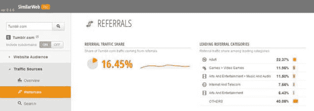
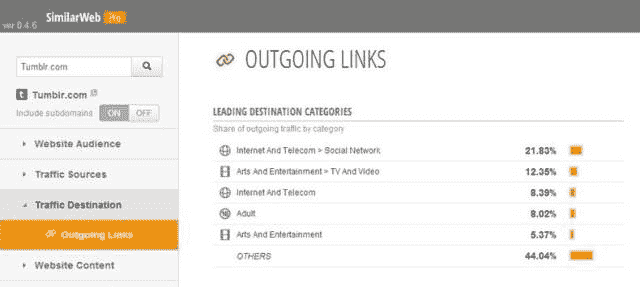

# Tumblr 的成人费用占网站前 20 万域名的 11.4%，成人网站是推荐的主要类别| TechCrunch

> 原文：<https://web.archive.org/web/https://techcrunch.com/2013/05/20/tumblrs-adult-fare-accounts-for-11-4-of-sites-top-200k-domains-tumblrs-adult-fare-accounts-for-11-4-of-sites-top-200k-domains-adults-sites-are-leading-category-of-referrals/>

Tumblr 有多少是色情内容，雅虎打算对此做些什么？关于后者，雅虎首席执行官玛丽莎·梅耶尔(Marissa Mayer)在今天上午早些时候的电话会议上谈到了解决不“品牌安全”内容的计划，称雅虎需要“重新定位的良好工具”，并将“以有品位的方式赚钱”但对于前者，它往往是一个黑箱——根本没有公开可用的数据。

然而，现在，我们可能有了一些答案。根据对 Tumblr 的 20 万个访问量最大的域名的分析，其中 22775 个是成人域名，占 11.4%。这项分析是由网络测量公司 [SimilarGroup](https://web.archive.org/web/20230326023937/http://www.similarweb.com/) 进行的，这家公司[在今年早些时候筹集了](https://web.archive.org/web/20230326023937/https://techcrunch.com/2013/01/29/similargroup-raises-2-5-million-to-take-on-alexas-often-terrible-web-rankings-with-its-new-similarweb-service/)250 万美元，旨在与 Alexa 在网络排名上的大本营竞争。

这家测量公司分析了这些成人子域名的访问量，发现 16.6%的 Tumblr 访问量发生在成人博客上。

此外，Tumblr 从外部网站收到的推荐流量中，有 22.37%来自成人网站，这使得成人网站成为推荐的主要类别。与此同时，Tumblr 8.02%的出站流量流向了成人网站。

以下是 SimilarWeb Pro 的一些截图，显示了过去一年(2012 年 5 月至 2013 年 4 月)Tumblr 的数据，详细列出了推荐和外发链接的细分:

截至发稿时，Tumblr 和雅虎都没有回应置评请求。

事实上，Tumblr 早期成功增长的秘诀在于其成人内容。在某些圈子里(理解为:主流用户，通常是男性)，这就是该网站今天仍然为人所知的原因。有趣的是，当我在这个不太懂技术的群体中提起 Tumblr 时，我总是听到这种事情:“哦，你是说那个色情网站？”*嗯嗯*。

公平地说，任何依赖用户生成内容的网站都会有色情问题——即使是 [Instagram 和 Pinterest](https://web.archive.org/web/20230326023937/https://techcrunch.com/2012/05/12/pornterest-vs-pornstagram-vs-tumblrs-nsfw/) 有时也会变脏。但 Tumblr 似乎比其他网站更出名。

尽管如此，梅耶尔是对的——这是一个在 Tumblr 上线时正确定位广告的问题，以确保色情和品牌不会在同一页面上并存。

All Things D 分解[为什么 Tumblr 的色情收藏对雅虎来说不是问题](https://web.archive.org/web/20230326023937/http://allthingsd.com/20130518/why-yahoo-doesnt-think-tumblr-has-a-porn-problem/)，解释说 Tumblr 的广告出现在仪表板的侧边栏——人们关注他们所关注的博客的主页提要。另一种类型的广告称为“聚焦”广告，在推荐账户目录中推广 Tumblr 博客。这两种类型的广告都没有影响到那些来 Tumblr 购买成人票的用户。

这是因为，搜索 Tumblr 成人内容的用户通常就是这么做的——*搜索*。(当然，在“安全搜索”过滤器关闭的情况下。)这些人现在看不到 Tumblr 的广告，除非他们真的订阅了成人网站。然而，这并不一定意味着他们将来会对所有的广告免疫。

梅耶尔今天还讨论了雅虎未来的广告计划，称它可能会与博客作者合作，提供获得他们许可的广告，并计划将雅虎的搜索功能整合到 Tumblr 的网站上。换句话说，雅虎在推出额外的广告格式时需要非常小心，以确保品牌和色情内容不会纠缠在一起。

毕竟，只要在一个“hott girlz doing xyz”的视频旁边放一张据称对家庭友好的家喻户晓的名字的截图，就会引起重大争议，并可能损害 Tumblr 的自有品牌。

Union Metrics 的首席执行官海斯戴维斯(Hayes Davis)表示，目前，Tumblr 上的品牌营销并不担心成人内容。Union Metrics 的公司现在每天在 Tumblr 上跟踪超过 1 亿次事件，包括帖子、转发博客和赞，Tumblr 有超过 1.07 亿个博客和 500 亿个博客。

“Tumblr 正在成为这些品牌的一个具有重要战略意义的营销渠道，他们正在该平台上进行大量投资。就在今年，我们已经签约了代表无数行业的品牌和机构，包括高等教育、娱乐、时尚和美容、体育、消费品、旅游、科技、新闻和零售，”戴维斯说。

他解释说，营销人员喜欢 Tumblr 上品牌内容的病毒式参与和持久力，并表示帖子在该网站上的存活时间要比在其他网络上长得多。Tumblr 今天自己的揭示也暗示了这一数据点，即该网站上今天的 500 亿篇博客帖子中，只有 50 亿篇是原创内容——其余的，据推测，是转发博客(在自己的博客上转发他人的内容)。

但至于 NSFW 的内容，根据 Union Metrics，“坦率地说，它从来没有出现在我们的任何讨论中。”

时间会证明未来是否依然如此。

同样值得注意的是？[梅耶尔刚刚发了一篇博客](https://web.archive.org/web/20230326023937/http://marissamayr.tumblr.com/post/50907453679/the-great-workplace-dilemmas-of-our-time):

【T2