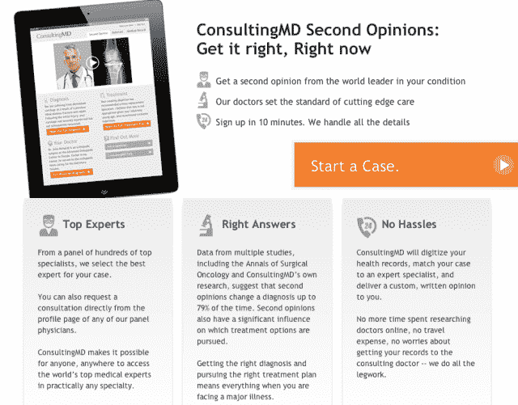

# ConsultingMD 从 Venrock 获得 1000 万美元，以在网上提供快速推荐和第二意见 TechCrunch

> 原文：<https://web.archive.org/web/https://techcrunch.com/2013/05/21/consultingmd-lands-10m-from-venrock-to-bring-speedy-referrals-and-second-opinions-online/>

当涉及到诊断和接受严重医疗程序的可能性时，只要我们能得到第二意见(和值得信赖的转诊)，我们就希望得到第二意见。由于奥巴马医改，明年将有 3000 万至 4000 万美国人首次获得保险，预计数百万人将因此经历更高的费用和更低的覆盖范围，整个系统将会受到冲击。

这就是为什么一家湾区的初创公司看到了对值得信赖、负担得起的在线资源的巨大需求，以获得第二意见和推荐。潜在的巨大商机。

由 Reputation.com 联合创始人 Owen Tripp 和斯坦福医院介入放射科主任 Lawrence Hofmann 博士构想的 [ConsultingMD](https://web.archive.org/web/20221225060022/http://www.consultingmd.com/) 于 2012 年初推出，旨在简化诊断流程，帮助患者与顶级专家联系，以快速获得第二意见。换句话说，它想成为“网络的梅奥诊所”，正如华尔街日报在二月份所说的。

投资者对此很感兴趣；尤其是一家在投资医疗 it 公司方面颇有经验的公司。今天，ConsultingMD 宣布从 Venrock 获得了 1000 万美元的 A 轮融资，此前它去年从 Harrison Metal 获得了 100 万美元的种子资本，使其总额超过 1100 万美元。虽然特里普(像地球上的每一位创始人一样)表示，该公司有一系列投资者的兴趣，但该公司选择了 Venrock 来领导这一轮投资，因为他认为他们是医疗保健 it 领域的“领先风险公司”，并且致力于“推进以病人为中心的护理”

乍一看，ConsultingMD 背后的概念可能听起来类似于人们熟悉的健康科技初创公司，例如 [ZocDoc](https://web.archive.org/web/20221225060022/http://www.zocdoc.com/) ，它允许任何人搜索医生，找到评级和评论并在线预约，或者快速增长的信息和医生 Q & A 平台，例如 [HealthTap](https://web.archive.org/web/20221225060022/https://www.healthtap.com/) 。然而，这位联合创始人告诉我们，ConsultingMD 希望达到更高的目标——超越简单地为医生创建一个目录或 Q &服务，以建立一个真正的“虚拟诊所”——特里普认为这是网络上仍然缺乏的东西。

这位联合创始人继续说道，有了 ConsultingMD，对自己的健康状况感到焦虑的人可以回答几个问题，剩下的就交给网站了。然后，ConsultingMD 将自动提取患者的医疗记录和图像，并对任何书面记录进行数字化处理，按时间倒序组织它们，并对病史进行注释。以前，患者需要数周时间来收集所有这些信息，反过来，医生也需要数周或数月时间来通读这些记录并做出诊断。特里普说，这家初创公司的技术已经将这一过程缩短到从开始到结束只需 48 小时。

ConsultingMD 模式的另一个关键部分是，一旦患者在平台上开始一个病例，并且它已经收集并数字化了所有记录，它会自动为患者匹配“最佳”专家。这家初创公司开发了一个医生网络，创始人称该网络由“每个领域中 0.1%的顶尖专家”组成。特里普解释说，这些专家往往是主要医学研究大学的负责人或主席。

换句话说，ConsultingMD 试图解决的真正问题是访问问题。在当今世界，普通人不知道如何找到或联系这些顶级医师。通过创建一个由精英医生和专家组成的网络，并为他们数字化患者的医疗记录，ConsultingMD 希望简化这一发现过程，并帮助推动医疗信息的数字化。

然而，一个问题是这项服务并不便宜。ConsultingMD 试图创建一个精英平台，汇集全国最优秀的专家。对于那些寻求第二意见的人来说——在授权该网站访问他们的医疗记录并披露他们的历史之后——这项服务的平均费用为 3750 美元。虽然这对个人来说是一个相当昂贵的价格，但 ConsultingMD 认为，真正的机会是与公司合作，帮助员工获得更好的护理和结果。

只需额外支付 200 美元，这家初创公司还提供转诊服务，将患者与所在地区的顶级医疗专家联系起来，安排预约，并为医生提供他们所有的数字化医疗信息。

最终，这家初创公司希望通过让医生与他们网络中的其他精英医生建立联系，只接纳那些获得高质量同行推荐的医生，从而为双方提供价值。通过允许他们进入一个平台，自动将他们与更多直接适用于他们的重点和专业领域的案例联系起来，ConsultingMD 希望提供一个更有吸引力的潜在客户和额外的收入来源。

另一方面，这家初创公司希望为患者提供一种获得精英中的精英的方式，并通过这样做，为他们提供一个获得比他们的家庭医生更好的结果的机会。当然，这种服务很有吸引力，但不可否认的是，由于价格相当高，而且没有保险，ConsultingMD 可能会失去一些潜在受众。

然而，通过使用新基金来吸引寻求降低成本和改善员工待遇的公司和初创公司，这家初创公司可以在这个不断增长的 B2B 利基市场创造大量价值。

