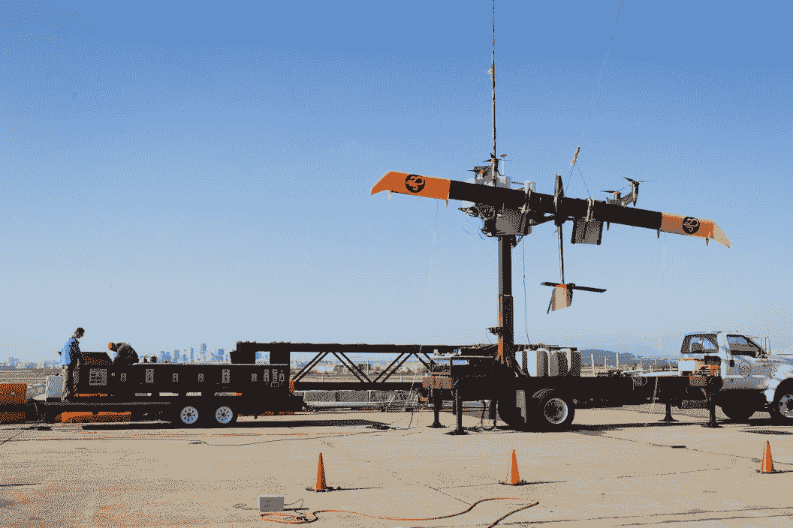

# Google X 收购 Makani Power 及其机载风力涡轮机 TechCrunch

> 原文：<https://web.archive.org/web/https://techcrunch.com/2013/05/22/google-x-acquires-makani-power-and-its-airborne-wind-turbines/>

# Google X 收购 Makani Power 及其机载风力涡轮机

在之前投资该公司之后，谷歌现在已经收购了 [Makani Power](https://web.archive.org/web/20221206001736/http://www.makanipower.com/google/) ，一家绿色能源初创公司，目前正在[建造](https://web.archive.org/web/20221206001736/http://www.makanipower.com/2010/06/airborne-wind-turbine/) [空中风力涡轮机](https://web.archive.org/web/20221206001736/https://beta.techcrunch.com/2012/01/16/kite-like-turbines-harness-wind-power-at-altitude/)。布拉德·斯通(Brad Stone)在《商业周刊》[关于 Google X](https://web.archive.org/web/20221206001736/http://www.businessweek.com/articles/2013-05-22/inside-googles-secret-lab) 的报道中首次报道了此次收购，从斯通的报道来看，该团队将加入 Google X。谷歌于 2006 年向这家总部位于加州阿拉米达的公司投资了[1000 万美元](https://web.archive.org/web/20221206001736/http://earth2tech.com/2007/11/28/googles-green-energy-partners-esolar-makani/)，2008 年又投资了 500 万美元。据我们所知，这也标志着谷歌首次专门为其 Google X skunkworks 收购一家公司。

斯通报道称，谷歌首席执行官拉里·佩奇批准了这项收购，但正如谷歌 X 的主管阿斯特罗·泰勒所指出的那样，佩奇表示，X“可能有预算和人员来完成这项工作，但我们必须确保在不久的将来让至少 5 台设备崩溃。”

该公司由索尔·格里菲斯和前世界杯帆板运动员唐·蒙塔古创建。收购价格没有披露。

谷歌已经证实了这一收购，并向我们提供了谷歌 X 的“月球拍摄队长”阿斯特罗·泰勒的以下声明:

> 创造清洁能源是世界面临的最紧迫的问题之一，谷歌多年来一直有兴趣帮助解决这个问题。Makani Power 的技术开启了一扇全新的风能之门。他们把今天涉及数百吨钢铁和宝贵的开放空间的技术变成了一个可以用真正智能的软件解决的问题。我们期待将它们引入谷歌[x]。

【YouTube http://www.youtube.com/watch?v = hbPXXpaW5ws？feature = player _ 嵌入式]

Makani [说](https://web.archive.org/web/20221206001736/http://www.makanipower.com/google/)它希望这次收购能为它提供“资源来加速我们的工作，使风能在成本上与化石燃料竞争。”此次收购发生在该公司完成其 Wing 7 原型机的首次自主飞行一周之后。

以下是 TechCrunch 专栏作家 Matylda Czarnecka 在 2012 年对该项目的描述:

> 类似迷你飞机的 Makani 机载风力涡轮机 T1 在风速达到每秒 3.5 米时启动。每个叶片上的转子有助于推动它进入轨道，一旦升空就可以兼作涡轮机。这些叶片用一根绳子拴在地面上，这根绳子输送能量，将它们抛向天空，并接收涡轮机产生的能量，将其发送到与电网相连的地面站。

【YouTube http://www.youtube.com/watch?v=jYN0yrntB2M？feature = player _ 嵌入式]

【T2