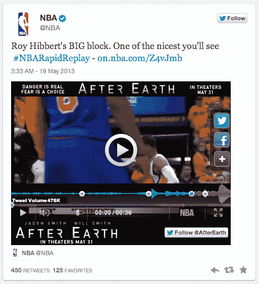

# Twitter 推出电视广告定位，Twitter 为流媒体实时视频放大| TechCrunch

> 原文：<https://web.archive.org/web/https://techcrunch.com/2013/05/23/twitter-launches-twitter-amplify-for-real-time-videos-in-stream-partnering-with-bbc-fox-fuse-and-weather-channel/>

Twitter 今天做出了最新的努力，通过更多地利用广告商喜欢花钱的主流媒体，来迎合麦迪逊大道和大预算广告世界。今天最大的焦点是电视和你的客厅。在纽约，该公司宣布了 [Twitter Amplify](https://web.archive.org/web/20230305215514/http://advertising.twitter.com/2013/05/Twitter-Amplify-partnerships-Great-content-great-brands-great-engagement.html) ，这是一种将实时视频引入网站的方式，最初的合作伙伴包括广播公司 BBC America、FOX、Fuse 和天气频道。它还宣布了以 T5 为目标的[电视广告，这是该公司](https://web.archive.org/web/20230305215514/http://advertising.twitter.com/2013/05/Amplify-TV-commercials-on-Twitter-Premiering-TV-ad-targeting.html)[收购蓝鳍实验室](https://web.archive.org/web/20230305215514/https://techcrunch.com/2013/02/05/twitter-confirms-purchase-of-bluefin-labs-to-boost-tv-analytics-and-advertising-services/)的首批成果之一。

Twitter 广告定位的工作原理是这样的:广告商或媒体买家使用 Twitter 为这项服务创建的特殊仪表板，让品牌监控广告何时在电视上播出。通过这种方式，竞选经理可以发送与他们协调的推广推文。Twitter 表示，它们使用“视频指纹技术来自动检测某个品牌的商业广告何时何地在电视上播放，而不需要广告商进行任何手动跟踪或上传媒体计划细节，”BlueFin Labs 的联合创始人之一、现任 Twitter 产品经理迈克尔·弗莱舍曼(Michael Fleischman)在一篇博客文章中指出。

通过这种方式，广告商能够衡量人们对电视广告的社会反应，反之亦然。在电视广告上使用 Twitter 的句柄和标签将是那些广告商将人们转移到社交网络的方式。

Twitter 表示，它将能够确定广告在电视上播放的时间和地点，并跟踪那些随后在 Twitter 上发布广告和广告所反对的电视节目的人。该公司在其博客上写道:“我们相信，一个足够关注电视节目并在推特上发布相关消息的用户很可能也看到了广告。”。

该公司寄希望于一个至关重要的统计数据，作为这一切都将奏效的信念飞跃:它表示，Twitter 上 64%的以移动为中心的用户在家里的电视机前使用它。

目前，Twitter 的定位服务只能在美国使用。

### 广播剪辑

与此同时，作为 Twitter Amplify 一部分的 instream 广播剪辑，从 BBC America、FOX、Fuse 和 Weather Channel 开始，将直接与平台上的广告和视频紧密联系在一起。这是 Twitter 已经在与 NBA 合作做的事情，例如，在 NBA，一个视频也有一个广告链接:

有趣的是，Twitter 似乎将限制付费用户使用这种新型 Twitter 卡，推广内容和赞助总监格伦·布朗(Glenn Brown)指出，他们将“由推广的推文驱动”。这个想法似乎是，而不是取代电视体验(至少现在还不是！)这些流媒体视频将被用作“精彩、及时的内容，完善他们的电视体验或提醒他们收看。”换句话说，就是让人们看电视的方法，而不是简单地给他们提供一种在 Twitter 上看到他们想要的东西的方法，并完全切断电视。

在纽约的活动中，首席执行官迪克·科斯特罗谈到了该公司如何通过强调实时更新，使广告成为一种更加“无摩擦”的体验。很明显，在 Twitter 中加入更多类似广播的体验将会进一步推进这一概念。

该公司在活动期间还提供了一些有趣的广告福利:与《欢乐合唱团》女演员[简·林奇](https://web.archive.org/web/20230305215514/https://twitter.com/TwitterAds/status/337564704471908352)的问答环节，以及[推文自动售货机](https://web.archive.org/web/20230305215514/https://twitter.com/joell/status/337545177415696385)生产赠品。

Twitter 今年一直在采取越来越强的措施，让其平台变得更加广告友好(和收入友好)。这始于二月份发布的一个广告 API ,这样更大的广告商可以更好地管理他们在 Twitter 上的活动；一个改进的[广告分析仪表板](https://web.archive.org/web/20230305215514/http://advertising.twitter.com/2013/03/The-new-Twitter-Ads-center.html)；以及 Google AdWords 式的[关键词定位](https://web.archive.org/web/20230305215514/http://advertising.twitter.com/2013/04/Introducing-Keyword-Targeting-in-Timeline.html) (TC 覆盖[此处](https://web.archive.org/web/20230305215514/https://techcrunch.com/2013/02/20/twitter-ads-api/)，此处[此处](https://web.archive.org/web/20230305215514/https://techcrunch.com/2013/03/13/to-drive-more-advertising-twitter-updates-its-ads-dashboard-with-more-data-on-performance-analytics-and-spend-and-real-time-managment/)和[此处](https://web.archive.org/web/20230305215514/https://techcrunch.com/2013/04/17/advertisers-can-now-target-twitter-users-by-keywords-from-their-tweets/))。就在本周早些时候，该公司还正式推出了[线索生成卡](https://web.archive.org/web/20230305215514/http://advertising.twitter.com/2013/05/Capture-user-interest-with-the-Lead-Generation-Card.html)，Twitter 已经测试了一段时间，它允许广告商包括请求更多信息等行动，用户可以通过点击广告推文中的按钮自动获得这些信息。(你可以看到最后一个也为 Twitter 向商业的飞跃创造了条件，即一键购买。)

虽然 Twitter 没有提供任何官方公开指导，说明它预计今年或未来的广告收入，但外界对这个数字有很多猜测，因为许多人预计 Twitter 将上市，据观察人士称，上市日期可能是 2013 年底或 2014 年。eMarketer 在三月份的一份报告指出，它将该公司 2013 年的广告销售额提高到 5 . 83 亿美元，2014 年的广告销售额提高到 9 . 5 亿美元，其中 60%来自手机。

Twitter 全球收入总裁 Adam Bain 去年提供的统计数据显示了该公司在过去一年的增长。贝恩当时指出，Twitter 拥有超过 1.4 亿活跃用户；现在这个数字估计接近 3 亿。

贝恩还指出，55%的用户通过手机访问 Twitter，季度增长率为 40%，在 Twitter 的活跃用户中，只有约 60%的人会发微博，但他们都在“听”。甚至在一年前，Twitter 就已经有 79%的人在关注品牌，这表明 Twitter 一直在寻找更好的方式在平台上利用广告。

更多即将到来。

吉姆·普罗瑟