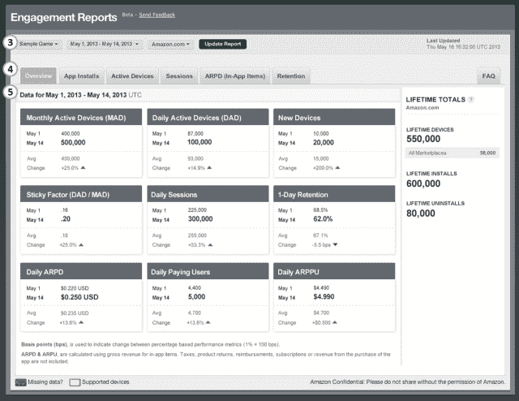

# 亚马逊发布应用参与报告，允许 Appstore 开发者跟踪应用使用和收入 TechCrunch

> 原文：<https://web.archive.org/web/https://techcrunch.com/2013/05/24/amazon-launches-app-engagement-reports-allowing-appstore-developers-to-track-app-usage-revenue/>

# 亚马逊发布应用参与报告，允许应用商店开发者跟踪应用使用和收入

继续发展其针对移动应用开发者的服务套件，亚马逊今天宣布了应用参与报告，这是免费的应用使用报告，现在是该公司[移动应用分发门户](https://web.archive.org/web/20221206212237/https://developer.amazon.com/home.html)的一部分。这些报告是为需要应用性能和收入信息的亚马逊应用商店开发者设计的。

该公司在今天下午的官方[公告](https://web.archive.org/web/20221206212237/https://developer.amazon.com/post/TxPB0GWMIKVVNM/Announcing-App-Engagement-Reports-Free-App-Usage-Metrics-that-Require-No-Integra.html)中解释说，具体来说，这些报告包括每日和每月的活跃设备、安装、会话、每台设备的平均收入和保留指标，它们可以按市场过滤，以图表形式查看，或下载为 CSV 格式。开发人员还可以更改报告上的数据范围，以便查看历史趋势。

现在提供六份项目报告:

*   **概述**:你的应用或游戏的关键使用数据摘要
*   **平均收入**:应用内项目的每日和每月平均每台设备收入(ARPD)和平均每付费用户收入(ARPPU)
*   **保留**:第 1-3-7 天的每日保留和第 1-2-3 周的每周保留
*   **活跃设备**:日活跃设备(DAD)、月活跃设备(MAD)、粘性系数(DAD/MAD)
*   **会话**:每日会话总数和每台设备的平均会话数
*   **App 安装**:日常安装和卸载

发布时，这些报告仅适用于在 2012 年 10 月 25 日之后提交和发布的应用。对于从那以后没有更新应用程序的开发人员，他们需要重新发布应用程序或提交更新以激活报告功能。然而，不需要对应用程序的代码进行任何其他更改，也不需要集成任何其他软件。

该报告将包括 Kindle Fire 和 Fire HD 等亚马逊设备上运行的应用程序的数据，以及运行最新版本亚马逊 Appstore 移动应用程序的任何其他 Android 设备的数据。

应用分析和销售数据对于让亚马逊的 Appstore 成为更完整的服务至关重要——例如，这些东西长期以来一直是 Google Play 或苹果 iTunes 等竞争商店的标准功能。尽管许多开发人员仍然集成第三方 SDK，以允许增加功能和更详细的报告，而不仅仅是现成的，但预计 Appstore 本身至少可以提供一些关于应用吸引力和销售的基本信息。亚马逊表示，报告是“开发者的普遍要求”，这可能是一种保守的说法。

在加入新的参与报告之前，亚马逊最近几个月还推出了其他几项改变，以加强其为开发者提供的 Appstore 产品。为了给开发者更多的创收机会，该公司不仅在全球范围内扩展了自己的足迹，还增加了一些功能，如 T2 应用内支付、订阅，甚至是自己的虚拟货币 T4 亚马逊币。

既然开发人员已经有一点时间来试验这些新产品，那么他们应该能够跟踪这些功能的表现，以及它们是否对 ARPU(每用户平均收入)和保留率等关键指标产生影响，这才是有意义的。

关于报告各个部分的附加信息以及如何访问它们将在[这里](https://web.archive.org/web/20221206212237/https://developer.amazon.com/post/TxPB0GWMIKVVNM/Announcing-App-Engagement-Reports-Free-App-Usage-Metrics-that-Require-No-Integra.html)进行解释。同时,[参与度报告常见问题解答](https://web.archive.org/web/20221206212237/https://developer.amazon.com/help/faq.html#Reporting)提供了关于新报告的更多具体问题的答案。