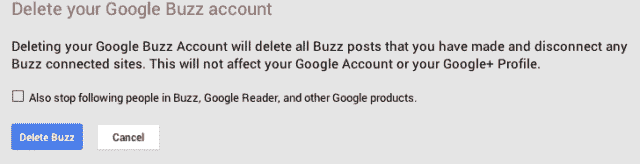

# 提醒:Google Buzz 还是死的，你的数据会被移到 Drive，他们感谢你使用它 TechCrunch

> 原文：<https://web.archive.org/web/http://techcrunch.com/2013/05/25/reminder-google-buzz-is-still-dead-your-data-will-be-moved-to-drive-and-they-thank-you-for-using-it/>

# 提醒:Google Buzz 还是死的，你的数据会被移到 Drive，他们感谢你使用它

谷歌早在 2010 年推出的社交服务 Google Buzz(T1)在 2011 年被取消，它提醒以前的用户，他们的数据仍然存在，并将在 7 月份转移到你的 Google Drive 账户。真可爱。

该电子邮件准确描述了您的数据将会发生什么，谢天谢地，这不会计入您的驱动器存储限制。

如果你不删除数据，让谷歌把你的东西移到 Drive，它说你过去分享的公共 Buzz 帖子“可能会出现在搜索结果和你的谷歌个人资料中。”那好吧。

以下是整封邮件，以防你过滤掉 Buzz 通信，直接进入垃圾邮件:

> 2011 年 10 月，我们宣布关闭 Google Buzz。在 2013 年 7 月 17 日或之后，谷歌将采取关闭的最后一步，并将你的 Buzz 帖子的副本保存到你的 Google Drive，这是一种在线存储文件的服务。Google 将在您的 Google Drive 中存储两(2)种类型的文件，新创建的文件不会计入您的存储限制。如果你想彻底清除网上世界的流言蜚语，现在就去这里删除数据:【https://profiles.google.com/me/deletebuzz
> 
> 1.第一种类型的文件是私有的，只有你可以访问，包含你写的 Google Buzz 公开和私有帖子的快照。
> 2。第二种类型的文件将只包含你的 Google Buzz 公开帖子的副本。默认情况下，任何有链接的人都可以看到它，它可能会出现在搜索结果和你的[谷歌个人资料](https://web.archive.org/web/20221005052651/http://profiles.google.com/me/about)(如果你链接了你的 Buzz 帖子)。请注意，任何指向您的 Google Buzz 内容的现有链接都会将用户重定向到该文件。
> 3。您对其他用户帖子的任何评论只会保存到这些用户的文件中，而不会保存到您的文件中。一旦此电子邮件中描述的更改是最终的，只有该用户将能够更改这些文件的共享设置。这意味着，如果你评论了另一个作者的私人帖子，该作者可以选择将该帖子及其评论公开。如果你想避免这种可能性，[现在就删除](https://web.archive.org/web/20221005052651/https://profiles.google.com/me/deletebuzz)你所有的 Buzz 内容。
> 4。新的 Google Drive 文件将只包含以前启用 Google Buzz 的用户的评论，并且这些文件不会包含在将数据移动到 Google Drive 之前已删除的评论。
> 
> 创建文件后，它们将被视为与任何其他驱动器文件相同。它们是你的，随你的便。这包括下载它们、更新谁可以访问它们或删除它们。
> 
> 在这些文件创建之前，你可以[在这里](https://web.archive.org/web/20221005052651/http://profiles.google.com/me/buzz)查看你在 Google Buzz 上发表的帖子。如果你不想将你的任何 Buzz 帖子或评论保存到 Google Drive 文件中，你可以立即[删除](https://web.archive.org/web/20221005052651/https://profiles.google.com/me/deletebuzz)你的 Google Buzz 账户和数据。
> 
> 感谢您使用 Google Buzz。

因为谷歌在邮件中提到你可以删除你的数据，不是一次，而是两次，这就是我将要采取的行动。

[Buzz 从未起飞](https://web.archive.org/web/20221005052651/https://beta.techcrunch.com/2011/04/28/buzz-off-google-buzz/)，谷歌继续将其所有的努力集中在 Google+上。Buzz 不工作有很多原因，[主要围绕隐私](https://web.archive.org/web/20221005052651/https://beta.techcrunch.com/2010/02/12/google-buzz-privacy/)。与 Gmail 的紧密结合让整个体验变得一团糟，模糊了个人信息和公共信息之间的界限。

这显然是谷歌彻底摆脱该产品以及围绕该产品出现的所有隐私担忧和问题的最后一步。哦，以防你错过了那个删除链接，[又来了。](https://web.archive.org/web/20221005052651/https://profiles.google.com/me/deletebuzz)

感谢*你*，谷歌。