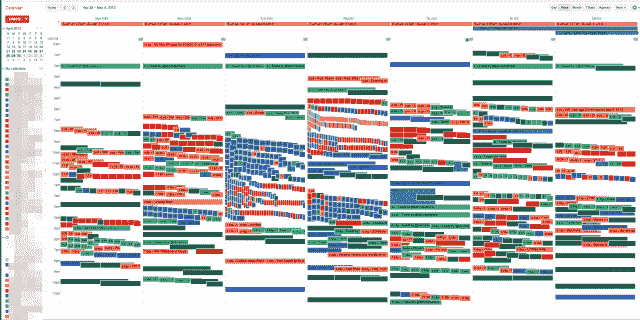

# 数据枯竭的力量| TechCrunch

> 原文：<https://web.archive.org/web/https://techcrunch.com/2013/05/26/the-power-of-data-exhaust/>

斯科特·布朗有一个问题是关于他所听到的域名的数量:域名提供商是否设置了电子邮件回复？他的发现导致了 [Bounce.io](https://web.archive.org/web/20230304220647/https://bounce.io/) 的推出，这是一家为期五个月的公司，每天收获 2000 万到 3000 万封被退回的电子邮件，相当于一个广告百宝箱和一个非常丰富的大数据蜜罐。

Bounce.io 接收被退回的邮件并做两件事。它将广告添加到被退回的电子邮件中，这些电子邮件实际上来自那些无论出于何种原因向被停放的域名发送电子邮件的人。来自垃圾邮件机器人的电子邮件被出售给数据安全公司，这些公司将其视为前所未有的新来源。对他们来说，这是一个不断刷新的有机大数据蜜罐。

这里的故事是关于一家准备在电子邮件广告中发财的公司。但更重要的是，布朗的经历指出了“数据枯竭”的力量，即所有跟踪我们的多余数据。数据本身是一维的。总的来说，这些数据具有经济意义，反映了比我们想象的更多的信息。

# 反弹的故事

我在本周的 [Glue](https://web.archive.org/web/20230304220647/http://gluecon.com/) 会议上遇到了布朗，他解释说，当他与一名欠下 5 万多个域名的丹佛当地商人交谈时，他的好奇心被激起了。另一位朋友是一家大型消费品牌的产品营销经理，他有大约 4000 个促销域名，以及该消费品牌域名的所有排列。

Brown 决定创建一个小 Node.js 应用程序来捕获入站邮件，该应用程序会发送一封电子邮件，通知发件人有退回的邮件。他问同事们是否会在 12 个域名上安装它。他们同意了，在第一周，他们每天收到 20 万封电子邮件。

布朗应用了他在一家前公司开发的规则引擎，并使用它来区分机器生成的电子邮件和人类发送的电子邮件。他了解到，令人惊讶的是，8%的电子邮件来自真人。

他们收集并开始整理和识别来自人们的邮件。作为一项实验，他们开始发送合法的退信，并为退信道歉。然后他们追踪了开放率，结果是 60%。

“检查一下只是人的天性，”他说。“点击率只有 2%到 3%，但 2%能赚很多钱。我们投放了第一个广告，并在一周时间内向几十万封电子邮件发送了广告。”

这是一个 50 美元的返校广告。没有人曾经给退回的电子邮件发件人做过广告。他说，他们回去找他在域名行业认识的人，询问他们所有的域名。到二月份，他们已经检查了 400 万个域名。今天，该公司跟踪 800 万。该公司现在每天收到 2000 万到 3000 万封电子邮件，并发出 200 万封带有广告的回复邮件。开放率约为 60%。服务器在 AWS 上运行，对数据进行分类和筛选。

剩下的 92%的数据被提供给大型安全供应商。这是一个月的饲料。广告收入更高，但数据业务是一项 2000 万美元的业务。

真正的目标是互联网服务提供商。时代华纳有线电视有 1000 万用户。每个用户每天发送 10 封电子邮件。在那封邮件中，20%是退信。这相当于每天 2000 万封电子邮件。布朗说，目标是让互联网服务提供商发送这些电子邮件，这样他们就可以在里面放广告。像时代华纳这样的互联网服务提供商每年可以从每个用户那里获得 1.5 美元的净利润。“这相当于一年 1500 万美元的基金，”布朗说。

有了 ISP，数学就颠倒了。现在有一个更大的馅饼，因为 92%的电子邮件来自人类。

“这是一个十亿美元的生意，”布朗说。

布朗说，他们知道这是一个非常好的想法，其他人会将它视为一个有利可图的空间。但是他们的服务已经建立并准备扩展。Sedo 或 GoDaddy 等公司可能是竞争对手。谷歌和雅虎！有可能建立或收购公司。安全公司可能会参与竞争，因为这是大数据的一大亮点。

问题是:Bounce.io 是数据的第三方。他们依靠别人来获得它。尽管他们在域名管理上取得了成功，但这并不是一个大市场。

“我们正试图推动 ISP 的故事，并试图树立反弹智能的品牌。”

布朗有“大邮件路由”的背景他编写了一个邮件传输代理，为华尔街的大公司运送大量邮件。他的合作伙伴发明了一种跟踪工具来查看电子邮件是否被发送到收件箱。

像布朗这样的人似乎像胶水一样在会议大厅里游荡。在会议上，我和几个人讨论了这种正在出现的新型数据耗尽。现在它来自四面八方。退回的电子邮件是一个很好的例子，但还有无数其他形式正在创造一个深刻的新数据现实。

人类的处境要求我们交流。这就是为什么人们在推特上谈论这只猫做的一些可爱的事情，或者在脸书上发帖说他们在市场上买了一些橙子。我们需要这种交流。

# 量化的人类

Chris Dancy 在首席技术官办公室为 BMC Software 工作，开发[新产品](https://web.archive.org/web/20230304220647/http://www.bmc.com/products/myit/it-self-service.html)并以[量化企业](https://web.archive.org/web/20230304220647/http://www.bmc.com/products/myit/the-quantified-enterprise.html)的原则为基础。他的灵感很大一部分来自他用来跟踪和量化自己的数据消耗的自动化工具。一切都可以量化、测量和分析。所以他自己在做。正如[克林特·芬利在《连线》杂志](https://web.archive.org/web/20230304220647/http://www.wired.com/wiredenterprise/2013/02/quantified-work/all/)中所写的，丹西称自己是地球上最量化的人。这有助于重塑他，通过使用他追踪的数据排气，让他对自己和工作的未来有更深入的了解。

【YouTube http://www.youtube.com/watch?v=VqMech4Wt2Y&w=640&h=390]

丹西用传感器追踪他的行动。他的狗有一个传感器来跟踪它在房子里的位置。他家里的传感器被编程，所以音乐可以在白天打开和关闭。当他走进房子时，屋里的灯就亮了。他使用 IFTTT T7 和 Zapier T9 来连接谷歌日历、Evernote 和 Excel 中的应用程序。

布朗和丹西都发现了数据枯竭的力量。布朗和他的商业伙伴正在利用它从退回的电子邮件中收集数据，进行分析并将其回收到广告网络中。数据被打包，以便数据安全公司更好地了解垃圾邮件发送者和他们来自的黑暗世界。Dancy 将自己的数据耗尽作为一种赋权手段。这些数据让他洞察到自己可以更好地生存的方式，以及工作的未来将如何转变。

布朗和丹西的所作所为也透露了更多关于我们的信息。我们需要更好地对待我们愿意留下的数据。我们让推特、谷歌和脸书拿走我们的数据，随心所欲地使用。也许是时候让我们利用数据枯竭的力量了，这样我们就可以自己使用它，也许不愿意让它如此漠视地从我们身边溜走。

(特写图片归功于[格兰特·麦克拉肯](https://web.archive.org/web/20230304220647/http://cultureby.com/2007/07/how-social-netw.html)和他关于社交网络如何工作以及数据枯竭难题的博文。)