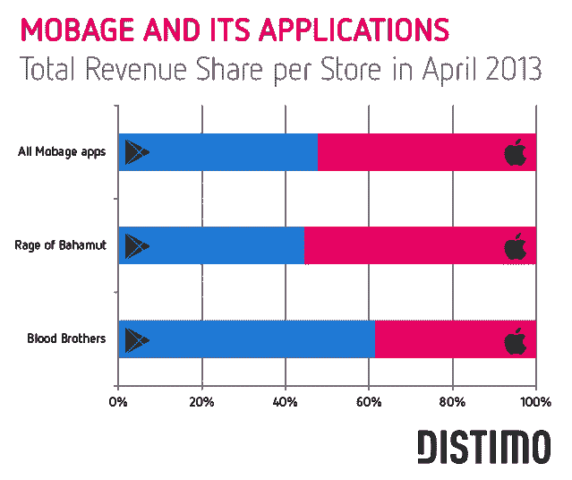
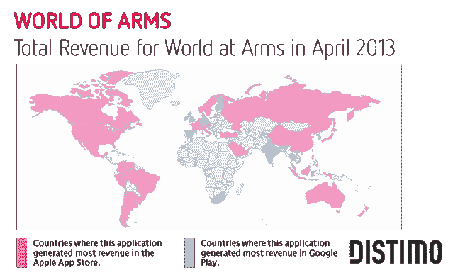
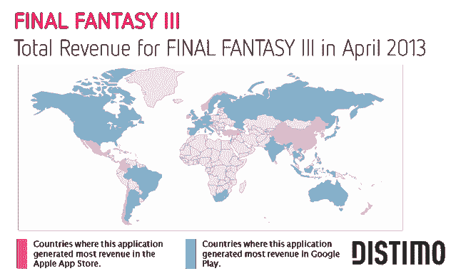
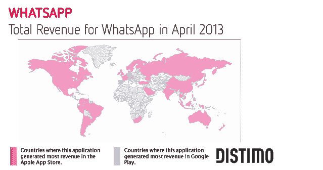
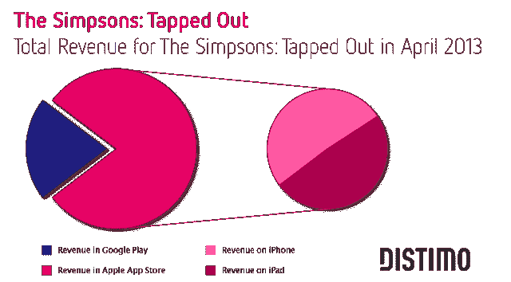

# 自去年 11 月以来，Google Play 的应用收入份额增长了 8%，但苹果仍然领先 TechCrunch

> 原文：<https://web.archive.org/web/https://techcrunch.com/2013/05/29/google-plays-app-revenue-share-up-8-since-november-but-apple-still-leads/>

说到移动应用收入，普遍的共识是苹果的应用商店仍然是王道。例如，上个月， [App Annie 报告称](https://web.archive.org/web/20230206164933/https://techcrunch.com/2013/04/17/apple-and-googles-app-stores-now-neck-and-neck-except-on-the-metric-that-matters-most-to-developers-revenue/)iOS 应用商店上个季度的收入是 Google Play 的 2.6 倍。今天，应用商店分析公司 [Distimo 发现了类似的趋势](https://web.archive.org/web/20230206164933/http://www.distimo.com/report/download-latest)，但也有稳定增长的迹象，甚至在 Android 开发者中也有一些成功的故事。

2012 年 11 月，Google Play 仅占两大应用商店(苹果应用商店和它自己)总收入的**19**，但是今年 4 月，这一份额已经跃升了 8 个百分点，达到**27**。

开发商利用这一趋势的一个显著例子是 Mobage，它上个月在两家商店创造了超过或大致相当的收入，不仅在利润丰厚的亚洲市场，在美国也是如此。2013 年 4 月，其应用程序在 Google Play 中创造了超过 510 万美元的收入(占总收入的 48%)，而苹果应用商店的总收入略高，为 560 万美元(占 52%)。

另一家发行商智乐(Gameloft)今年 4 月在谷歌 Play 上推出的《武器世界》(World of Arms)免费增值游戏在英国、德国、西班牙、芬兰、印度、泰国、韩国、越南、以色列、爱尔兰和香港等特定市场创造了更多收入。

与此同时，Square Enix 的《最终幻想 3》占其 4 月份全球总收入的 73%，但考虑到其总收入仅为 13 万美元，这个数字似乎不那么令人印象深刻。然而，与上面的“武器世界”不同，《最终幻想 3》是一款收费游戏，售价 15.99 美元，这可能是它的票房相对较低的原因。

WhatsApp 提供了一个更有趣的案例，说明一个受欢迎的开发者是如何成功攻击这两家应用商店的。WhatsApp 使用不同的商业模式来赚钱。在 Android 上，用户可以获得一年的免费订阅，但之后必须为该应用付费，而在苹果的应用商店上，该应用的价格为 0.99 美元。iOS 上的下载量很高，但这款应用通常会上市销售，以提高下载量。

这项长期的游戏——希望在让安卓用户完全上瘾后从他们身上赚钱——开始在一些国家为 WhatsApp 带来回报，包括德国、意大利和西班牙。在德国，Google Play 为该公司赚取了近 29 万美元，而 4 月份苹果商店的收入为 20.7 万美元。相比之下，美国版本在苹果应用商店的售价为 35.5 万美元，而谷歌 Play 的售价仅为 4.1 万多美元。

在西班牙，WhatsApp 上个月的 Google Play 总收入为 89%。事实上，Distimo 评论说，Google Play 在该国的高收入如今是一个普遍现象，尽管这些数字本身没有日本或韩国这样的国家高。

## 苹果目前仍是王者

尽管该报告试图强调案例研究，以显示 Google Play 在哪里取得了进展，但最终得出的结论是，苹果应用商店“仍然是最有益的”，尤其是在美国。Distimo 发现，2013 年 4 月，Google Play 前 200 名中所有应用的日收入为 110 万美元，而苹果应用商店前 200 名(iPhone 和 iPad)的日收入为 510 万美元，是苹果应用商店的 4.6 倍。这两个排行榜中的大多数应用程序都包含使用应用内购买的免费应用程序。

报告解释说，对这种差异的解释之一是，许多美国应用程序开发者仍然只在 iOS 上发布。(这也是我们最近研究的一个趋势。)然而，即使两个美国应用商店都提供应用程序，苹果 iOS 应用程序产生的收入也更多。例如，King.com 的《糖果粉碎传奇》(Candy Crush Saga)和 EA 的《辛普森一家》(The Simpsons: Tapped Out)都是这方面备受瞩目的案例研究，后者于 2013 年 4 月在美国产生了约 480 万美元的收入，其中 79%在苹果应用商店中。

这种趋势也适用于应用程序的长尾，尽管如上所述，显示 Google Play 的收入份额一直在增加(见上图)。证实了 App Annie 早些时候的报告，日本和韩国市场是 Google Play 收入攀升的主要贡献者。