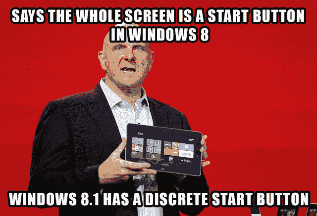

# Windows 8.1 需要一个开始按钮，因为没有开始按钮 Windows 是愚蠢的

> 原文：<https://web.archive.org/web/https://techcrunch.com/2013/05/29/windows-8-1-to-get-a-start-button-because-windows-is-dumb-without-one/?utm_source=feedburner&utm_medium=feed&utm_campaign=Feed%3A+Techcrunch+%28TechCrunch%29>

# Windows 8.1 需要一个开始按钮，因为 Windows 没有开始按钮是愚蠢的

好消息！微软超级博主 Paul Thurrott [详细介绍了](https://web.archive.org/web/20221207032927/http://winsupersite.com/windows-8/blue-start-experience-changes)开始按钮的回归和 Metro/smart tile/Start Page 的象征性消亡，Windows 8.1 能够直接启动到桌面，避开了 Windows 8 最糟糕的部分。最重要的是，正如之前报道的那样，微软不对这些修复收费。

没有比经典更好的了。

