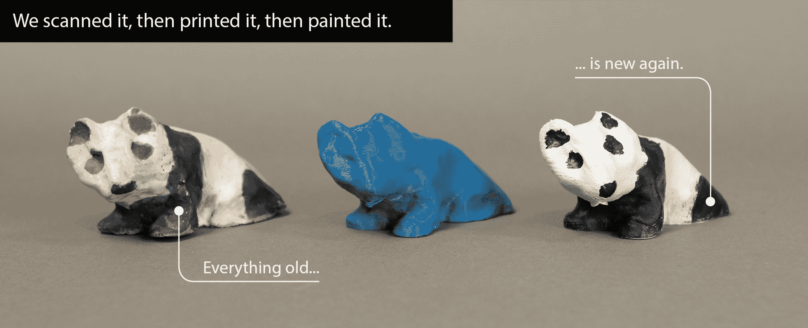

# Makerbot 在布鲁克林开设了一家占地 50，000 平方英尺的新工厂 TechCrunch

> 原文：<https://web.archive.org/web/https://techcrunch.com/2013/06/03/makerbot-opens-new-50000-square-foot-factory-in-brooklyn/>

# Makerbot 在布鲁克林开设了一个 50，000 平方英尺的新工厂

硬件宠儿 Makerbot 在 2011 年获得了 1000 万美元的融资，刚刚宣布他们将于周五在布鲁克林的日落公园开设新工厂和仓库。这个空间是老布鲁克林海军造船厂的一部分，将建在散布在海滨的旧仓库群中。

该公司计划在日落公园雇佣 50 名新员工，与目前在布鲁克林组装和运输 Makerbots 的 100 多名“生产人员”一起工作。他们最近还为这个空间雇佣了一名办公室经理。

该公司还向[展示了他们的数字化 3D 扫描仪在工作中的新照片](https://web.archive.org/web/20221002151050/http://www.makerbot.com/blog/2013/05/31/whats-new-with-the-makerbot-digitizer-update-2/)。例如，他们能够扫描一个旧的小雕像，并重新打印和绘制它，创造出一个形状奇特但可爱的熊猫的近乎完美的复制品。

该公司由 Bre Pettis 经营，一直是“布鲁克林制造”运动的典型代表，在搬迁之前的几年里，其大部分组装工作都在布鲁克林市区进行。你可以在这里观看我们参观工厂。