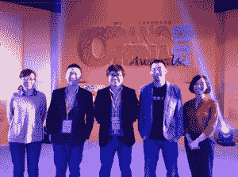

# TechCrunch 永久回归中国

> 原文：<https://web.archive.org/web/https://techcrunch.com/2013/06/05/techcrunch-returns-to-china-for-keeps/>

# TechCrunch 永久回归中国

卢刚(中)和 TechNode 团队在北京举行的年度 China Bang 活动上

TechCrunch 拥有大量的国际读者——创业革命没有地理界限。没有哪个国家比中国更能展示这种广阔，在中国，巨大的市场，炽热的经济，政府的手(有争议的)和大量的企业家震撼了创业世界。而巨头[百度](https://web.archive.org/web/20230305214821/http://www.baidu.com/)、[腾讯](https://web.archive.org/web/20230305214821/http://www.tencent.com/)、[阿里巴巴](https://web.archive.org/web/20230305214821/http://www.alibaba.com/)更是火上浇油。

这就是为什么 TechCrunch 在 2011 年来到中国[进行颠覆](https://web.archive.org/web/20230305214821/https://techcrunch.com/2011/11/04/top-videos-from-techcrunch-disrupt-beijing-tctv/)，这也是为什么今天我们激动地宣布与中国顶级科技博客和活动团体之一建立合作关系。我们将与 [TechNode](https://web.archive.org/web/20230305214821/http://www.technode.com/) 及其创始人[卢刚](https://web.archive.org/web/20230305214821/http://cn.linkedin.com/in/ganglu)联手，让 TechCrunch 更加贴近中国的创业生态系统。

今年晚些时候，我们将推出官方中文版的 TechCrunch。CN，如果你想知道的话)，它将翻译来自美国网站的帖子。今年秋天，我们将在北京举办一场小型活动，明年我们将把一场完整的 Disrupt 带回中国。接下来还有更多。

TechCrunch 和 TechNode 都致力于连接东西方的创业生态系统。这包括在 TechCrunch 的全球舞台上介绍有影响力的中国企业家和初创公司，并将硅谷的精华带到中国。

TechCrunch 团队非常高兴能与卢刚合作，我们在第一次合作《扰乱北京》时就认识了他。他是一位严肃的技术专家(对你来说，他就是卢刚博士——无线网络方面的博士)，一位媒体先驱，也是中国初创企业领域受人尊敬的声音。卢刚和我们在中国的读者一直在耐心等待我们在中国步入正轨。现在我们终于来了。