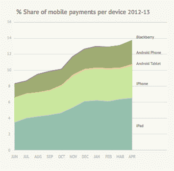
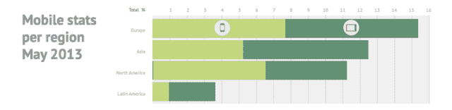

# 平板电脑继续成为支付平台，Android 和 iPad 在 10 个月内增长 5% TechCrunch

> 原文：<https://web.archive.org/web/https://techcrunch.com/2013/06/06/adyen-m-commerce-index/>

# 平板电脑继续成为支付平台，安卓和 iPad 在 10 个月内增长了 5%

支付公司 Adyen 发布了第一份新的季度指数，旨在跟踪移动商务的发展前景。数据显示的一个显著增长是平板电脑作为一种商业设备越来越受欢迎。首届 *Adyen 全球移动支付指数*基于其平台上 10 个月的交易。为了说明该指数的规模，去年该公司在全球范围内处理了超过 100 亿美元的在线、移动和销售点支付交易。

该指数显示，过去 10 个月，平板设备(包括 iPad 和 Android)的移动交易总量增长了 5%，同期从 48%升至 53%。这只是最新的数据点，说明了在移动商务方面，平板电脑与智能手机所扮演的不同角色。

其他研究表明，平板电脑正在打造一个强大的利基市场，作为一种休闲浏览设备的[——这反过来又使它们能够支持休闲和冲动购物，这在智能手机有限的空间内更难实现(尽管高度策划的体验可能是通过移动管道推动冲动交易的一种方式，正如](https://web.archive.org/web/20221006000413/https://beta.techcrunch.com/2013/03/07/tablets-vs-smartphones-page-views/) [YPlan](https://web.archive.org/web/20221006000413/https://beta.techcrunch.com/2013/06/04/yplan-series-a/) 正在做的那样)。从购物探索的角度来看，平板电脑更大的屏幕尺寸只是提供了更多的浏览空间。结合触摸界面和轻量级平板电脑平台的便捷性/速度，它比典型的电子商务网站更具趣味性。(例如，参见 [Vitacost 的平板电脑网站](https://web.archive.org/web/20221006000413/https://beta.techcrunch.com/2013/04/08/vitacost-ipad-app/)。)

尽管平板电脑——尤其是 iPad——在 Adyen 的移动支付指数中占据主导地位，但它也显示出智能手机发挥着强大的作用——特别是在北美，那里大多数(58%)的移动交易都是使用智能手机进行的。然而，iPad 是全球其他地区的主导力量。不过，值得注意的是，iPhone 比 Android 平板电脑成为更强大的交易平台——这可能是因为 iPhone 用户与 Android 平板电脑用户的数量之比:

根据 Adyen 的数据，截至 2013 年 4 月，iPad 现在占全球交易总额的 6.6%(高于 2012 年 6 月的 3.6%)，10 个月的总增长率接近 83%。iPhone 用户占总交易量的 4.4%，高于 2012 年 6 月的 3.1%(增长+42%)。但来自安卓手机的交易几乎翻了一番，从 1.1%升至 2%，而安卓平板电脑的使用也翻了一倍多，从总交易的 0.3%升至 0.7%。

总体而言，Adyen 平台上的全球移动支付交易在测量期间增长了 75%，移动交易的总百分比从 2012 年 6 月的 8.2%增长到 2013 年 4 月的 13.8%。*指数*还发现，欧洲以 15.3%的移动设备交易量领先全球，其次是亚洲(12.4%)和北美(11.2%)。

当谈到移动商务进入传统上由 PC 交易主导的不同领域时，旅游以 20%的移动渗透率位居榜首，其次是零售、票务服务和数字商品(各有 15%的渗透率)。Adyen 说，游戏明显滞后，移动游戏仅占交易的 9%，这可能是因为台式电脑提供了更丰富的游戏体验。

在零售领域，平板电脑分别以 10%和 5%的移动交易额挤走了智能手机——零售是基于发现的购物非常重要的另一个领域。相比之下，根据 Adyen 的数据，票务服务几乎完全是移动的，智能手机占整体 15%移动馅饼的 9%。