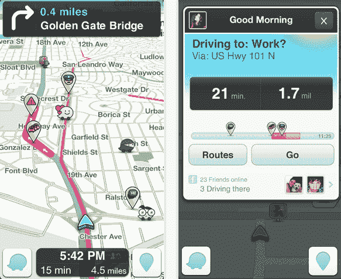

# 谷歌进军 Waze 可能会阻碍脸书和苹果

> 原文：<https://web.archive.org/web/https://techcrunch.com/2013/06/09/googles-inroads-for-waze-could-roadblock-facebook-and-apple/>

在愈演愈烈的地图大战中，谷歌似乎不仅是先行者，而且是最大胆的先行者。

据以色列出版物《环球时报》报道，谷歌准备以 13 亿美元收购以色列交通和导航公司 Waze，这是近年来谷歌最大的收购案之一。这一最新进展出现在 Waze 将被大公司之一收购的传言中，脸书以 10 亿美元收购，苹果以 5 亿美元收购，现在是谷歌。

得益于来自其近 5000 万用户的众包信息，Waze 提供了关于交通拥堵、警察在场、速度感应摄像头和其他交通相关信息的信息。

据多名[其他](https://web.archive.org/web/20221220153919/http://www.calcalist.co.il/internet/articles/0,7340,L-3604625,00.html)T4【希伯来 [消息人士](https://web.archive.org/web/20221220153919/http://www.themarker.com/technation/1.2041935)透露，这笔交易将全部以现金进行。据报道，诺姆巴丁将继续担任首席执行官，Waze 也将继续作为自己的品牌。Waze 的研发机构以及他们在以色列的办公室将至少保留三年。

我们最初听说苹果对 Waze 感兴趣，这在当时是非常合理的，因为苹果正在开发和发布一款有缺陷、不完善的地图应用。Waze 可能帮了不少忙。

然而，这些谣言逐渐平息，为新的谣言腾出了空间，即脸书正在考虑收购这家社交卫星导航公司。

事实上，《环球报》报道称，脸书的高管们与 Waze right 在以色列进行了谈判，但两家公司都没能达成令人满意的解决方案。但也许更有趣的是，当脸书仍在谈判收购 T3 时，谷歌介入并与 Waze [进行了交谈，这表明谷歌是多么渴望在地图领域阻止潜在的竞争对手。](https://web.archive.org/web/20221220153919/http://www.ynet.co.il/articles/0,7340,L-4390157,00.html)

谷歌和 Waze 目前都没有对收购发表评论，但这不是搜索巨头第一次与 Waze 合作。[就在上个月](https://web.archive.org/web/20221220153919/https://techcrunch.com/2013/05/24/another-google-waze-rumour/)，彭博报道称两家公司正在谈判，Waze 寻求超过 10 亿美元。

报告称，该交易刚刚进入尽职调查，细节可能会有变化。

谷歌与 Waze 的长期目标有些不清楚。它显然增加了在以色列的足迹，目前它在以色列有两个办公室，那里有一个繁荣的创业场景，谷歌已经从那里摘走了 Labpixies 和 Quicksee。但进一步看，这也是让苹果和脸书等竞争对手远离这种可靠和受欢迎的地图软件的好方法。

请记住，谷歌的地图应用已经是一个世界级的产品，在竞争方面没有任何东西可以与之匹敌。但这并不是说人们没有努力。随着 iOS 6 和 iPhone 5 的推出，苹果将谷歌地图作为其 iDevices 上的默认地图应用。对苹果来说不幸的是，苹果地图糟糕透顶。

通过收购 Waze，谷歌让像苹果和其他公司这样的竞争对手远离简单的收购，即收购一家已经拥有可靠技术的公司。通过这笔交易，谷歌有效地阻止了苹果和脸书的机会。

看吧，脸书、苹果、微软和其他任何大型科技公司都将把重点放在定位技术上，作为支持其他服务的一种方式。地图是移动生态系统的脊梁。它影响了广告、其他社交工具和应用以及电子商务。苹果、脸书和朋友们不会很快放弃拥有我们的位置数据，但谷歌在阻止购买技术而不是开发技术方面做得很好。

Waze 成立于 2007 年，已经从 KPCB、地平线风险投资公司、Blue Run Ventures、Magma Venture Partners 和 Vertex Venture Capital 等投资者那里筹集了 6700 万美元。