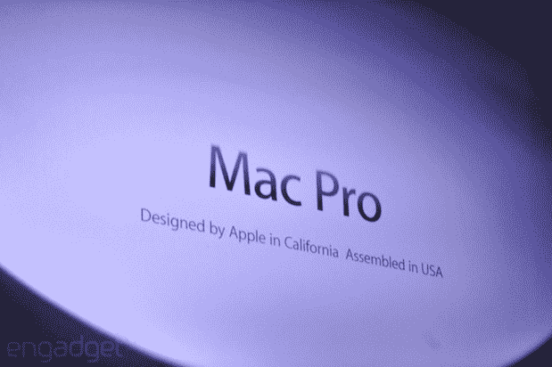

# 苹果将在美国组装 Mac Pro

> 原文：<https://web.archive.org/web/https://techcrunch.com/2013/06/10/apple-to-manufacture-mac-pro-in-the-u-s/>

# 苹果将在美国组装 Mac Pro。

美国制造业毕竟不是一个失败的事业:苹果已经兑现了它的承诺，在美国制造新的 Mac Pros 系列。今天，在苹果 WWDC 的主题演讲中宣布的细节很少，但我们猜测它们将在苹果德克萨斯的新工厂组装。

美国制造业的[衰退斜率](https://web.archive.org/web/20221209124305/http://www.politifact.com/truth-o-meter/statements/2012/sep/06/barack-obama/barack-obama-says-us-has-gained-half-million-ma/)已经从 20 世纪 60 年代的兔子斜率到 20 世纪 90 年代和 21 世纪初的双黑钻石斜率。制造业在 20 世纪 60 年代占就业岗位的 29%，但在 2011 年降至 9%。最近，我们看到从 2010 年到 2012 年增加了 50 万个工作岗位，这标志着这个陷入困境的行业出现了一个积极的新趋势——无论多么温和。苹果公司想独享所有的荣誉。

首席执行官蒂姆·库克在一次公关闪电战中调侃回归故土。例如，在上个月国会就苹果公司 130 亿美元的逃税问题进行质询时，库克提醒那些阿谀奉承的政客该公司在美国提供了多少有价值的工作岗位。

苹果并不是第一个将制造业带回美国的电脑巨头。IBM 曾计划将其广受欢迎的联想系列产品的制造带回美国。“这家中国电脑公司打算在北卡罗来纳州开始生产少量 ThinkPad 和 ThinkCentre 笔记本电脑、台式机和平板电脑。北卡罗来纳州惠特塞特的工厂将雇用 100 多名工人，成功的公司只需花费几百万美元，”[我们自己的 Matt Burns 解释道。](https://web.archive.org/web/20221209124305/https://beta.techcrunch.com/2012/10/02/lenovo-computers-soon-to-be-made-in-america/)

苹果计划的更多细节即将公布。

*更正:原标题是“在美国制造”。我们只知道苹果会在美国组装它*