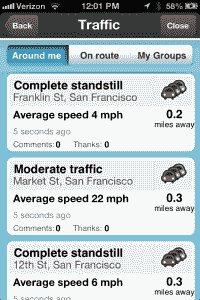
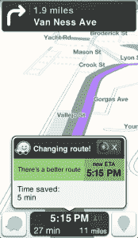

# WTF 是 Waze 为什么 Google 刚刚花了十亿+买它？TechCrunch

> 原文：<https://web.archive.org/web/https://techcrunch.com/2013/06/11/behind-the-maps-whats-in-a-waze-and-why-did-google-just-pay-a-billion-for-it/>

科技行业最近见证了大量的收购，Salesforce 本月以 25 亿美元收购了的 [ExactTarget，雅虎以 11 亿美元收购](https://web.archive.org/web/20221005154518/https://beta.techcrunch.com/2013/06/04/with-exacttarget-acquisition-salesforce-com-has-spent-close-to-3-5-billion-to-get-into-the-chief-marketing-officers-suite/) [Tumblr 的](https://web.archive.org/web/20221005154518/https://beta.techcrunch.com/2013/05/20/its-official-yahoo-is-buying-tumblr-for-1-1b-promises-to-keep-it-independent/)为其[收购狂潮](https://web.archive.org/web/20221005154518/https://beta.techcrunch.com/2013/05/16/yahoo-tumblr/)锦上添花。但今天的新闻[称谷歌正在收购流行的 iOS 地图和导航应用 Waze，](https://web.archive.org/web/20221005154518/https://beta.techcrunch.com/2013/06/11/its-official-google-buys-waze-giving-a-social-data-boost-to-its-location-and-mapping-business/)(据报道价值约 11 至 13 亿美元)略有不同。

虽然价格相似，Tumblr 很可能在雅虎介入之前就已经看到了兴趣，但几个月来谣言一直围绕着 Waze。第一个[是苹果，据报道出价约 5 亿美元](https://web.archive.org/web/20221005154518/https://beta.techcrunch.com/2013/01/02/is-apple-plotting-a-route-to-a-waze-acquisition-rumours-on-the-road-point-to-yes/)，然后是[脸书，据说以 10 亿美元的价格击败 Waze](https://web.archive.org/web/20221005154518/https://beta.techcrunch.com/2013/05/09/reports-facebook-is-buying-social-mapping-and-traffic-app-waze-for-up-to-1b-to-court-more-mobile-users/)，然后谷歌突然介入，提高赌注，完成交易。

事实上，以色列出版物 Globes[报道称，脸书的高管们非常投入，他们飞到以色列，正在进行严肃的(尽管停滞不前)谈判，这时谷歌出现了。](https://web.archive.org/web/20221005154518/http://www.ynet.co.il/articles/0,7340,L-4390157,00.html)

#### 每个人都在谈论的是什么？

[Waze](https://web.archive.org/web/20221005154518/http://www.waze.com/) 成立于 2007 年，是一家总部位于以色列帕洛阿尔托的开发商，为 iOS 和 Android 开发免费地图和即时路线导航应用。自一年后成立以来，Waze 已经从许多著名的硅谷公司(包括凯鹏华盈(Kleiner Perkins)和香港的 Horizons Ventures)筹集了 6700 万美元的外部资金，并已发展到 110 名员工，其中大部分员工在以色列，约有 10 名员工在帕洛阿尔托，包括首席执行官诺姆·巴丁(Noam Bardin)。

在此后涌现的大量第三方移动地图应用中，Waze 今天的用户数量达到了 5000 万(10 月份为 3000 万)，并凭借其独特的众包模式找到了一条稳定的增长曲线。Waze 不是孜孜不倦地绘制每一条道路、车道和小路，而是依靠其数百万用户充当交通警察、现场行动和制图师，在他们开车时标记和记录事故、瓶颈和交通的更新。它吸收并汇总这些实时用户数据(关于速度、位置、路线等)，用它来构建和完善自己的地图，并为司机计算最佳可能的路线(以及重新选择路线)，等等。

这种众包数据、司机源地图、社区监管和市民交通报告为用户体验增加了互动元素，不仅很快变得令人上瘾，而且由于其痴迷(通常是极客)的记者大军实时转播交通数据和更新，往往更加准确。众包模式(理论上)还有助于当你不可避免地错过阿尔伯克基的左转时，Waze 更容易提供更准确的改道信息——由于这些实时计算和校准(和处理)给应用程序及其基础设施带来的压力，大多数应用程序(甚至谷歌)都很难做到这一点。

换句话说，这是一个很难解决的问题，你在路线等方面的实时反馈和数据越多。，对司机来说体验越好。

因此，这一点，加上让司机能够进入社交层，查看实时油价，附近的加油站，兴趣点和使用免提导航(所有这些都随着你的驾驶而调整)，使 Waze 成为原生导航应用程序的一个有吸引力的替代品。这是令人印象深刻的，考虑到它的本土竞争对手在你购买手机时就已经在那里了，只需手指轻轻一点。不管是什么类别的应用程序，要想竞争，都必须有一个明显更高的价值主张，否则你只会坚持使用手机上的东西。

#### 它是如何吸引三巨头的

 正如[乔丹最近指出的](https://web.archive.org/web/20221005154518/https://beta.techcrunch.com/2013/06/09/googles-inroads-for-waze-could-roadblock-facebook-and-apple/)，所谓的“地图战争”在大型移动科技公司之间变得越来越激烈。对于普通人来说，虽然导航和地图应用可能不是你购买一部手机而不是另一部手机的原因，但可靠、易用的地图应用是良好移动体验的关键。毕竟，我们如此频繁地使用我们的地图和导航应用——真的依赖它们。出于这个原因，难怪脸书、苹果和谷歌都在争先恐后地超越对方。

特别是对于苹果公司来说，当该公司被传言正在检查 Waze 时，它仍然因其自己的本地地图和导航应用程序的尴尬过早发布而感到刺痛，这是如此糟糕，以至于苹果公司首席执行官蒂姆·库克前所未有地公开道歉。由于苹果地图尚未成熟就登陆 App Store，收购一款广受欢迎、可以说更加精确的导航应用是有意义的。希望苹果放弃 Waze 的决定不是该公司认为它可以在内部建立一个更好的应用程序的产物。当然，也许可以，但这也有点自大/缺乏远见的味道，这让他们认为苹果地图已经足够好，可以发布了。(你以为乔布斯对“足够好”就满意了？地狱没有。)

至于 Waze 和脸书:这家社交网络公司一直在大力加强其手机游戏，包括最近推出的大肆宣传的 Android 半操作系统(或“apperating system”，如果你更喜欢极客的话),这是它最近发布的一系列其他手机更新、转变和产品发布中的一个。毕竟，移动正在成为脸书底线的越来越重要的部分[。对于脸书来说，能够提供一个可靠、受欢迎的地图应用作为其 Android 体验的“原生”部分，可能会给潜在客户一个重新审视的理由，并对](https://web.archive.org/web/20221005154518/https://beta.techcrunch.com/2013/05/01/facebook-mobile-ad-revenue/)[对 Facebook Home](https://web.archive.org/web/20221005154518/https://beta.techcrunch.com/2013/05/12/droidfooding-home/) 的平淡采用带来一点震动。

谷歌的情况有点不同，因为它已经有了世界级的地图产品。从所有的意图和目的来看，谷歌地图设定了标准，谷歌还不如发明了面向消费者的数字导航(当然，这一切都要向 MapQuest 道歉。)我的意思是，你能说出还有哪家公司派出了一队看起来很滑稽的导盲犬来绘制每一条街道的地图吗？我们现在理所当然地认为，我们可以突然打开谷歌地球，立即“飞到”地球上的任何地方，“查看卫星图像、地图、地形、3D 建筑，从外太空的星系到海洋的峡谷。”这太荒谬了。

#### 为什么谷歌胜出

在今天的一篇博客文章中，Waze 的首席执行官诺姆·巴丁对 Waze 的共同动机(特别是谷歌首席执行官拉里·佩奇和谷歌地理副总裁布莱恩·麦克伦登的共同动机)做了一些深入的分析。):

> “我们对与谷歌地图团队合作的前景感到兴奋，以增强我们的搜索能力，并加入他们正在进行的努力，建立世界上最好的地图，”他说，然后透露，收购后“没有任何实际变化”，Waze“将保持(其)社区、品牌、服务和组织。”

但这并不能说明什么，所以虽然两家公司都没有公布所有血淋淋的细节，但下面是谷歌愿意花大价钱的几个原因，以及为什么它应该给苹果、脸书和其他人地图形状的配合。

##### 地理。

以色列在技术和研发方面有着悠久而著名的历史，以色列的创业经济已经是该地区最强的经济之一，并且还在继续发展和产生伟大的公司。但是除了思科以 50 亿美元收购 NDS 之外，Waze 是近年来以色列本土公司最大的退出案例之一。尤其是消费者。

但更重要的是，像所有科技公司一样，谷歌现在非常清楚以色列的人才储备。过去，它收购了 Labpixies 和 Quicksee 等本土初创公司，并且已经在以色列开展业务，[包括最近为当地企业家推出的项目](https://web.archive.org/web/20221005154518/http://www.google.com/entrepreneurs/initiatives/israel.html)。由于 Waze 的大部分员工都在以色列，谷歌希望维持目前的格局，因为这将使以色列强大的研发和新兴人才库变得更容易获得。

##### 少讲 5000 万，多讲数据。

公司为他们的用户进行收购并不罕见，特别是如果这种吸引力和用户基础是显著的(并且它的用户是年轻的一方)。雅虎收购 Tumblr 就是一个完美的例子。但是，随着谷歌已经拥有了可以说是美国最受欢迎的导航应用，它并没有因为更多用户而死去。尽管 5000 万用户肯定没什么坏处。

但很可能在这些公司眼中的感知价值的重叠部分有更强的吸引力。Waze 不认为自己是一家“地图公司”，而是一家“大数据公司”。考虑到谷歌是为了组织这个星球的信息，谷歌实际上是大数据的定义(并帮助发明了 MapReduce)，即使它讨厌这个标签，正如麻省理工学院的安东尼奥·雷加拉多解释的那样。更重要的是，谷歌喜欢尝试不同的[方式来可视化其地图](https://web.archive.org/web/20221005154518/https://developers.google.com/live/shows/ahNzfmdvb2dsZS1kZXZlbG9wZXJzcg4LEgVFdmVudBj9jtUDDA)中的大数据，其新的、更新的地图产品[也在不断改进。](https://web.archive.org/web/20221005154518/http://google-latlong.blogspot.com/2013/05/meet-new-google-maps-map-for-every.html)

 而且，真的，地图游戏是靠大数据赢的，不是吗？

由于其庞大的数据集和成熟的地图基础设施，谷歌本身已经开始利用这些数据为用户提供定制的个性化地图——这是 Waze 试图创造的社交化、可定制体验的基础。但是，总的来说，当谈到实时导航，根据司机的路线进行调整时，谷歌仍然感觉更多的是预编程。是的，它在最新版本的谷歌地图中有所改进，但尽管它有彩色的交通图层来显示用户的交通状况，但它似乎无法与 Waze 的路线中不断更新的交通信息相提并论。比如说，当司机想避开车流时，它通常不会提供和 Waze 一样多的潜在路线。

这些用户体验的差异本身看起来可能很小，但综合起来，它们可能会给谷歌地图带来巨大的增值。此外，谷歌的设计已经变得统一，以努力维持其各种属性的单一用户体验。Waze 的设计和用户体验更好玩、更升、更互动。Wazers 可以虔诚地报告交通堵塞或速度陷阱，谷歌知道它可以利用这一点。

##### 社交驱动

Waze 给了谷歌利用 Google+并使谷歌地图更加社会化的绝佳机会。该公司已经迅速在其产品中整合其新的社交图(Google+)，但目前还没有。 [Waze 也在加强其社交游戏，](https://web.archive.org/web/20221005154518/https://beta.techcrunch.com/2012/10/31/closing-in-on-30m-users-waze-goes-big-on-social-adds-facebook-sign-on-pickup-requests-location-sharing-more/)在 10 月份增加了社交功能，允许司机看到他们的哪些朋友正在前往共同目的地的路上，让他们能够共享驾驶、接送、聚会地点，并更容易地在路上交流状态。

[Waze 还增加了脸书单点登录](https://web.archive.org/web/20221005154518/https://beta.techcrunch.com/2012/10/31/closing-in-on-30m-users-waze-goes-big-on-social-adds-facebook-sign-on-pickup-requests-location-sharing-more/)，人们可以很容易地看到 Google 用 Google+身份验证来取代 Google，以推动更多用户使用 Google+。说实话，Google+可能需要一些朋友。凭借其脸书集成，Waze 让用户能够在一个共享的目的地点周围聚集朋友，向该群体分发方向并使用快捷方式——所有这些很酷的功能都可以通过 Google+继续扩展(因为它已经在新版谷歌地图中添加了社交搜索功能)。

##### 本地广告的巨大潜力

虽然谷歌总是努力被视为[某种下一代数字服务提供商](https://web.archive.org/web/20221005154518/https://beta.techcrunch.com/2013/05/15/googles-three-hour-io-keynote-boils-down-to-these-highlights-and-one-theme-foundation/)，但它首先是一家广告公司。事实上，它的许多服务的主要功能是帮助他们的客户在他们的用户面前获得他们的广告。随着 Waze 寻求扩大自己的收入潜力和广告平台，谷歌广告可能是其未来的关键资产。

 直到最近，Waze 一直将盈利放在次要位置，专注于增长和产品。但是，去年年底， [Waze 推出了自己的广告产品，本质上是一个“为希望吸引附近司机注意力的当地企业主和大品牌提供的位置导向广告平台。”](https://web.archive.org/web/20221005154518/https://beta.techcrunch.com/2012/11/07/looking-to-monetize-its-maps-waze-launches-a-location-aware-mobile-ad-platform-for-local-businesses/)

举例来说，Waze 以前允许用户快速点击和滑动其类别来定位附近的加油站，但其新的广告产品旨在将这一功能提升到一个新的水平。Waze 不是简单地在你手机有限的表面区域贴满广告，而是想创建一个系统，让当地的企业(和连锁店)可以在地图上占有一席之地，同时向已经在附近开车的人发送有针对性的信息和“本地”广告，比如说，已经在寻找当地的吃饭的地方。

Waze 的广告产品让 Dunkin' Donuts 等品牌能够访问自助广告平台，在那里他们可以“设置、更改和衡量他们的移动广告活动”，以及“本地搜索广告和高级定位”等功能

这让你想起了谁？

许多大型科技公司一直在寻求在本地引起轰动，无论是 Foursquare、Yelp 还是脸书，还有更多公司正在努力实现这一目标。这三家公司尤其可以通过签到和本地搜索来利用地理位置数据，但它们都无法与谷歌的规模相提并论。

是的，Google+的本地商业页面可能不太像脸书页面那样被采用，但该公司正在努力弥补差距，使 G+成为一个目的地，一个对本地企业真正有价值的数字房地产。虽然它还没有流量，但忽视 Google+越来越难了。该公司拥有庞大的本地企业、列表、联系信息、工作时间等数据集，他们利用这些数据来迎合本地广告商，这些广告商希望通过搜索相关关键词等来接触客户。

[美国本地移动广告支出预计将在未来几年](https://web.archive.org/web/20221005154518/http://www.biakelsey.com/Company/Press-Releases/130404-U.S.-Mobile-Local-Ad-Revenues-to-Reach-%249.1-Billion-in-2017.asp)飙升，这使得谷歌庞大的本地企业和搜索索引对 Waze 极具价值，在某种程度上，反过来也是如此。虽然增加这种搜索及其伴随的海量数据集和后端处理可能会导致更混乱的用户体验(很难想象谷歌永远不会接触 Waze 的 UI)，但谷歌也可以给 Waze 提供它仍然缺失的搜索功能和集成。

#### 游戏结束了？

人们越深入了解收购的动机，就越容易证明 10 亿美元的价格是合理的。此外，尽管很少有人提到像这样的高价收购，但这似乎是一笔大买卖。谷歌没有让一款优秀的地图和导航产品落入(迫切)需要它的其他大公司手中，而是利用其已经非常出色的地图产品，增加了一款更年轻但可能同样有价值的产品。

虽然 Wazers 可能担心它的新主人会修补(和破坏)应用程序当前的体验和界面，但更有可能的是，任何重大的变化或集成仍然是一个漫长的路要走。此外，正如我的 homeskillet 和同事 Greg Kumparak 指出的那样，谷歌可以立即开始从 Waze 的实时交通数据和移动改道技术中获得价值——这两者都是谷歌需要的，并且都有可能集成到谷歌地图中，而不会破坏 Waze 的用户体验。

然而，最终，如果“地图大战”不仅仅是媒体炒作，如果其结果对他们的移动战略有任何重大影响，那么这对脸书和苹果来说似乎是一个相当大的损失。看起来，仅仅是让 Waze 脱离谷歌的手似乎是值得的，但同样，在地图之外还有一个巨大的移动领域。不管怎样，在 Waze-oogle 交易之后，苹果、脸书和其他所有人都在逆流而上。