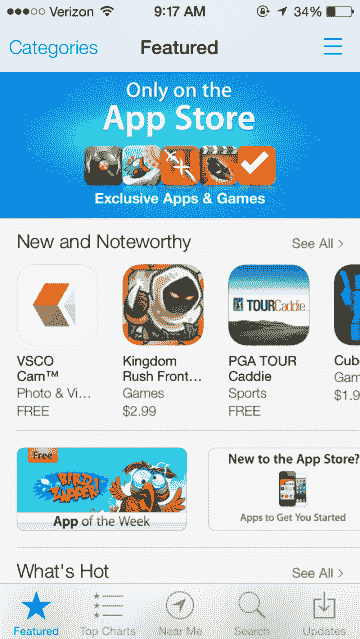
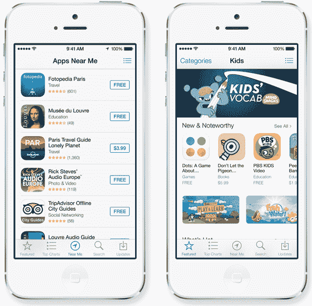
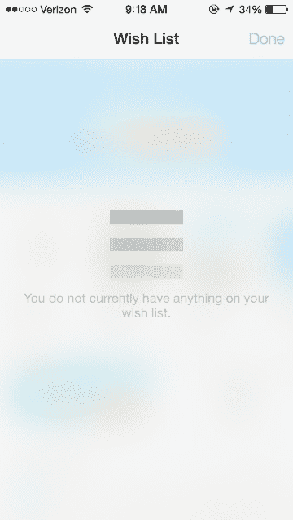
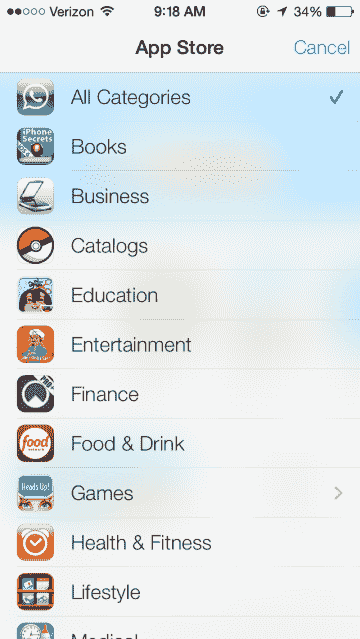
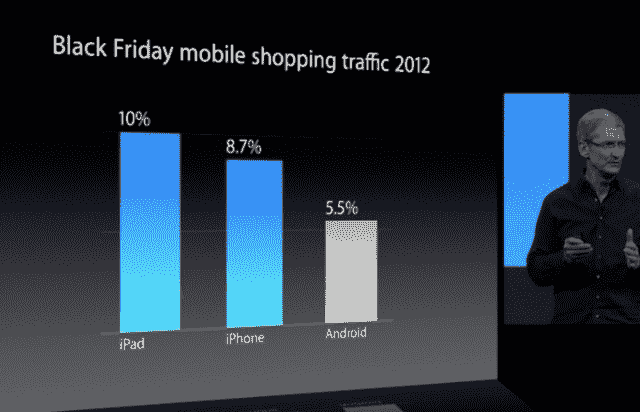
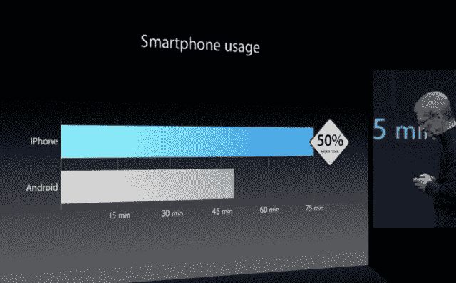

# 为什么苹果杀死了应用天才，应用商店的长尾下一步是什么

> 原文：<https://web.archive.org/web/https://techcrunch.com/2013/06/11/why-apple-gave-up-on-genius-for-apps-and-whats-next-for-the-app-stores-long-tail/>

在最新版本的苹果移动操作系统 iOS 7 中，苹果不再提供“Genius”功能，作为在 iOS 应用商店中展示和发现新移动应用的一种方式。相反，过去属于“Genius”的位置现在属于“Near Me”，这是昨天在 WWDC 的主题演讲中演示的一项新功能，它根据你的位置推荐应用程序。

这是 iOS 6 的一个重大变化，在 iOS 6 中,“Genius”选项不仅在 iOS 应用商店主屏幕的底部有一个按钮，它还是直接位于中心的按钮——邀请用户先点击它。

 对许多第三方来说，应用推荐一直是一项艰难的业务，似乎就连苹果也在尝试让这些推荐更有用的方法。但通过引入“Near Me”而不是“Genius”，苹果基本上放弃了根据用户的偏好向他们提供更个性化的推荐，而是根据用户的当前位置提供通用的应用推荐。

例如，在主题演讲期间，在某人正在旅行的背景下演示了“我附近”功能。当然，启动 iOS 应用商店来查找附近酒店、餐馆或景点的应用程序在某些时候会很方便。但这并不是日常需要，所以很好奇为什么“我附近”在新店里还是得到了中心位置。毕竟，大多数寻找新应用的用户会点击图表或应用商店的特色部分，在那里算法和策划的列表，如“什么是热门”或“新的和值得注意的”提供了更好的选择。

## 发现服务的更多机会？

移除应用程序的“Genius”正值苹果公司打击替代应用程序发现资源之际。最近几个月，苹果被一些人——主要是受害者——指责关闭了 appfreet 和 AppShopper(后者后来在修改后回归)等发现服务[，似乎是根据某种旨在将所有新应用发现工具都放在内部的一揽子政策。](https://web.archive.org/web/20221221065054/https://techcrunch.com/2013/04/18/apple-kills-appgratis-push-notifications/)

 但事实显然并非如此——如果说有什么不同的话，现在移除应用程序的“天才”给了第三方更多的机会来介入并试图满足用户的需求。

苹果针对应用发现服务的政策[于去年秋天](https://web.archive.org/web/20221221065054/https://techcrunch.com/2012/10/01/how-a-new-apple-developer-guideline-could-be-curtains-for-apps-that-promote-other-apps/)首次颁布，并不是禁止这些服务，而是对试图操纵应用商店排行榜获利的开发者发出警告。指导方针可能规定，除了开发者自己的“*之外，推荐其他应用的应用将被拒绝*，但苹果正在使用该条款选择性地拒绝那些它知道违反潜规则的应用。

在这个领域安全运行的其他应用程序包括长期的应用程序发现源 [Appsfire](https://web.archive.org/web/20221221065054/http://new.appsfire.com/) 和相对较新的 [Hubbl](https://web.archive.org/web/20221221065054/http://hubbl.io/) ，例如，它们都没有经历过同样的麻烦。事实上，Hubbl 的联合创始人 Archana Patchirajan 告诉我们，他们最新的应用程序更新在短短三天内就获得了 App Store 发布的批准。

## 为什么天才对应用程序不起作用

应用推荐市场经历了一些剧变，这不仅仅是因为苹果的拒绝。该领域的一些运营服务，比如像人行横道这样的，已经转向其他业务，而其他的[则关闭了](https://web.archive.org/web/20221221065054/http://www.cbinsights.com/blog/trends/app-discovery-start-ups)。许多留下来的仍然是小众玩家。苹果自己也没有做出任何公开举动，直到现在推出了“Near Me”，提供任何关于应用程序推荐的新观点。它没有像收购 Chomp 那样收购任何初创公司，以便更好地了解应用推荐方面的挑战和可能性。

但至少它通过移除“Genius ”(用于应用程序——在 iOS 7 中仍用于音乐)承认了其早期的系统不起作用。

Appsfire 的联合创始人 Ouriel Ohayon 认为，苹果的推荐版本从未引起用户的共鸣，因为“体验和推荐都不那么相关，”他说。“应用程序的推荐大多基于你下载的内容，而不是你真正需要和喜欢的内容(基于品味)。你下载的并不是你下一步想要什么的信号。“发现不仅仅是这些，”Ohayon 补充道。

用户也可能看不到“天才”的必要性，因为他们已经转向苹果的推荐图表。当他们寻找与他们已经安装的应用程序相似的应用程序时，每个应用程序列表页面中的“相关”部分就是为了这个目的——它也保留在 iOS 7 中。

和我一样，Ohayon 也质疑“Near Me”现在在 App Store 中的突出位置，这似乎是一个指标，表明苹果正在努力寻找个性化的推荐。“这不是一种自然的思维方式。这可能是一个很好的二次发现机制，可能是 Genius 的一部分。

Patchirajan 同意，苹果的“天才”机制长期以来未能发挥应用程序发现的潜力，因为真正有效的个性化推荐是几个因素的结合，而不仅仅是关注“喜欢 X 也喜欢 Y 的人”，或你的位置，正如“我附近”现在所呼吁的那样。

相反，推荐算法还应该寻找许多其他信号，包括用户拥有的应用程序、用户的社交档案、用户的兴趣档案和情景意识。Patchirajan 说:“你需要有丰富的应用元数据，仅仅是应用的类别和关键词是不够的。”

## 对开发人员的影响很小

尽管在这一领域开展业务的开发者会对苹果自己在应用推荐方面的能力抱有偏见，但我们在业内采访过的人的更广泛共识是，在让用户找到应用，然后获得更高排名方面，“天才”的移除不会对开发者产生重大影响。

MobileDevHQ 的首席执行官伊恩·塞弗曼解释道:“从营销人员的角度来看，天才是一块难啃的骨头。因为它非常个性化，所以很难确保你的应用在用户的天才推荐中受到关注。”(然而，他认为[“在我附近”的功能有可能成为另一个“顶级排行榜](https://web.archive.org/web/20221221065054/http://www.mobiledevhq.com/howdoesios7affectappmarketersandhowdoyoutakeadvantage--110/articles)”)

应用程序下载仍然主要由苹果的图表和特色部分驱动，而不是像“Genius”这样的实验性推荐部分，也可能不是即将推出的“Near Me”。从我们听到的应用商店搜索引擎优化(ASO)来看，iOS 7 并没有太大的变化。粗略一看，搜索似乎基本相同。(对关键词和算法改进的研究需要一些时间)。

新的 iOS 应用商店“愿望列表”功能——长期以来一直是 iTunes 桌面版本的一个选项——现在已经转移到移动设备上，但这也不太可能推动应用程序通过图表，因为它基本上是一个“可能”的列表。

 对于开发者来说，不幸的是，它看起来更像是千篇一律。

[苹果的 iOS 应用已经达到 90 万个，但是它支付给应用开发者](https://web.archive.org/web/20221221065054/https://techcrunch.com/2013/06/10/apples-app-store-hits-50-billion-downloads-paid-out-10-billion-to-developers/)的 100 亿美元的收入越来越集中在图表的顶端。美国顶级 iPhone 出版商中只有 2%是新进者，因为进入顶级排行榜变得比以往任何时候都难。

苹果公司最终将不得不找出一个更好的推荐系统，如果它想迎合越来越多的应用程序开发者，他们仍在推出新的创作，希望成为应用程序商店淘金热的一部分，这一热潮没有显示出放缓的迹象。

如果没有，这些开发者可能会将注意力转向 Android。今天，Google Play 在下载量和收入方面的增长速度都超过了苹果的应用商店，T2 从去年 11 月占 Google Play 和苹果应用商店总收入的 19%跃升至今年 4 月的 27%。Google Play 还提供了更大的消费者市场份额，以及一个[稍微](https://web.archive.org/web/20221221065054/https://techcrunch.com/2013/02/20/the-app-stores-are-getting-full-only-2-of-iphone-top-publishers-in-u-s-are-newcomers-3-on-google-play/)更欢迎新开发者的平台。然而，该商店历来难以为其开发者创造收入，苹果首席执行官蒂姆·库克(Tim Cook)昨日指出，一些数据表明 iOS 用户对其设备的参与度有多高。

但最终，谷歌/Android 不必让其整个用户群都沉迷于他们的手机——它只需将其用户群扩大到足以驱动大量下载，然后开发者的支付和收入将随其规模和规模的性质而变化。

与此同时，让苹果的应用预测用户拥有稳定的新应用可供尝试，将成为苹果不能永远依靠“Near Me”及其应用商店排行榜等临时工具的事情。

