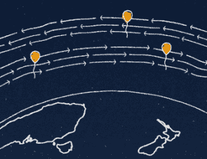
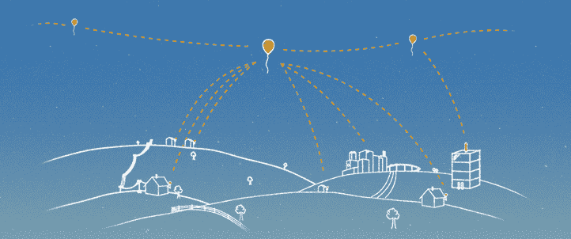

# 谷歌宣布 Loon 项目:偏远地区的气球动力互联网

> 原文：<https://web.archive.org/web/https://techcrunch.com/2013/06/14/google-x-announces-project-loon-balloon-powered-internet-for-rural-remote-and-underserved-areas/>

# Google X 宣布 Loon 项目:为农村、偏远和服务不足的地区提供气球动力的互联网

谷歌眼镜和谷歌自动驾驶汽车等项目背后的秘密实验室 Google X 今天宣布了其最新项目:[气球动力互联网接入](https://web.archive.org/web/20230202060349/http://www.google.com/loon/)用于地球上常规地面互联网不是一个好选择的地区。本周早些时候，谷歌开始在新西兰的[T3 测试这些气球，这些气球旨在在同温层风中航行时提供类似 3G 网络的互联网接入。](https://web.archive.org/web/20230202060349/https://maps.google.com/maps?q=Canterbury,+New+Zealand&hl=en&ll=-43.735383,171.702576&spn=1.232403,2.897644&sll=37.0625,-95.677068&sspn=43.037246,92.724609&oq=canterbury+n&hnear=Canterbury,+New+Zealand&t=m&z=9)

我们之前听说过关于此事的[传言](https://web.archive.org/web/20230202060349/http://online.wsj.com/article/SB10001424127887323975004578503350402434918.html)，但是就像 Google X 的大部分项目一样，这个想法听起来像是一个长镜头。毕竟，使用自由飞行的气球听起来像是制造灾难的方法——或者至少是制造失控的气球。

http://www.youtube.com/watch?feature = player _ embedded & v = m96 type k1 ao

因为整个想法听起来有点疯狂，谷歌说，它把这个倡议称为“项目龙”然而，谷歌认为，它已经找到了一种方法，让这些气球“在风中自由航行”，并通过上下移动它们来把握正确的风向。这仍然意味着团队必须管理这些气球的舰队——这里的想法是有一天让这些气球环游世界。谷歌表示，它正在“通过一些复杂的算法和强大的计算能力”来解决这个问题。谷歌使用美国国家海洋和大气管理局的风数据来预测气球的飞行路线。

目前，谷歌表示，它在这个试点项目中使用了 30 个气球，新西兰大约有 50 名测试人员正在地面上使用这项服务。这些测试器有特殊的天线，当气球在 20 公里半径内时，可以连接到气球上。

谷歌，尤其是其董事长埃里克·施密特，长期以来一直在谈论让全球三分之二目前无法上网的人口上网的重要性。谷歌指出，Project Loon 旨在帮助解决这个问题。它不仅可以将互联网接入带到当今技术不太适用的地区(丛林、群岛、山脉)，而且谷歌似乎还希望这种气球动力网络可以帮助降低许多国家的互联网接入价格，目前许多人都负担不起。

http://www.youtube.com/watch?feature = player _ embedded & v = mcw6j-qw GMO

