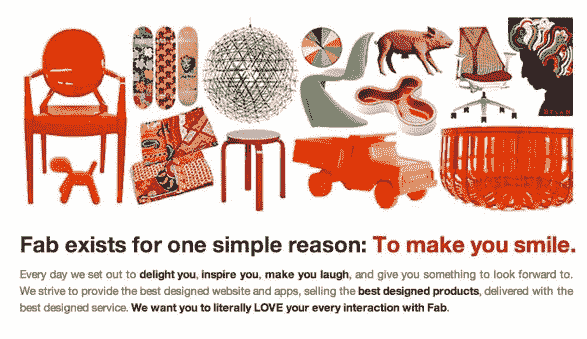

# Fab 以 1.5 亿美元的 1B 估值获得 1.5 亿美元(并正在再融资 1 亿多美元)

> 原文：<https://web.archive.org/web/https://techcrunch.com/2013/06/18/fab-grabs-150-million-from-tencent-andreessen-horowitz-and-others-at-1b-valuation-and-is-raising-another-100m-more/>

专注于设计的商业公司 Fab 已经筹集了我们几个月前获得的那轮资金。Fab 今天宣布，它已经在该公司的 D 轮融资的第一批中筹集了 1.5 亿美元。我们被告知，1.5 亿美元是 Fab 预计在未来几个月内完成的更大 D 轮融资的第一部分。新加入这一轮的是中国互联网巨头腾讯，它也将在 Fab 拥有一个董事会席位；和日本企业集团伊藤忠。之前的投资者 Atomico、Andreessen Horowitz、Menlo Ventures、RTP Capital、Pinnacle Ventures、Lars Hinrichs 和 Docomo Capital 也参与了最新一轮融资。

这使 Fab 的资金总额达到 3.1 亿美元。我们从多个渠道获悉，正如我们在 4 月份报道的那样，该公司的投资前估值为 10 亿美元(Fab 的一位发言人已经证实了这一估值)。我们还从一个消息来源获悉，Fab 将在这轮融资的后期再融资 1 亿美元或更多。在 2012 年 Fab 的最后一轮融资中，该公司价值约为[6 亿美元](https://web.archive.org/web/20221223021130/https://techcrunch.com/2012/11/01/at-9-million-users-strong-fab-raises-more-money-and-is-just-getting-warmed-up/)。过去的投资者包括首轮资本、软科技风险投资、巴罗达风险投资、阿什顿·库彻、盖伊·奥塞里、茁壮成长资本、凯文·罗斯、SV 天使、华盛顿邮报、VTB 资本、Phenomen 风险投资和印度时报。

创始人兼首席执行官杰森·戈德堡(Jason Goldberg)表示，公司在 3 月份开始了筹资路线，以筹集足够的资金来维持几年的跑道，至少到 2015 年。他补充说，这一轮有价值 4 亿美元的投资者感兴趣。

**成长、国际化和另一个支点**

Fab 拥有 1400 万用户，在首次转型后，仍在继续快速增长。去年，该公司的收入为 1.2 亿美元，并在 2 月份透露，2013 年 1 月的销售额比 2012 年 1 月增长了近 300%。事实上，一月份是 Fab 有史以来第三高的销售月份。

据该公司称，Fab 在 2013 年的销售额应该达到 2.5 亿美元。晶圆厂现在实现了 43%的毛利率，高于 2011 年的 29%。有趣的是，Fab 表示，其大部分收入并非来自 flash 销售，这是 Fab 在 2011 年转向后采用的最初模式。正如我们在公司简介中所写的，Fab 臭名昭著地从 Fabulis，一个同性恋社区的社交网络，转变为一个 flash 销售网站。Fab 表示，目前三分之二的销售额不是来自网站上的闪购，该公司最近更名以反映这一变化。Fab 50%的销售额来自家居类。

五月，Fab [推出了它的新设计商店](https://web.archive.org/web/20221223021130/https://techcrunch.com/2013/04/30/on-track-for-300m-in-2013-sales-fab-pivots-again-buys-custom-furniture-shop-massivkonzept-and-opens-retail-storefront/)，这使它更像一个综合电子商务网站。你可以通过房间、家具类型、颜色、设计师等进入设计页面。

国际市场也是该公司一个巨大的潜在增长领域。Fab 在英国有 100 万会员，其近 40%的销售额来自欧洲，是其在美国以外增长最快的市场。亚洲是下一个前沿市场，这就是为什么 Goldberg 和 Fab 邀请腾讯和伊藤忠作为合作伙伴。

正如戈德堡解释的那样，目前世界上只有四家电子商务公司的估值超过 100 亿美元:亚马逊、阿里巴巴、易贝和乐天。他认为，Fab 有合法的机会成为第五名，引领他所说的情感商业。这基本上意味着 Fab 帮助人们发现他们喜欢和想要的物品。

Fab 接管情感商务计划的一部分包括制造自己的产品和家居用品系列。Fab 还与设计师合作，通过 Fab 独家制造和销售家居用品。此外，Fab 正在尝试实体店，第一家店将在德国汉堡开业。移动也是一个巨大的增长领域，三分之一的销售是通过移动进行的。国际也将是 Fab 的一个主要战略重点，Fab 刚刚收购了德国定制家具商店 Massivkonzept。Fab 在 27 个国家销售产品，目前 40%的销售发生在美国以外

**哪个晶圆厂在**上花钱

1.5 亿美元是一大笔现金，Fab 正在筹集更多资金。钱去哪了？戈德堡说，Fab 将投资于供应链、物流、客户服务、技术和商品销售的额外改进。2012 年初，从购买到发货平均需要 16 天。如今，Fab 75%的订单在购买后 24 小时内发货，Fab 希望确保网站上销售的所有产品都是如此。今年，Fab 将在荷兰开设自己的新仓库，为欧洲客户服务。2014 年，Fab 将在拉斯维加斯地区开设一个仓库。

如上所述，Fab 还将加倍努力在内部制造和设计更多产品，并与设计师合作，在 Fab 上独家提供产品。我们还可以期待社交和移动领域的更多发展。戈德堡说，Fab 将在国际上投入更多资金(可能通过更多收购，因为它在两年内收购了五家公司)。

随着腾讯的投资，戈德堡说，Fab 将共同努力，扩大该网站在中国的存在。

至于为什么 Fab 在短短两年内筹集了这么多资金，戈德堡坚持认为这就是零售业的运作方式。“告诉我一个价值超过 50 亿美元的电子商务企业没有筹集到很多资金，”他说。他解释说，为了给物流、履行、库存和制造等事情提供资金，企业需要大量资本。他补充说，如果 Fab 继续作为美国业务，该公司就不需要筹集那么多资金。

至少对美国和欧洲企业来说，现在也有了一条多少有些清晰的盈利之路。戈德堡说，Fab 在美国和欧洲的业务可能会在 2014 年第四季度或 2015 年 Q1 实现盈利。