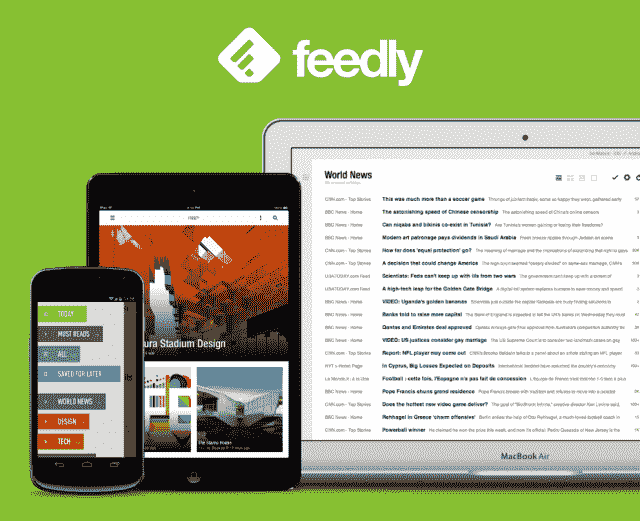
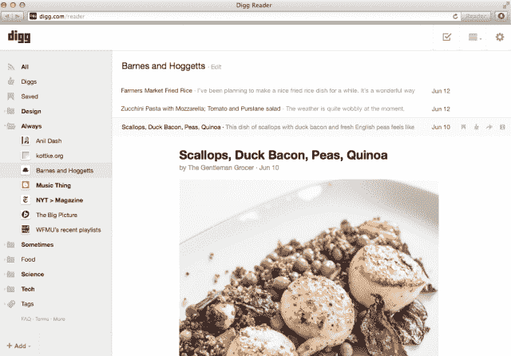
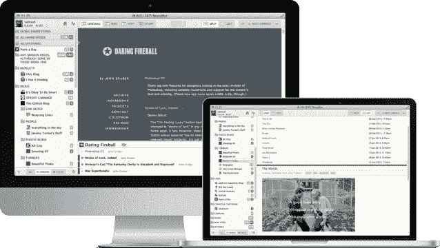
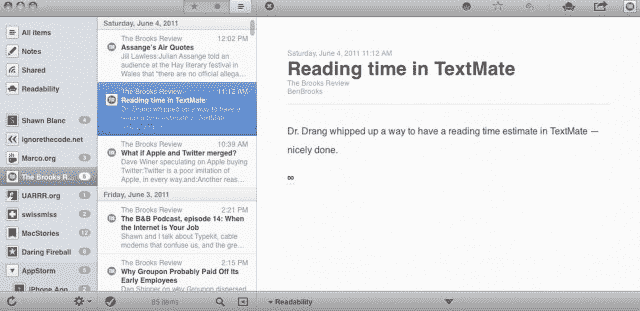
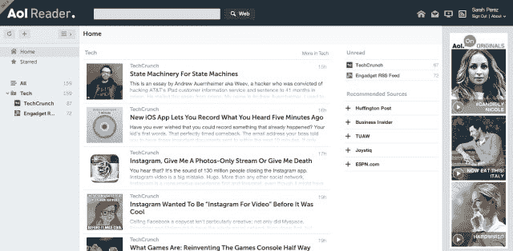
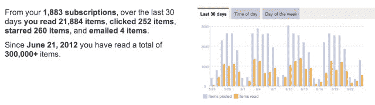

# 谷歌阅读器没有替代品，只有替代品 TechCrunch

> 原文：<https://web.archive.org/web/https://techcrunch.com/2013/06/24/there-is-no-google-reader-replacement-only-alternatives/>

谷歌阅读器变慢了。在过去的几天里，按钮坏了，将订阅源标记为已读似乎比平时花费了更多的时间，一些设备上的 Android 移动网站转移到了桌面视图，没有办法将事情改回来。作为用户，直到痛苦的结束，我们不能再抱怨这些事件，因为谷歌不在乎——它将在 7 月 1 日关闭谷歌阅读器，我们都必须离开。

这在数字上相当于摇滚音乐会结束后点亮了室内灯光。各位，你们不必回家，但也不能留在这里。

没有人关心 RSS 订阅，除了大约 5000 万互联网上最贪婪的新闻读者。记者、博客作者、程序员、精通技术的 IT 工作者、研究人员、学生、初创公司创始人，以及其他任何已经习惯了一个简单产品的人，这个产品让*你*——而不是算法或推文——能够控制哪些新闻源需要追踪，哪些故事需要阅读。

随着谷歌即将关闭，许多替代品涌现出来，为谷歌阅读器提供“替代品”。虽然有些人很接近，但没有一个人完全掌握了这种体验。

** 5000 万:Digg 对关注 RSS 的人的估计。*

## 目前唯一真正的竞争者:Feedly & Digg

Feedly 多年来一直在开发自己的 RSS 产品，这让它在这个领域有了巨大的领先优势。上周，[它宣布拥有 1200 万用户](https://web.archive.org/web/20221231062102/https://techcrunch.com/2013/06/19/feedly-cloud-goes-live/)，因为它正式推出了“Feedly Cloud”，这是一个后端基础设施，为 RSS 阅读器客户端应用程序的生态系统提供动力，如 [Reeder](https://web.archive.org/web/20221231062102/http://reederapp.com/) 、 [Press](https://web.archive.org/web/20221231062102/http://twentyfivesquares.com/press) 、 [Nextgen Reader](https://web.archive.org/web/20221231062102/http://nextmatters.com/) 、 [Newsify](https://web.archive.org/web/20221231062102/http://newsify.co/) 、 [gReader](https://web.archive.org/web/20221231062102/http://www.greader.co/) 等等，这些应用程序被谷歌从 RSS 中抛弃。这些应用程序只提供了前端 RSS 浏览体验，这意味着它们需要其他人的 API 才能运行。Feedly 是少数几个介入并满足这一需求的公司之一。

**为什么选择 Feedly** :谷歌阅读器用户会喜欢 Feedly，因为它最接近于反映谷歌阅读器的体验，并且它提供了许多可以根据你的喜好进行调整的设置。该服务的“仅标题”视图(可以在首选项中全局设置)提供了类似的紧凑视图，非常适合标题扫描操作，这是 Google Reader 曾经提供的。它还支持许多谷歌阅读器的功能，包括支持许多相同的键盘快捷键、标签、收藏夹(“保存以备后用”)和“标记为已读”功能，以快速浏览类别。

**出了什么问题** : Feedly 最近推出了它的“搜索”功能，可以让你通过关键词或主题找到内容——这是当今用户最大的需求之一。该公司表示，这项工作仍在进行中，但这是一项需要兑现的大工程。此外，虽然该公司提供网络和移动客户端，但移动应用程序仍然有些过度设计，具有大而多彩的类别标题，而不是像谷歌阅读器那样的基本文件夹列表。

也就是说，很难找到 Feedly 的很多缺点，该公司正在迅速努力增加一些缺失的部分。当然，这里或那里会有一些你需要习惯的小事情(比如“t”快捷键不再让你标记项目，而是在推特上发布)。然而，在某些情况下，它们会变得更好(比如按类别设置默认视图的选项)。

**Digg 阅读器**

Betaworks 对谷歌阅读器的快速开发是一个新生事物，很有可能成为 Feedly 的有力竞争者。虽然最初，该团队一直致力于推出提供核心 RSS 阅读体验的东西，但计划是通过提醒用户他们网络中最受欢迎的内容，将 RSS 阅读器带入现代时代，并更好地将用户与 Digg.com 联系起来。在 Digg Reader 的“热门”部分，该服务扫描你的订阅源，然后用一个、两个或三个点对它们进行排名，以帮助你发现热门文章。在实践中，这些建议有时被击中或错过，但我们一直在测试的测试版尚未完成。

**为什么选择 Digg Reader** :和 Feedly 一样，这款应用可以让你将内容组织到文件夹中，查看未读次数，使用谷歌阅读器快捷方式四处移动，保存文章以备后用，以及分享到社交网络。除了上述的“热门”部分，它还提供了类似于 Feedly 的“今日”的内容，让你一目了然地了解流行趋势。前 Google Reader 用户也会喜欢 Digg Reader 的简约外观，它几乎全部是黑色、白色和灰色(RSS 内容本身之外)。

问题:【Digg Reader 的大部分问题都与时间有关:该团队只有有限的几周时间来开发这项服务，他们是在谷歌宣布关闭后才开始的。尽管如此，仍有一些前谷歌阅读器用户可能依赖的功能在新阅读器产品发布时(计划于本周二)尚未准备好。例如，搜索在这里也是缺失的，除了脸书、Twitter 或 Digg 之外，标记内容或分享到其他社交服务的能力也是缺失的。(“稍后阅读”服务，如 Pocket、Readability 和 Instapaper，都是受支持的。)

Digg Reader 只提供两种视图，“列表”和“扩展”虽然前者旨在为用户提供标题扫描选项，但 Feedly 的“仅标题”视图更紧凑，这意味着它更像谷歌阅读器的“紧凑”视图。

发布时，Digg Reader 将有一个 iOS 应用程序，但 Android 版本还要几周才能准备好。

## 创业公司

提供完整的谷歌阅读器替代品并不是一项简单的任务，因此值得注意的是，一些初创公司试图在没有脸书或 Betaworks 等大型公司支持的情况下承担这项工作。话虽如此，对于谷歌阅读器的超级用户来说，这些小公司中没有一家能够取代即将失去的东西。

**NewsBlur(无限订阅，24 美元/年)**:这款跨平台的新闻阅读器提供读者导入、压缩视图、保存故事，甚至还有一个有趣的“培训”功能，旨在帮助读者了解你最喜欢哪种类型的故事。但 NewsBlur 的界面过于繁忙和混乱，缺乏搜索功能，当你有很多提要要加载时会很慢。

**Feedbin(2 美元/月)** : Feedbin 的付费网络应用是另一个很好的选择，可以用来跟踪订阅源、查看未读计数、订阅和标记，它通过键盘快捷键使用类似阅读器的导航。然而，虽然它支持阅读器数据导入，但它缺乏一些关键功能，如搜索或 Feedly 的各种布局。但最重要的是，它本身并不是一个完全跨平台的产品。如果你在网络上使用 Feedbin，那么为了在移动设备之间保持数据同步，你需要使用一个由它的 API 支持的应用程序，如 Reeder、Press、Favs、Tafiti 或其他，或者测试一下新的 Android Feedbin 阅读器。

【T2

Old Reader 和 Hive(之前的 HiveMined) :这两家初创公司在理论上听起来很有前景，因为它们都专注于简单地重建原始阅读器——前者也致力于让社交方面回归。不幸的是，这两者都还没有实现，而且在谷歌阅读器关闭时也不会成为可靠的替代品。

两个应用有时都存在速度问题(不过，老阅读器在这方面比 Hive 好得多)。虽然老阅读器有搜索功能，但只是标题搜索，没有完整的关键词搜索。与此同时，Hive 没有搜索功能，并努力导入读者订阅。有时 Hive 的按钮注册点击速度太慢，以至于你不确定应用程序是否已经关闭。对外部服务的共享要么有限，要么不存在。这两项服务都不提供手机应用。

**Reeder(付费)**:直到最近， [Reeder](https://web.archive.org/web/20221231062102/http://reederapp.com/) 还不是谷歌阅读器的替代品，它只是谷歌托管的查看提要的前端界面。自从 Reader 宣布关闭后，该公司表示现在正计划继续开发，但这涉及到其部分的重大变化。如今，Reeder 在移动设备上使用 Feedbin 和 Feedly 的 API，并且还在努力支持独立的 RSS(在 iPhone 应用程序中引入，但尚未在 iPad 或 Mac 应用程序中引入)。因为 Reeder 是建立在其他基础设施之上的，所以目前它还没有准备好取代 Google Reader。也就是说，鉴于它有一个积极参与的苹果用户群和一些牵引力，这是一个值得关注的问题。

**NetNewsWire** :今天[刚刚发布](https://web.archive.org/web/20221231062102/http://blackpixel.com/blog/2013/06/netnewswire-4-open-beta.html)，NetNewsWire (ver .它拥有许多类似谷歌阅读器的功能，包括键盘快捷键、有限的共享选项、收藏、标记为已读功能等等。然而，它默认采用类似收件箱的视图，其移动客户端应用程序仅适用于 iOS，尚未更新到新的 iOS 7 风格。

## 其余的:我也是，Flipboard 替代品和 Aol 的灾难性尝试

自从谷歌阅读器宣布关闭以来，我们的收件箱几乎每天都塞满了“替换”的广告。在这里列出这些几乎是对 TechCrunch 读者的伤害，因为真正的替代品是在基础设施和 API 方面的巨额投资，并显示出试图通过紧凑的视图、键盘导航、标记和搜索等功能来满足谷歌阅读器难民的需求。仅仅提供一个基于 RSS 的产品并不能使一项服务成为谷歌阅读器的替代品，试图这样定位充其量是赶时髦，最差也是不诚实。

许多这样的项目看起来像是一夜之间拼凑起来的周末项目。没有一个是好的。(是的，我收到了你的邮件。)

此外，这些“我也是”的产品中有几个看起来更像淡化版的 Flipboard，而不是谷歌阅读器。真的，如果你只是想要一本新闻杂志，那么就使用 Flipboard，或者等着看[脸书公司即将推出的“移动报纸”产品。](https://web.archive.org/web/20221231062102/http://www.techmeme.com/130623/p12#a130623p12)

**美国在线阅读器**

甚至美国在线(披露:TechCrunch 的母公司)也搞砸了它的 RSS 阅读器首次亮相，并推出了一款我们在 TechCrunch 的许多人甚至不能正常工作的产品。Aol 的 RSS 阅读器声称提供 Google Reader 导入，但拒绝在多种浏览器中上传 Google Reader 的 XML 文件，据我们几个勇敢地测试了这项服务的人说。

Aol 的阅读器在 Chrome 上出现了间歇性问题，尤其是今天早上，例如，拒绝添加 TechCrunch feed(感谢 Aol)，在 Safari 上花了大约 30 秒来做同样的事情。这种缓慢可能是一个发射错误，但它不是有希望的。阅读器也缺少搜索功能，但确实提供了标签、有限分享、收藏、四种不同的观看选项(虽然这些选项与 Feedly 非常相似)，哦，还有侧边栏中的巨型 Aol 原创视频广告…

嗯，至少他们有一个货币化计划。

## 谷歌阅读器没有替代品

在上面列出的每一个产品中，以及几十个我们没有链接到的仍在宣传自己是读者难民之家的产品中，都存在巨大的功能差距——比如搜索，还没有人完全充实它。因此，用户也将失去搜索和发现老网站内容的能力，这些老网站已经关闭很久了，并带走了他们的 RSS 档案。谷歌阅读器可以让你穿越时空回到网络的过去，一种私人的回到过去的机器。除非你多年来一直在努力标记或主演这些旧内容，否则如果没有像谷歌那样的搜索功能，它将基本上消失在太空中，谷歌曾经挖掘看似无限的 RSS 档案。

Reader 也不仅仅是一项网络服务。它是一个移动网站，一个移动应用程序和一个 API，让 RSS 客户端的生态系统蓬勃发展。

这是一个量化的自我追踪器，它的“趋势”部分告诉你你的新闻阅读习惯，包括你阅读、点击、分享和发送电子邮件最多的网站以及时间，还有一个跟踪保持新鲜或变得不活跃的订阅源。

它也是一种发现服务，可以将你和朋友联系起来，让你打包订阅并分享，通过关键词搜索内容，浏览其他人感兴趣的帖子。这是一个提醒工具，可以跟踪任何时候在谷歌新闻、博客搜索、推特或易贝上提到的人、话题或关键词。

对于任何正在寻找谷歌阅读器替代品的人来说，最令人难过的消息是还没有。

只有选择。