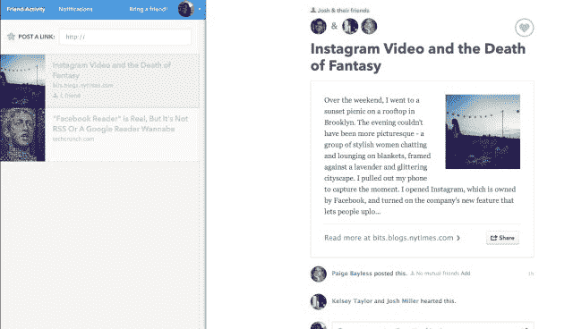

# Branch 背后的团队称，Potluck 是一种新的链接共享服务，面向不发推特或博客的互联网“潜伏者”

> 原文：<https://web.archive.org/web/https://techcrunch.com/2013/06/25/from-the-team-behind-branch-potluck-is-a-new-link-sharing-service-for-the-internets-lurkers-who-dont-tweet-or-blog/>

社交对话平台[分公司](https://web.archive.org/web/20230207093515/http://branch.com/)背后的[团队](https://web.archive.org/web/20230207093515/http://branch.com/company)今天与 [Potluck](https://web.archive.org/web/20230207093515/http://www.potluck.it/) 一起推出了一项新的业务，这项服务似乎与该公司早期激发有思想、有质量的网络讨论的努力完全相反。根据互联网的 1%规则，如果只有一小部分人会参与内容创作(就像 Branch 一样)，那么就把 Potluck 看作是吸引大多数所谓“潜伏者”的服务。

Potluck 本质上是一个链接共享网络，建立在用户通过 Twitter、脸书和 Gmail 的社交联系之上。但与今天的许多社交网络不同，包括脸书和 Twitter 以及 Branch，重点不是让用户塑造在线角色，而是分享的内容。

Branch 首席执行官兼联合创始人乔希·米勒(Josh Miller)在一篇关于 [Medium](https://web.archive.org/web/20230207093515/http://www.crunchbase.com/product/medium-com) 的博客文章中解释道:“家常便饭让分享变得更加个人化，压力更小，从而降低了分享的效果。”

他说，在今天的大多数社交网络上，有产生“两位数的喜欢、原创的俏皮话、令人惊叹的图像”的压力，通过强调内容而不是分享内容的人，人们希望 Potluck 能够建立一个分享服务，在那里首先注意到的不是谁，而是什么。

在 [Potluck](https://web.archive.org/web/20230207093515/http://www.potluck.it/) 上分享的链接没有人的名字或头像，只有链接的主题或名称，以及谈论它的朋友的数量。只有点击之后，你才会发现还有谁在讨论这个话题。然后你可以加入讨论，或者只是“用心”去表达你的赞同。

用户在 Potluck 中分享的链接是他们每天在网上冲浪时都会遇到的，但通常不会被分享。这些链接可以指向任何东西——一篇文章、一个 YouTube 视频，甚至是一条推文，这些内容将显示在 Potluck news feed 的一个富媒体小部件中。

米勒告诉 TechCrunch，虽然 Branch 被一些较大的互联网出版商采用，例如《今日美国》和 SoundCloud，但它还没有引起大众的注意。“我的大学室友和兄弟姐妹都不喜欢它，”他承认道。“之所以没有，是因为有了 Branch，我们在很大程度上推动了出版咒语……(它)确实吸引了喜欢出版的人，但对于不写博客和发推特的人来说，这不是他们可以接触到的东西。”

米勒引用皮尤研究中心的数据解释说:“86%的互联网用户以前没有写过推文或博客，也不想写。”。

然而，Branch 一直在不断增加功能，试图吸引更广泛的潜在用户群，最终意识到这些功能在独立产品中可能会更好。因此，几个月前，团队去掉了 Branch 中不工作的未使用部分，并将它们构建成 [Potluck](https://web.archive.org/web/20230207093515/http://www.potluck.it/) 。

【T2

在私人测试期间，Potluck 的 1000 名测试者平均花 10 分钟在网站上分享链接和参与对话。

是的，如果你想知道，这项服务的最终目标是巧妙地将互联网的潜伏者转化为分享者。“什么分公司，公司，关心的是谈话。这就是我们的动力，”米勒说。“我们花时间关注家常便饭的全部原因是因为我们真的想让那些没有交谈的人能够进行交谈。”

这款产品的推出正值最受欢迎的社交网络，如脸书、Instagram 甚至 Snapchat，都基于一种“朋友图”，可以说是在云中复制你的通讯录。所有这些服务都是为了把你和你已经认识的人联系起来。与此同时，米勒说，有些人怀念互联网能够把你和你可能想让 T2 认识的人联系起来的时代——就像你曾经通过旧评论区、互联网论坛、BBS 或其他地方找到的那样。

“除了我们认识的人，我和我的朋友都不知道互联网是任何人的地方，”米勒说。“在一个由数十亿人组成的网络中，不可避免地会有机会将你与你可能认识或应该认识的人联系起来。”

此外，他补充道，“下一个大型社交网络将会为你提供一个你在别处找不到的非常独特的网络。”也就是说，它将建立超越今天每个人都在脱离的社交图的东西。

Potluck 现在就在这里直播，一个 iOS 应用程序将在几周内到来。