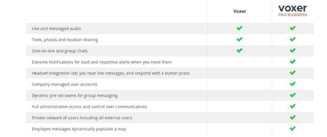

# Voxer 转变为商业世界的对讲机服务 TechCrunch

> 原文：<https://web.archive.org/web/https://techcrunch.com/2013/06/25/voxer-transforms-into-a-walkie-talkie-service-for-the-business-world/>

# Voxer 转变为商业世界的对讲机服务

Voxer 正在进军商业领域，为其对讲机风格的一键通服务提供一系列新的高端功能。

Voxer Pro 和 Voxer Pro For Business 可以在 Android 和 iOS 设备上运行，就像标准服务一样。如果你不熟悉，Voxer 服务是一个发送语音和文本信息的应用程序。下载应用程序，导入您的联系人，然后开始发送消息。对于这个异步的世界来说，这有点理想。可以发送消息，而不必为了打电话而打电话。这可能看起来没有人情味，但这有点像与某人保持通信。

标准应用程序是免费的。Voxer Pro 每月 2.99 美元或每年 29.99 美元。新功能包括一个中断模式，以及我喜欢的极端通知，它以响亮的重复警报的形式出现。Voxer Pro Business 的每个用户每月费用为 4.95 美元，直到 10 月 1 日，价格将增加到每个用户每月 9.95 美元。

Voxer Pro Business 还拥有该公司所谓的 Voxer Pro Manager，这是一个桌面商业通信系统，通过带有地理标记位置的实时地图提供对公司网络的管理控制和可见性，以帮助管理员工。

【T2

自 2011 年推出以来，Voxer 服务已经积累了数百万用户。在我看来，它总是有点简单，我想知道它能持续多久。但是我错了。显然，一直以来，将 Voxer 作为一项商业服务来提供是一种意图。事实证明这是多么明智的一步。通过梳理所有数据，Voxer 发现成千上万的人在工作中使用 Voxer。正如 Liz Gannes 今天所写的，大约有 21000 名玫琳凯化妆品销售人员使用这项服务。这显示了语音信息在社会中传播的深度。

这让我想起了我昨天对卡林·维格纳的采访，他是 [Biba](https://web.archive.org/web/20221007213716/http://biba.com/) 的联合创始人，这是一家[会议和信息服务](https://web.archive.org/web/20221007213716/https://beta.techcrunch.com/2013/06/25/biba-comes-out-of-stealth-with-15m-for-mobile-first-password-free-approach-to-conferencing-and-messaging/)。威格曼在 2010 年将他的公司 CubeTree 卖给了 SuccessFactors。他解释说，由 CubeTree、Yammer 和市场上其他公司开发的企业社交网络技术做得非常好，但它们都以数千万用户为上限。他将此归因于习惯于使用活动流相互传递信息的年轻员工群体之外缺乏采用。但是语音和短信有更深的市场覆盖面。短信覆盖了数亿人。消息系统也有同样的潜力。

看看 Voxer 就知道了。几年内，它已经积累了数千万用户。商业世界中的社交网络服务花了数年时间才接近这种用户基础。

因此，体素表面一个有趣的可能性。消息传递是杀手级社交企业应用吗？如果是这样，那么你可以期待一大群竞争者攻击这个领域。

但是 Voxer 的大目标是 Nextel，它通过对讲机式的服务积累了大量财富。Nextel 代表了集成通信专用设备的老派重量级企业系统。Voxer 正在用软件取代硬件，可用于任何设备。

接下来是微软的 Lyncs 和 Skypes，以及思科和来自 Twilio 生态系统的数以万计的应用。甚至还有类似基于 Twitter 的语音信息平台 Twello 这样的服务。

这是一个拥挤的领域，但 Voxer 看起来有一个聪明的开始，将消息用于现代工作日的日常使用。