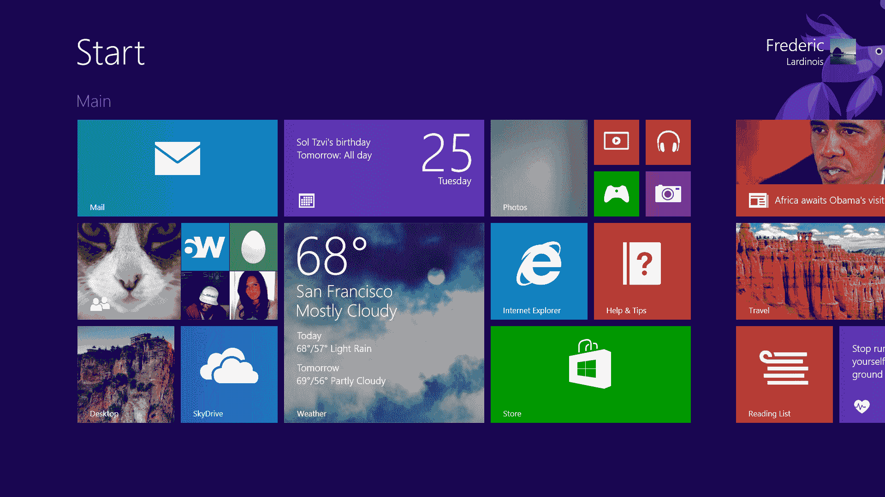
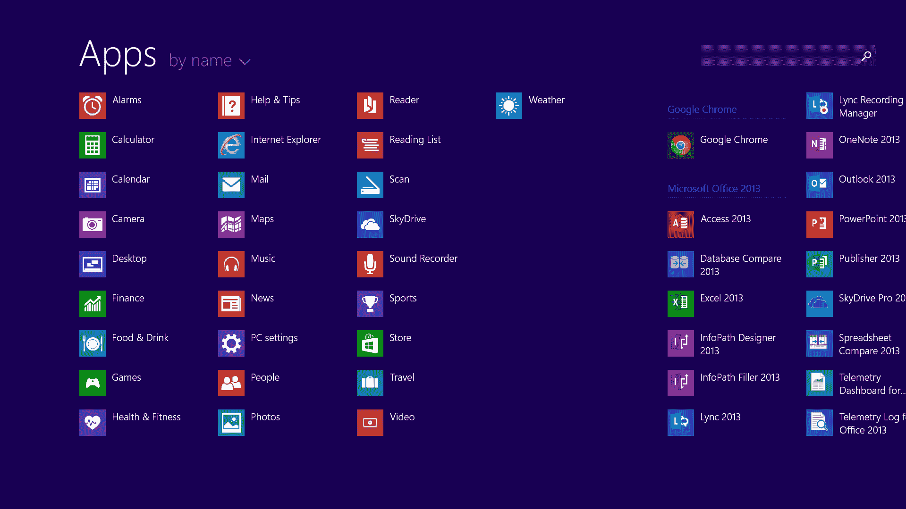
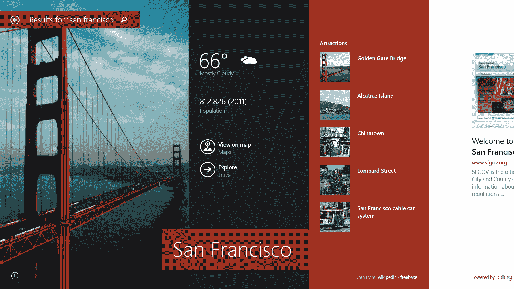
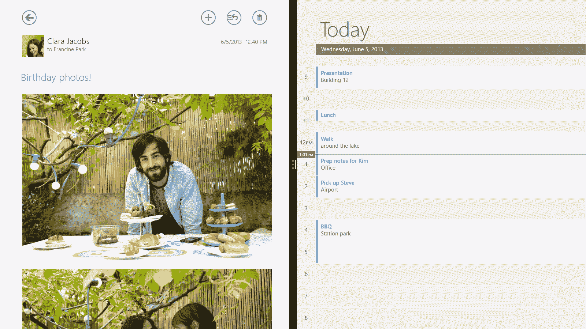
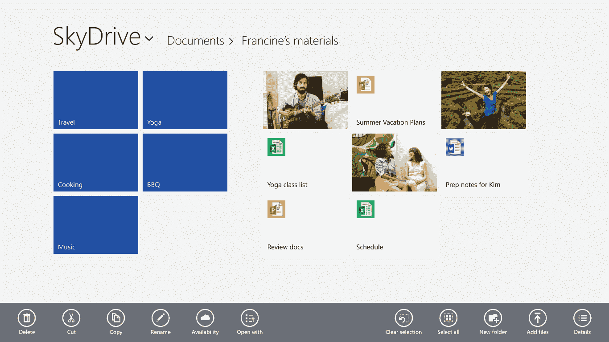
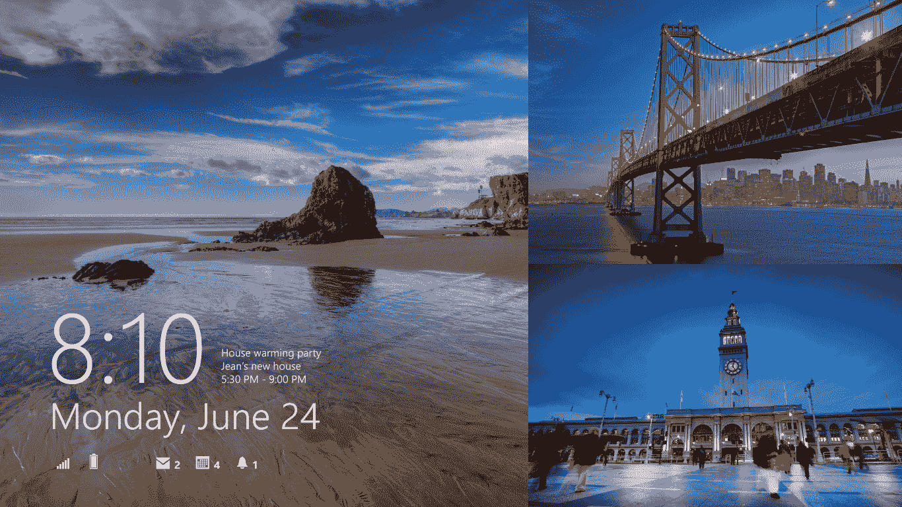

# 微软推出 Windows 8.1 预览版，包括开始按钮、深度 SkyDrive 集成、更智能的搜索工具以及更多技术

> 原文：<https://web.archive.org/web/https://techcrunch.com/2013/06/26/microsoft-launches-windows-8-1-preview-with-start-button-deep-skydrive-integration-smarter-search-tool-more/>

微软今天在旧金山举行的 Build 开发者大会上正式推出了 Windows 8.1 预览版，这是其旗舰操作系统下一版本的第一个公开测试版。对微软来说，Windows 8.1 代表着解决 Windows 8 一些问题的机会。微软重新推出开始按钮，现在允许用户直接进入桌面，这表明该公司一直在倾听用户的声音。在许多方面，8.1——即使在这个预览版中——也是 Windows 8 应该有的。

正如微软已经说过的，Windows 通常的三年更新周期在今天的环境中不再适用。尽管微软自推出以来对 Windows 8 进行了 700 多项改进，但 Windows 8.1 代表的不仅仅是这些努力的高潮。它不仅仅是一个服务包，而且实际上包括了许多新的特性，这些特性使得它比以前的版本更有用。

### 开始按钮，启动到桌面和更多

开始按钮显然是吸引许多用户的主要原因。值得注意的是，虽然开始按钮回来了，但开始菜单不会很快回来。默认情况下，单击“开始”按钮会将您带到老式的“开始”菜单。然而，令人欣慰的是，微软增加了一个新的应用程序屏幕，当你点击开始按钮时，它可以取代开始菜单。应用程序屏幕简单地列出了你所有的应用程序，没有实时磁贴和其他修饰的干扰。您可以按名称、最常用的应用程序和最新的应用程序对列表进行排序。您也可以通过从开始屏幕向上滑动来调用应用程序屏幕。

正如微软今年早些时候宣布的那样，现在终于可以再次直接启动到桌面了。当与应用程序屏幕结合使用时，这允许您在使用 Windows 8.1 时几乎完全绕过开始菜单。

在正式发布之前，有传言称 Windows 8。1 也允许用户自定义操作系统如何处理角落导航，但是到目前为止，似乎唯一的选择就是关闭这个功能。

谈论开始屏幕:微软增加了相当多的新功能来提高它的实用性。现在重新排列应用程序(包括同时排列多个应用程序)变得更加容易，应用程序磁贴现在可以比以前更大和更小。你也可以为开始菜单选择动画背景(这其实很酷)，或者选择为你的桌面和开始屏幕使用相同的背景。

### 搜索

Windows 8.1 的另一大特色是新的搜索工具。正如微软之前透露的那样，内置搜索工具现在可以寻找的不仅仅是文件和设置。相反，它现在是一个通用的搜索工具，可以在网络(使用 Bing)、硬盘、SkyDrive、文档和支持该功能的应用程序中查找结果。例如，搜索功能会向你显示改进后的 Xbox Music 服务的搜索结果，并让你播放搜索结果中的歌曲。当你打开搜索结果时，你还可以立即找到相关维基百科条目的链接，查看图片，如果相关的话，还可以查看附近的景点、即将举行的活动以及艺术家的歌曲、专辑和类似信息。

这看起来是这样的:

### Windows 应用商店应用:最多 4 个并排

Windows 8.1 的另一个重大变化是，当你并排使用两个 Windows Store 应用程序(以前称为 Metro 或 Modern UI 应用程序)时，现在可以随意调整这些窗口的大小。以前，你只能在将一个应用程序降级到侧边栏和让另一个应用程序填充屏幕的其余部分之间进行选择。Windows 8 和商店应用的另一个问题是，你一次只能看到两个应用，如果你有第二个屏幕，这些应用只能停留在一个屏幕上。现在，Windows Store 应用程序可以接管你的所有屏幕，如果你的分辨率足够高，你可以在每个屏幕上看到最多四个屏幕。一般规则是屏幕宽度每 500 像素一个应用。这是众多 Windows 8 中的一个。1 功能 Windows 8 应该从一开始就有，但很高兴看到微软现在终于添加了这一点。

### Skydrive 无处不在(具有更好的照片编辑功能)

对于 Windows 8.1，SkyDrive 就是云。这个新版本深度集成了 SkyDrive，因此您不再需要单独的应用程序来同步您的文件。您电脑上的许多设置现在也存储在 SkyDrive 上，因此当您登录到新电脑时，一切都会变得轻松自如。

值得注意的是，并不是每个文件都会自动同步到每个设备上。大多数文件只有在给定的机器上打开后才可用。

微软还在 Windows 8.1 预览版中为 SkyDrive 应用程序添加了一项功能，即使用滤镜和智能颜色增强功能进行基本的照片编辑，让你可以提升图像中天空或草地的颜色。

### 更新的设置菜单

这是微软解决的另一个烦恼:以前，当你想在你的 PC 上切换某些设置时，也有相当多的困惑，即哪些设置可以通过现代 UI 获得，哪些设置会调用桌面上类似 Windows 7 的老式设置窗口。在 Windows 8.1 中，微软最终整合了现代用户界面模式下设置菜单中的所有设置。从这里，您可以管理一切，从键盘和蓝牙设置到如何设置您的多屏幕桌面以及如何处理 SkyDrive 与您的 PC 同步。

### Windows 应用商店现在专注于发现，而不是类别，取消了安装限制

在这次更新中，微软还推出了一个重新设计的 Windows 商店，现在当新版本到来时，你从商店购买的应用程序会自动更新(默认情况下，这是打开的，但你也可以随时关闭它)。新商店不再专注于类别，而是强调应用发现和推荐。然而，当你打开商店时，你首先看到的是根据微软的一些最有趣的新应用的编辑选择。然而，当你向右滚动时，你开始看到个性化推荐(由 Bing 提供)、热门应用和新发布的列表。最后，会显示顶级免费和付费应用的标准列表。你仍然可以通过从屏幕顶部向下滑动(或右击)来进入类别视图。

随着 Windows 8.1 的推出，微软将 Windows Store 带到了 70 个新市场，使总数达到了 191 个，并且还在 41 个市场推出了用于加载 Windows 帐户的礼品卡。

在这次更新中，微软还取消了之前的五个设备限制，即你可以在多少个设备上安装给定的应用程序。微软现在使用其欺诈检测算法来检测骗子，而不是实施严格的限制。

### 其他更新

Windows 8.1 预览版中显然还有大量其他更新。有一个新的 Xbox 音乐体验，专注于您的音乐收藏和类似潘多拉的广播功能，烹饪和健身的新应用程序和许多其他较小的更新。例如，Internet Explorer 11 并不是浏览器的重大改进，但你现在可以打开无限数量的标签，书签可以在所有 Windows 设备之间同步，甚至可以包括嵌套的收藏夹。这款邮件应用现在具有自动过滤时事通讯、从收藏夹中查找电子邮件的快捷方式以及 Outlook.com 用户已经习惯的[扫描功能](https://web.archive.org/web/20221209160610/http://windows.microsoft.com/en-us/windows/outlook-clean-inbox#1TC=t1)。

【T2

Windows 8.1 中的另一个很酷的功能是“阅读列表”，它让你可以将应用程序或浏览器中的几乎任何东西都标记为书签，以便以后使用。

现在，当您不使用电脑时，锁定屏幕就像一个个性化的相框，您可以直接在锁定屏幕上接听 Skype 电话，而无需登录。

### Windows 8 应该是什么样的

现在，在 Surface Pro 上使用 Windows 8.1 预览版一段时间后，它肯定感觉已经是一个非常强大的系统了。遗憾的是，微软现在推出的许多功能在 Windows 8 中还没有。