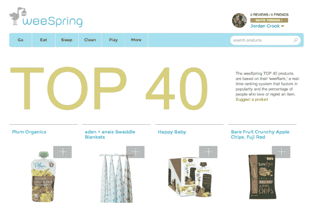
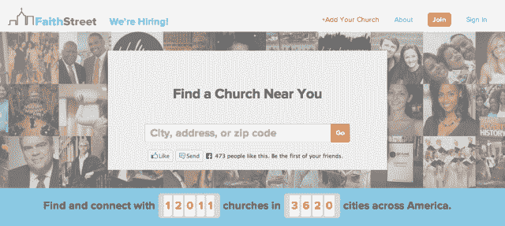
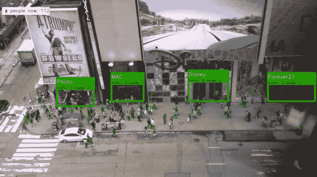

# 纽约 tech stars 2013 年夏季班 TechCrunch 的 TC 精选

> 原文：<https://web.archive.org/web/https://techcrunch.com/2013/06/27/tcs-picks-from-techstars-ny-summer-2013-class/>

我们来到了 TechStars 2013 年夏季课程演示日，毕业生们非常令人高兴，从帮助教堂会众捐款的服务到汽车 Fitbit，再到帮助准妈妈们为宝宝的到来做计划的服务。

TechStars 加速器是美国最大、最著名的科技创业项目之一，这个位于纽约的班级应该让 Silicon Alley 感到骄傲。所以，事不宜迟，以下是 TechCrunch 从 2013 年暑期班中挑选的内容:

#### Triggermail

【T2

Fayez Mohamood 和 Mahmoud Arram 启动了 [Triggermail](https://web.archive.org/web/20221006140004/http://www.triggermail.io/) 来帮助电子商务公司向他们的客户发送相关的触发电子邮件，类似于亚马逊的个性化电子邮件服务。对于那些没有市场营销学位的人来说，触发式电子邮件是在特定事件(或触发事件)之后发送的营销电子邮件，如你的生日、你访问该网站后的 90 天，或者你在该网站上购买了一件产品。

就目前的情况而言，创始人认为营销人员正在根据地理、年龄和性别对用户进行细分，但如果个性化程度更高，投资回报率可能会高得多。当 Triggermail 与客户签约时，他们会将客户代码放在他们的电子商务网站上，以跟踪用户的行为。同时，客户端将电子邮件的副本交给 Triggermail，Triggermail 返回 brand 应该发送的五封最佳触发电子邮件。该品牌选择他们喜欢的电子邮件，然后 Triggermail 为每个用户填充副本中的内容。

目前，该团队仍在进行价格测试，但客户的成本应该在 1000 美元左右。

#### 威斯普林

weeSpring 诞生于个人痛点。当联合创始人 Allyson Downey 怀上她的第一个孩子时，她发现自己在婴儿的“R”Us 哭了，被品种和她对品牌的不熟悉所淹没。当她深入研究如何为宝宝的到来做准备时，她发现其他准妈妈的标准做法是使用 excel 电子表格，然后在其他妈妈之间传递，以获得关于品牌和添加到待办事项列表中的事情的建议。

显然，这不是利用技术解决这个问题的最佳方式。就这样 weeSpring 诞生了。该网站列出了其他妈妈推荐的数千种产品，无论她们是在你的社交圈还是 weeSpring 网络的一部分。该网站于 1 月份向公众开放，从 300 种预填充产品发展到现在的 1，500 多种产品，有超过 30，000 种产品评级。每个产品都至少被一个用户推荐过。

据创始人，一对已婚夫妇说，他们建立这个网站期望每个用户得到 5 到 10 分，但是平均只有 15 分。用户可以选择只查看朋友的推荐和评级，或者整个网络，如果你超过 25 个评级，你就成为一个特色妈妈，浮在评论线程的顶部。

#### 信仰街

[信仰街](https://web.archive.org/web/20221006140004/http://www.faithstreet.com/)是一个移动和桌面网络，帮助你找到一个会众，与他人联系，并给你的教会。最终，该社交平台将进入犹太教堂、清真寺和所有各种信仰，但目前基督联合创始人团队正致力于建立基督教堂的网络。

教堂为他们的会众建立了他们自己的特定网络，在那里可以计划活动，可以听到祈祷，并且(是的，你猜对了)可以进行捐赠。是的，信仰街收取一小部分什一税。我直接问他们，我自己也是在基督教背景下长大的，他们如何证明从圣经规定的教会资金中拿一小部分是合理的。他们解释说，他们相信在线捐赠工具最终会给教会带来更多的钱。

超过 12，000 名教会领袖来到平台上注册免费服务。该团队上周才处理了他们的第一笔捐赠，但在一个每年向教堂捐赠超过 1000 亿美元的世界里，他们很可能会迅速盈利。

#### 定位仪

每天出门前，我们都要检查一些特定的情况，也就是天气。但是 Placemeter 公司的人相信，有一天，我们也会在离开家之前查看我们的预定目的地有多拥挤。

使用高度复杂的算法和已经覆盖曼哈顿的在线直播，Placemeter 可以通过自动计算进出的人数来确定 Forever 21 有多拥挤或街角的咖啡店有多拥挤。事实上，该团队只需要再部署 2000 个摄像头就可以覆盖整个曼哈顿。

最终，这将产生一个移动应用程序，但目前该团队正在进行数据采集。他们不仅需要数据的消费者，还需要愿意贡献数据的人。毕竟，Waze 有 5000 万用户，但只有大约 7 万人向地图服务提供数据。

也就是说， [Placemeter 要求用户注册](https://web.archive.org/web/20221006140004/http://placemeter.com/)进行贡献，并在他们的窗外放置一部旧的拍照手机，使用他们的应用程序通过 Wifi 贡献流媒体视频。早期贡献者将可以访问这些数据，一款面向消费者的应用将于今年秋季推出。

#### 破折号

【T2

[破折号](https://web.archive.org/web/20221006140004/https://dash.by/)是汽车的 Fitbit。在 1996 年以后生产的每辆汽车中，方向盘下面都有一个被称为 OBD(车载诊断)的端口。这个端口允许机械师快速对你的汽车进行诊断，这是他们经常收取过高费用的做法。通过 Dash，用户只需购买 OBD 插件，并将其连接到 Dash 移动应用程序，就可以对他们的汽车进行自己的持续诊断。

该应用程序向他们提供了关于他们在许多接触点上驾驶的反馈，包括加速过快、刹车过猛等。但它也可以作为一个 OnStar 类型的系统，检测你是否发生了碰撞，并呼叫紧急服务。此外，你将始终有一个衡量你的汽车的健康状况，并从应用程序中获得修复一个问题的估计成本。

Dash 可以作为 iOS 和 Android 应用程序使用，目前处于测试阶段。它将以免费增值的商业模式运营，用户可以通过应用内购买来解锁关于他们驾驶和汽车的进一步数据。