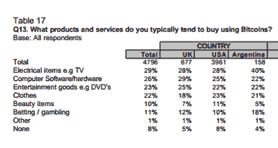

# 调查:四分之一的美国消费者听说过比特币——他们中的大多数人信任它

> 原文：<https://web.archive.org/web/https://techcrunch.com/2013/06/28/bitcoin-awareness-and-trust/>

根据你的观点，比特币要么是一个精心策划的庞氏骗局，要么是未来的货币。或者，如果你是街上的普通人，这可能是 C)你从未听说过的东西。调查公司 On Device 与即将在伦敦举行的[比特币大会](https://web.archive.org/web/20230321210725/http://btclondon.com/)的组织者联合进行了一项新的研究，将一些数据放在对新兴加密货币的态度背后，这[让风投们兴奋不已](https://web.archive.org/web/20230321210725/https://techcrunch.com/2013/04/05/why-do-vcs-care-about-bitcoin/)。

该公司在 2013 年 5 月调查了超过 22，000 名美国消费者，以测试比特币在其发展的相对早期阶段的认知度和信任度。比特币于 2009 年在网络上上线，但就货币而言，它仍然是一个啼哭的婴儿。再加上它与众不同的特点——作为第一种去中心化的数字货币——加上正在进行的基础设施、*和*、[政治和法律不确定性](https://web.archive.org/web/20230321210725/https://techcrunch.com/2013/05/16/mt-gox-dwolla-account-money-seizure/)的[初期问题，新生是描述它的明显绰号。脆弱如纸牌屋可能是另一个有价值的描述。但是一切都得从某个地方开始。在短短的历史中，比特币已经经历了几次大起大落。](https://web.archive.org/web/20230321210725/https://techcrunch.com/2013/04/10/bitcoin-crash/)

那么，美国消费者现在对比特币有什么看法呢？根据调查，只有超过四分之一(25.3%)的人听说过这种加密货币——这意味着美国落后于另外两个接受调查的国家，阿根廷和英国。在这两个国家，比特币的认知度显然在三分之一左右，分别有 37.9%和 32.2%的受访者知道比特币。然而，值得注意的是，该研究在阿根廷和英国调查的消费者要少得多(分别为 760 人和 2731 人)，因此误差幅度可能更高。

在信任比特币方面，美国消费者也落后于阿根廷和英国消费者，但美国比特币消费者的信任度显然仍然很高。该调查发现，62%了解比特币的美国消费者表示他们信任这种货币，而了解比特币的阿根廷人和英国人的这一比例分别为 73%和 69%。正如你所料，提高对比特币的认识似乎有助于培养更高程度的信任。

与对国家货币的信任相比，对比特币的信任仍然相对较低。正如你所料。比特币是这个房间里的新贵，没有任何像国家银行这样的中央机构的支持——矛盾的是，这也可能有助于提高对这种货币的信任。全球金融危机打击了消费者对传统的中央集权经济机构和政府的信心，因此，在一些人看来，一种不受机构控制的货币可能显得更值得信任。支持这种坚持到底的观点的是，最大的阿根廷受访者群体(44%)表示，比特币最大的好处是“不必与金融机构打交道”。所以银行不好，比特币好。

不出所料，阿根廷人也最有可能信任比特币超过他们的国家货币——但由于他们的货币在最近的历史中没有美元稳定，这是意料之中的。旧纸币的表现还不够好，以至于尝试一些虚拟的东西似乎有很大的风险。

比特币调查发现，大约五分之一(22%)的比特币意识阿根廷人信任比特币超过他们自己的国家货币(而近一半——48%——认为两者相同)。美国是第二大最信任比特币的国家，有 16%的人更信任比特币而不是美元。但迄今为止，最大比例(47%)的美国受访者对人民币的信任度低于美元。英国对比特币和国家货币的信任度也同样较低:14%的人对比特币的信任度高于英镑，48%的人不太信任比特币。

在比特币是否是未来货币的问题上，调查发现，人们普遍对比特币的未来潜力抱有相对较高的信心。阿根廷名列榜首——近一半(46%)的受访者肯定比特币未来的关键角色。但美国和英国的受访者对比特币的前景也相对乐观，超过三分之一(38%)的受访者认为比特币是未来的货币。不过，美国也有最大的比特币反对者群体——近四分之一(24%)的受访者表示，他们不认为比特币将在未来扮演核心角色。

喜欢比特币的理由呢？在美国和英国，当被问及比特币最大的好处时，最受欢迎的回答是“快速和方便”——分别有 36%和 43%的人提到这一点。

关于比特币最糟糕的一点，人们的看法差异更大，最大比例(34%)的阿根廷受访者表示，最大的缺点是“在贸易中的使用最少”——这再次表明，比特币在阿根廷的兴趣是由对一国货币的信任度较低以及寻找日常货币替代品的愿望推动的，而不是由比特币作为投资工具的潜力推动的。

在英国，不到三分之一(30%)的受访者提到的最大一项投诉是关于比特币波动的汇率，这表明投资者对比特币的兴趣比真正想使用比特币购买商品和服务的人更大。而在美国，不喜欢比特币的两个最常见的原因(各有 29%的人提到)是“交易中的最低使用”和“你不能实际持有比特币”。后者表明，要让人们信任纯数字货币，还有一段路要走。

人们用比特币购买的那类东西呢？事实证明，电器产品是一个受欢迎的选择，还有计算机软件/硬件和 DVD 等娱乐产品。

这三个国家的大多数受访者认为他们每年在商品和服务上的比特币支出低于 999 美元，74%的阿根廷受访者报告了这一支出水平，美国和英国的这一比例分别为 73%